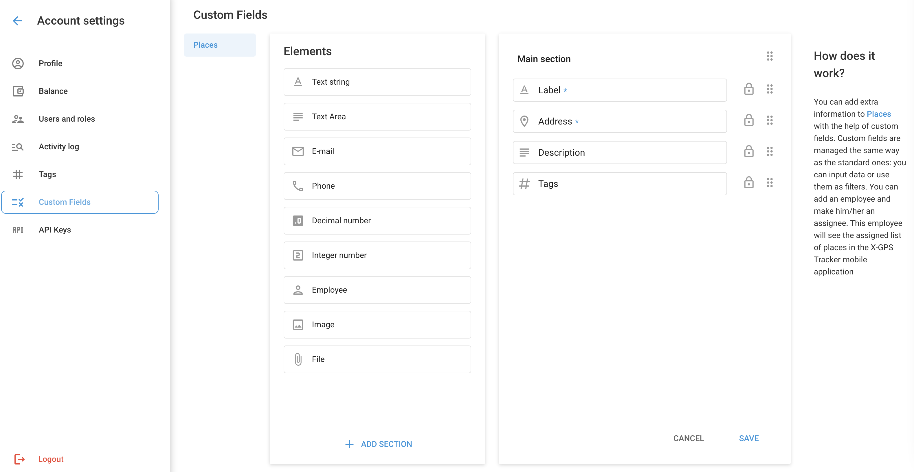

# Custom fields

Custom fields allow you to add personalized information to the description of places. Custom fields operate in the same way as standard fields, allowing you to store valuable data that can be used for filtering and improving operational efficiency.

**Examples:**

* In **Field service** management, custom fields can supplement information about visited Places. A field employee using the [X-GPS Tracker](https://x-gps.app/) mobile application can view and edit detailed information about Places, such as customer details and service requirements, enhancing task completion. [Read more in our blog](https://www.navixy.com/blog/custom-fields-navixy/).

## Custom field types

| **Field type**     | **Description**                                                                                                                    |
| ------------------ | ---------------------------------------------------------------------------------------------------------------------------------- |
| **Text string**    | Length up to 700 characters, allows any characters.                                                                                |
| **Text area**      | Length up to 20,000 characters.                                                                                                    |
| **E-mail**         | For email addresses only.                                                                                                          |
| **Phone**          | For phone numbers only.                                                                                                            |
| **Decimal number** | For decimal values.                                                                                                                |
| **Integer number** | For integer values.                                                                                                                |
| **Employee**       | Allows assignment of a responsible Staff member, making the place visible in the X-GPS Tracker application for the given employee. |
| **Image**          | Allows adding an image.                                                                                                            |
| **File**           | Allows attaching a file.                                                                                                           |

### Adding and editing Custom fields

To add a new custom field, navigate to **Account settings → Custom fields**.

1. **Select field type:** Choose the field type from the Elements list on the left.
2. **Drag and drop:** Drag the selected field type into the Main section on the right.
3. **Specify Information:**

* **Field name:** Enter the name of the field.
* **Description:** Provide a description for the field.
* **Required:** Indicate if the field is required. When adding a new place, it cannot be saved until all required fields are filled.

### Additional actions for Custom fields

* **Add Section:** Distribute custom fields into different sections for better organization.
* **Reorder:** Drag and drop fields and sections to arrange them in your preferred order.
* **Delete:** To delete a field, select it and click the trash can icon. Note that primary fields marked with a lock icon cannot be deleted.

#### Important Notes

* **Maximum Custom fields:** You can add up to 50 custom fields.
* **Automatic updates:** When editing fields, changes to their name, description, and order will automatically be reflected in all created places.
* **Deletion:** Deleting a custom field will remove it from all places permanently without the possibility of recovery.

## FAQs and Troubleshooting

* **Can custom fields be added to other objects besides places?** Currently, custom fields can only be added to places, with plans to expand this functionality in the future.
* **Can I fill in Custom fields from CRM systems via Navixy API?** Yes, you can fill custom fields in Navixy by making API calls to synchronize data from your CRM. This enables seamless data transfer and updates, ensuring that all information is up-to-date and accessible in both systems. Read more in [Navixy API Documentation](https://app.gitbook.com/s/6dtcPLayxXVB2qaaiuIL/general/readme).
