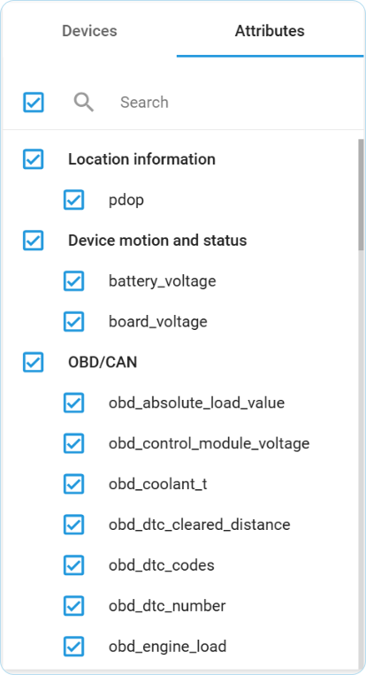

# Data Stream Analyzer

**Data Stream Analyzer** is a specialized troubleshooting tool that provides real-time diagnostics for IoT device data transmission. When your devices aren't reporting as expected, this powerful tool enables immediate verification and debugging across your entire fleet, regardless of manufacturer or protocol. For efficient issue resolution, you can:

* Perform real-time health checks of device data transmission without vendor intervention
* Debug specific attributes through focused data stream analysis
* Validate data integrity with comprehensive value logging (including null values)
* Verify data transformation processes and computed attributes
* Access TCP dumps and node logs for in-depth technical diagnostics
* Cross-reference multiple data sources to identify integration issues

Unlike conventional vendor-specific solutions, **Data Stream Analyzer** offers universal device compatibility and remote troubleshooting capabilities through a single technical interface, significantly reducing the time and complexity of device diagnostics.


### **Navigation**&#x20;

**Data Stream Analyzer** is available to account **Owners** in the **Account Settings** section. To access it:

* Click the profile icon in the top-left corner of the screen to open your account settings
* In the settings sidebar select **IoT Logic**
* Open the flow whose data you want to monitor from the **Data flow** list
* Click 


Let's dive deeper into all the possibilities and functions you can find here.

## Main workspace

The main control options for the Analyzer tool are gathered in the top menu.

**Data flow**: This list allows you to select an already created flow from your account. This is the main grouping parameter, so you'll be able to search for devices and attributes that belong to the chosen flow only.

**Mode**: There are two modes in the tool, and the view of the tool depends on the chosen mode.

* **Table view** (default): This mode shows decoded data from devices in a tabular format.
* **Flow logs** (coming soon): This mode shows overall logs, TCP dumps, and node logs in the chosen flow. It will be added in the next iterations.


The options above are inactive at the moment and contain the default selections. They will become available with further enhancements of IoT Logic functionality. Stay tuned!


Clicking the **Close** button will return you to the main IoT Logic screen.

Now let’s take a closer look at the interface sections and the information available within them.

## Table view

### Top menu bar

The top menu contains the main controls for the table view.

**Exclude null toggle**: This setting allows you to switch between two data display modes:

* **Off** — Displays all values based on packets received from the device, including those where the selected attribute has null (missing) values. This mode provides a complete view of all packet data.
* **On** — Displays only the packets where information was actually received from devices for the selected attribute, with valid, non-null values. In other words, it filters out incomplete data.

**Depth**: This control is responsible for the depth of history data and defines the range of recent data to display. For example, how many steps into the past do we need to go through to show attribute values. The maximum is 12 steps into the past. You can choose how many steps you want to see and check how values change. For example, if you set depth=4, you will see values for three steps from the past \[3], \[2], \[1] and the last received values \[0].

**Play/Pause**: This button allows you to start getting updates of values into the table in real-time, or pause the updates.

**Search value**: This field is used to find a specific value from all attributes in the table. The maximum is 100 symbols to search. For example, if you're checking the work of events and looking for a specific one from a device that should be triggered, the searched value will be highlighted.

**Export**: You can export all logs using the export button to share information with other specialists. The information will be in JSON format to make it easier to read.

### Devices and Attributes block

The left menu block contains a list of devices and attributes belonging to the chosen flow. To switch between lists, use the **Devices** and **Attribute** buttons on the top of the list. You may search devices by ID and attributes by their names.











You can select up to 10 devices. Once selected, all attributes supported by these devices will be displayed, allowing you to choose any number to show in the table. Only attributes relevant to the selected devices will be available.

### Last attribute values table

The information about received values per chosen devices and attributes will be displayed in this table.

The table provides information in the following way:

* The table header row is a list of devices chosen for monitoring. These devices will become columns that show values from every device.
* Rows with attribute names will group data from the chosen attribute. The information collected in the chosen depth from this attribute per every device will be displayed below.\
  The first column in rows under the attribute name with numbers is responsible for the depth of values. Where 0 is the current one, 1 is the previous one, and so on.

When you hover the mouse over any value, you will see additional data about when this attribute was generated by a device and when it was received by the platform:

Once new values are received from any device, they will be highlighted green for about 2 seconds. This way, you will see which attribute on which device was updated. Clicking on a device row will expand it, showing historical values limited by the set **Depth**.

#### Reading the table

Let’s interpret the table values using the case example shown on the screenshot above and see what insights we can get:

* Device **#1Teltonika FMB001** is not returning any values. This may mean that the device cannot provide this particular kind of data. Check if there are any other attributes with values for this device, if no, make sure that the device is properly connected.
* Devices **#2Teltonika FMB001** - **#5Teltonika FMB001** are returning values consistently, indicating they are connected correctly. Their location can be determined using **latitude** and **longitude** attributes. Since their coordinates remain unchanged across several recent **Depth** levels, the devices are stationary. This is further confirmed by the **moving** attribute, which has a value of **0**. Based on these observations, the data appears to be accurate and updated in real time.
* Device **STARLINK** provided values for only one **Depth** level, suggesting it was connected recently. The absence of values for the **moving** attribute likely indicates that this device likely does not have the relevant sensor.
