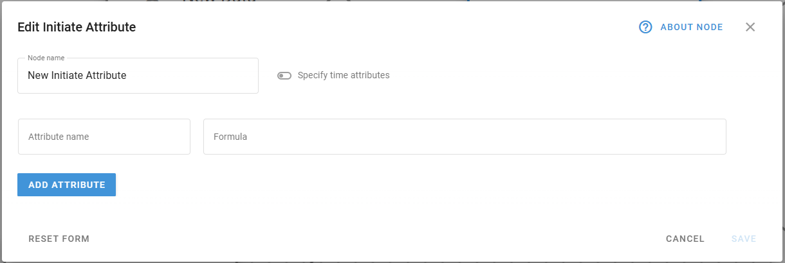
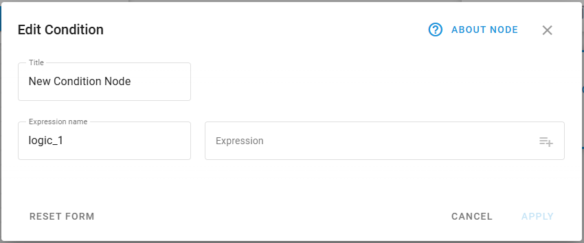
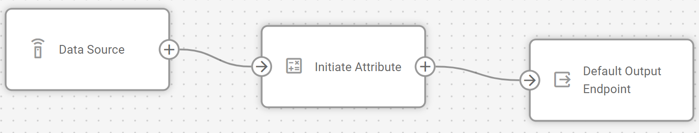
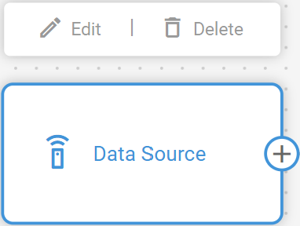

# Flow management

IoT Logic provides a flexible canvas environment where you can build custom data flows to process, transform, and route device telemetry. Each flow consists of interconnected nodes that perform specific functions within your data processing pipeline, from receiving raw device data to forwarding enriched information to external systems.

## Creating a new flow

IoT Logic starts with an empty workspace where you can design your data processing flow.

<figure><figcaption></figcaption></figure>

Follow these simple steps to create a flow:

1. Click the **New flow** button at the top of the screen to open the flow creation dialog.
2. Enter a **Flow name** and provide an optional **Description** to clearly show specific details about this flow's functionality or purpose.
3. Ensure the **Flow enabled** toggle is switched on (unless you're creating a flow that should initially remain inactive).
4. Click **Save** to create your flow and access the flow workspace.

The flow name and description help you identify each flow when you have multiple configurations. The enabled/disabled toggle provides a convenient way to temporarily stop data processing without deleting the entire flow configuration.


Disabled flows don't send any data! The readings from the devices involved in a disabled flow do not reach any destination, including the Navixy platform. This means that disabling a flow can interrupt your monitoring capabilities and data collection for the affected devices. Only disable flows when you deliberately want to stop data transmission completely.


After saving, your new flow appears in the workspace, and you can begin adding processing nodes from the left menu panel.

## Configuring flow components

Each flow consists of interconnected nodes that define how data moves through your system. The basic components available in the **Nodes** pane include:

### Data Source node



This node establishes the entry point for device data in your flow. It processes specific devices from your Navixy account that you can:

* Filter by manufacturer and model
* Specify the communication protocol
* Select from one to an unlimited number of devices to send data into the flow
* Easily select the whole device groups

For detailed configuration options, see [Data Source node](data-source-node.md).



<figure><figcaption></figcaption></figure>



### Initiate Attribute node



This node enables data transformation through the [Navixy Expression Language](https://app.gitbook.com/s/tx3J5BxnWyPV0nP2xr0z/technologies/navixy-iot-logic-expression-language). It allows you to:

* Create new calculated attributes based on device parameters
* Perform unit conversions and mathematical operations
* Apply time-based calculations



<figure><figcaption></figcaption></figure>



For detailed configuration options, syntax, and expression examples, see the [Initiate Attribute node](initiate-attribute-node/).

### Logic node



This node creates intelligent branching points that route data based on logical conditions. It allows you to:

* Create conditional workflows with IF-THEN/ELSE logic
* Route data through different processing paths based on real-time conditions
* Generate boolean attributes that record validation results
* Build complex decision trees with multiple conditions



<figure><figcaption></figcaption></figure>



For detailed configuration options, logical operators, and expression examples, see the [Logic node](logic-node/).

### Action node



This node enables automated responses to device data by performing specific operations when conditions are met. It allows you to:

* Send commands back to devices based on data analysis
* Trigger external system notifications or alerts
* Execute automated workflows based on device status changes



<figure><figcaption></figcaption></figure>



For detailed configuration options, see the [Action node](action-node.md).

### Output Endpoint node



This node defines where and how your processed data is transmitted. In its configuration, you can:

* Specify destination connection details (IP/domain, port)
* Select transport protocols and protocol versions
* Set up security measures including SSL and authentication
* Configure MQTT parameters like client ID, topics, and QoS levels
* Create reusable endpoint profiles for consistent configurations

For complete details on data transmission options, see the [Output Endpoint node](output-endpoint-node.md).



<figure><figcaption></figcaption></figure>




Your flow should include a **Default Output Endpoint** to send data to the platform. Maintaining this connection ensures your device data remains available for visualization and management in the Navixy interface.


## Building your flow

To assemble your data processing sequence:

1. Drag nodes from the left menu and drop them onto the workspace.
2. Click on each node to open its configuration panel and set up the required parameters.
3. Connect nodes by clicking on a node's output connector and dragging it to the input connector of the destination node.

<figure><figcaption></figcaption></figure>

Your flow must begin with at least one **Data Source** node and end with one or more **Output Endpoint** nodes. Between these, you can add transformation nodes to manipulate the data according to your requirements.

Nodes can be connected in various configurations:

* A single **Data source node** can feed multiple nodes for parallel processing
* Multiple **Data source nodes** can connect to a single **Output endpoint node** to consolidate data streams
* **Initiate attribute nodes** can be chained sequentially for multi-stage calculations

## Editing existing flows

After creating a flow, you can modify its configuration as your requirements evolve.

### Modifying flow details

To change the flow name, description, or enabled status:

1. Click  next to the flow name
2. Update the desired fields
3. Save your changes

### Removing elements


{% column width="58.333333333333336%" %}
When you need to restructure your flow, you can remove nodes or connections:

**Deleting a node:**

1. Hover your cursor over the node you want to remove
2. Click the delete icon that appears in the top right corner of the node


{% column width="41.666666666666664%" %}
<figure><figcaption></figcaption></figure>





When you delete a node, all of its connections will also be removed.



{% column width="58.333333333333336%" %}
**Deleting a connection:**

* Click on the connection line you want to remove
* Click **Unlink** or press the backspace key on your keyboard


{% column width="41.666666666666664%" %}
<figure><figcaption></figcaption></figure>



### Managing multiple flows

To switch between different flows:

1. Click the **Data flow** dropdown
2. Select the flow you want to view or edit, it opens on the workspace


Any unsaved changes in the current flow will be lost when switching, you will be asked to confirm the action.


## Saving and activating flows

After configuring your flow:

1. Click the **Save flow** button to store your flow configuration
2. Ensure the flow is enabled for it to begin processing data

Once activated, your flow will:

* Receive real-time data from the configured devices
* Apply any defined transformations through Initiate attribute nodes
* Forward the processed data to your specified endpoints in the [Navixy Generic Protocol](https://app.gitbook.com/s/tx3J5BxnWyPV0nP2xr0z/technologies/navixy-generic-protocol) format

If you need to temporarily disable data processing, you can toggle the flow's enabled status without losing your configuration.

## Example configurations

You can find detailed step-by-step descriptions of an example flow creation in [Flow configuration example](flow-configuration-example.md). The example also contains explanations on some common data enrichment options. Feel free to use this example as a template for your custom flows.
