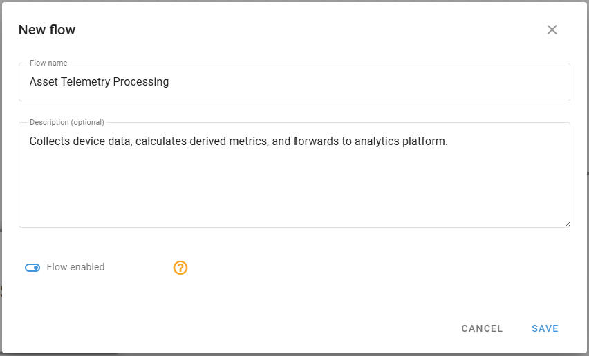
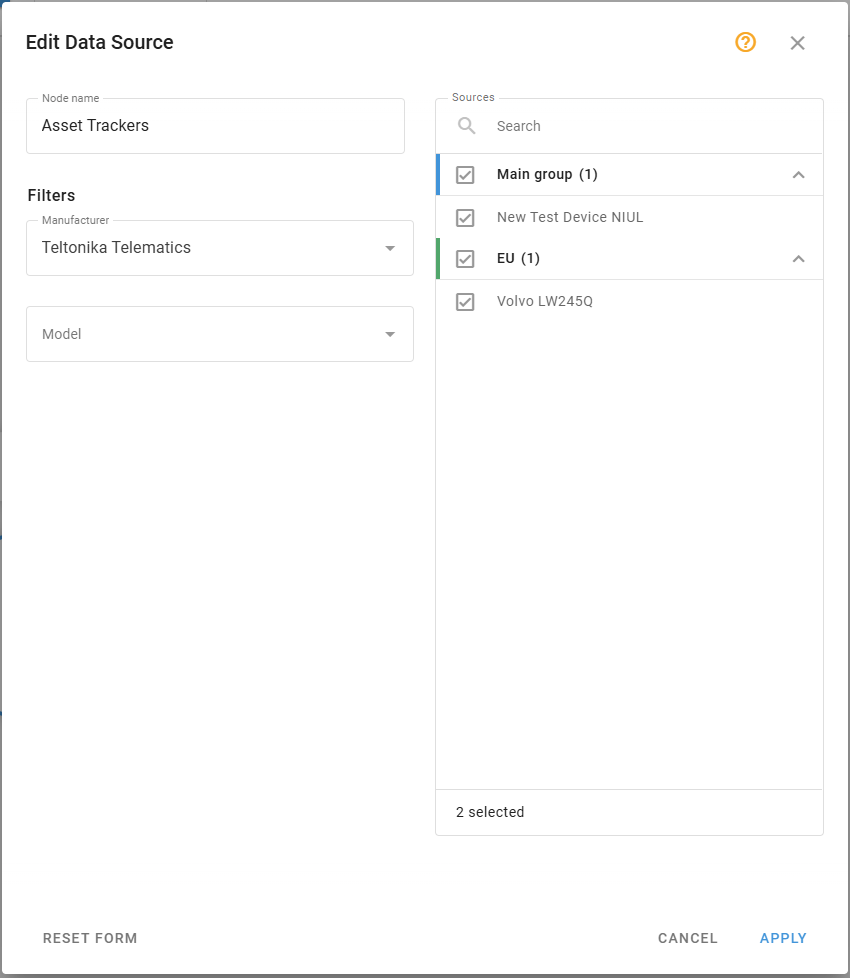
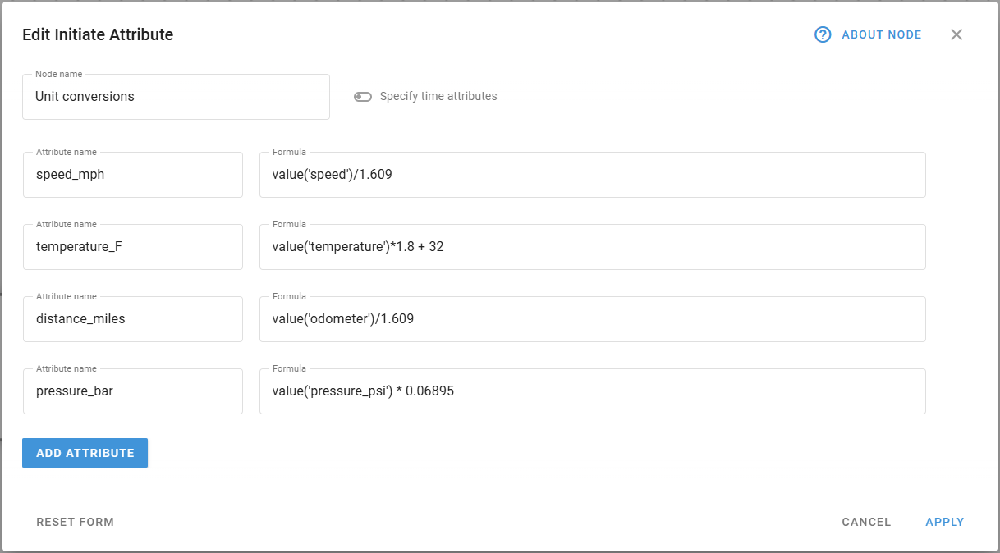
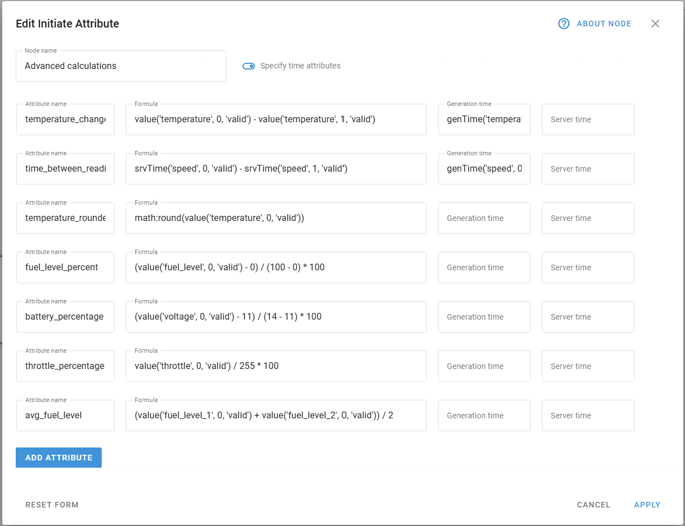
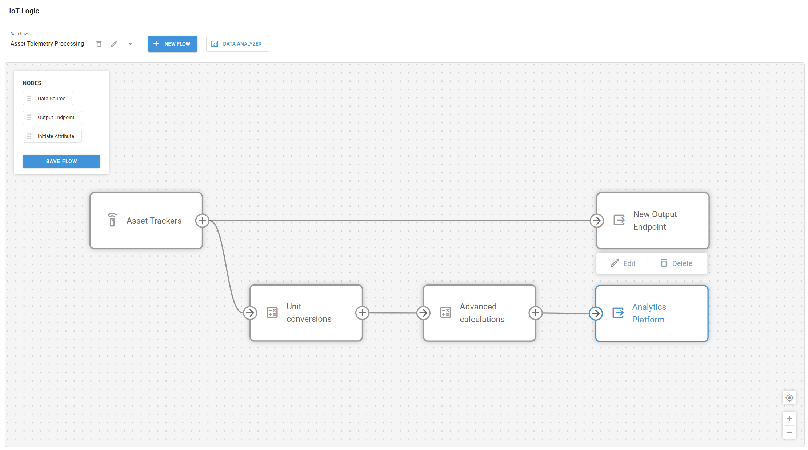
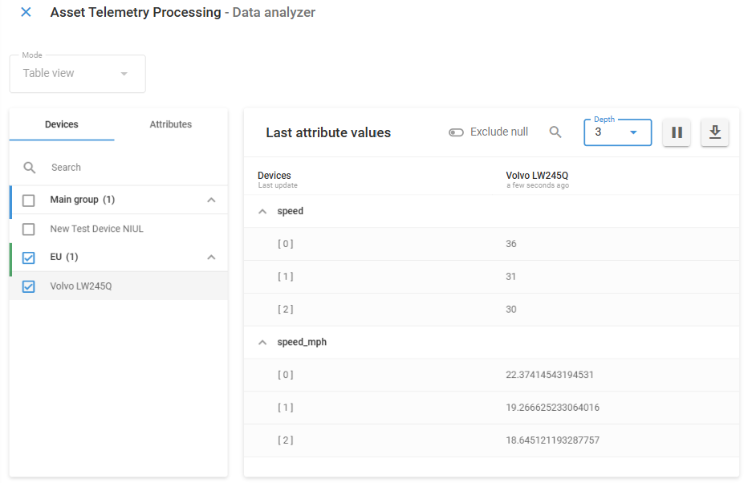

# Flow configuration example

This example demonstrates how to configure a flow that collects data from IoT devices, performs calculations to derive business-relevant metrics, and forwards the enriched data to an external system. The example uses a linear flow pattern that can be adapted to various industry use cases.

## Business scenario

In this scenario, an organization has deployed IoT trackers on their assets and needs to process data from these devices for business analytics. The organization receives the following parameters directly from their tracking devices:

* `speed`: Vehicle speed in kilometers per hour
* `temperature`: Environmental temperature in Celsius
* `odometer`: Distance traveled in kilometers
* `ignition`: Engine ignition status (1 = on, 0 = off)
* `fuel_level`: Current fuel level measurement
* `pressure_psi`: Pressure reading in PSI
* `voltage`: Battery voltage in volts
* `throttle`: Throttle pedal position from CAN bus (0-255)
* `fuel_level_1`: First fuel tank level measurement
* `fuel_level_2`: Second fuel tank level measurement

The organization needs to:

1. Collect raw telemetry data from devices to maintain a complete record of asset operations
2. Convert measurement units to match their standard reporting format (imperial units) for consistency with existing business systems
3. Calculate time-based metrics that indicate usage patterns to optimize asset utilization and maintenance schedules
4. Create derived metrics to generate operational insights not directly provided by the hardware
5. Forward the enriched data to an external analysis system for integration with business intelligence platforms
6. Send unchanged raw data to Navixy for monitoring

This flow will transform the raw device data into a format that directly supports business decision-making while maintaining the integrity of the original measurements.

## Flow configuration steps

Follow these steps to build a comprehensive data transformation and forwarding flow:



#### Create a new flow

1. Click the **New flow** button at the top of the IoT Logic interface
2. Enter _Asset Telemetry Processing_ as the flow name
3. Add a description: "_Collects device data, calculates derived metrics, and forwards to analytics platform._"
4. Ensure the **Flow enabled** toggle is switched on
5. Click **Save** to create the flow

<figure><figcaption></figcaption></figure>



#### Configure the data source

1. Drag a **Data Source** node from the left menu to the workspace
2. Double-click on the node to open its configuration panel
3. In **Node name** type _Asset Trackers_
4. Select the devices to include in this flow from the filtered list

* For this example, select at least two devices with similar capabilities

5. Click **Apply** to save node configuration

<figure><figcaption></figcaption></figure>



#### Set up basic data transformations

1. Drag an **Initiate Attribute** node from the left menu to the workspace
2. Connect the **Data Source** node to this **Initiate Attribute** node
3. Double-click the node to open its configuration
4. In **Node name** type _Unit conversions_
5. Create the following attributes for unit conversion:
6. Add a new attribute for speed conversion (km/h to mph): 1. Attribute name: _speed\_mph_ 2. Value: `value('speed')/1.609`
7. Add a new attribute for temperature conversion (Celsius to Fahrenheit): 1. Attribute name: _temperature\_F_ 2. Value: `value('temperature')*1.8 + 32`
8. Add a new attribute for distance conversion (kilometers to miles): 1. Attribute name: _distance\_miles_ 2. Value: `value('odometer')/1.609`
9. Add a new attribute for pressure conversion (PSI to Bar): 1. Attribute name: _pressure\_bar_ 2. Value: `value('pressure_psi') * 0.06895`
10. Click **Apply** to save node configuration

<figure><figcaption></figcaption></figure>


For explanations on calculations introduced in this step, see [Basic unit conversions](flow-configuration-example.md#basic-unit-conversions)




#### Create advanced calculated metrics

1. Drag another **Initiate Attribute** node from the left menu to the workspace
2. Connect the first **Initiate Attribute** node to this new one
3. Double-click on the node to open its configuration
4. In **Node name** type _Advanced calculations_
5. Create the following attributes for advanced metrics:
6. Add an attribute for temperature change detection: 1. Attribute name: _temperature\_change_ 2. Value: `value('temperature', 0, 'valid') - value('temperature', 1, 'valid')` 3. Generation time: `genTime('temperature', 0, 'valid')`
7. Add an attribute for finding time elapsed between two last readings: 1. Attribute name: _time\_between\_readings\_ms_ 2. Value: `srvTime('speed', 0, 'valid') - srvTime('speed', 1, 'valid')` 3. Generation time: `genTime('speed', 0, 'valid')`
8. Add an attribute for round temperature to nearest integer: 1. Attribute name: _temperature\_rounded_ 2. Value: `math:round(value('temperature', 0, 'valid'))`
9. Add an attribute for standardized value calculation (normalizing fuel level to 0-100%): 1. Attribute name: _fuel\_level\_percent_ 2. Value: `(value('fuel_level', 0, 'valid') - 0) / (100 - 0) * 100`
10. Add an attribute for battery charge percentage calculation: 1. Attribute name: _battery\_percentage_ 2. Value: `(value('voltage', 0, 'valid') - 11) / (14 - 11) * 100`
11. Add an attribute for throttle position calculation: 1. Attribute name: _throttle\_percentage_ 2. Value: `value('throttle', 0, 'valid') / 255 * 100`
12. Add an attribute for average fuel level from multiple sensors: 1. Attribute name: _avg\_fuel\_level_ 2. Value: `(value('fuel_level_1', 0, 'valid') + value('fuel_level_2', 0, 'valid')) / 2`
13. Click **Apply** to save node configuration

<figure><figcaption></figcaption></figure>


For explanations on calculations introduced in this step, see [Advanced metrics calculations](flow-configuration-example.md#advanced-metrics-calculations).




#### Configure the output endpoint

1. Drag an **Output Endpoint** node from the left menu to the workspace
2. Connect the second **Initiate Attribute** node to this **Output Endpoint** node
3. Click on the node to open its configuration
4. Configure the following settings:
   1. **Endpoint type**: _MQTT endpoint_
   2. **Endpoint name**: _Analytics Platform_
   3. **Protocol**: default _Navixy Generic Protocol (JSON)_
   4. **IP/Domain**: Enter the destination system address (e.g., "_analytics.example.com_")
   5. **Port**: _8883_ (default for MQTT, you can leave it empty)
   6. **Enable SSL**: _toggle on_
   7. **MQTT Version**: _5.0_
   8. **MQTT Client ID**: _asset-telemetry-client_
   9. **Topic**: _telemetry/assets/raw_
   10. **QoS**: _1_
   11. **MQTT Authentication**: _Yes_ (if required by your destination system)
   12. **MQTT Login and Password**: Enter credentials if applicable
5. Click **Create** to save node configuration

<figure><figcaption></figcaption></figure>



#### Add Default Output endpoint

1. Drag an **Output Endpoint** node from the left menu to the workspace
2. In **Endpoint type** select **Default Endpoint**
3. Click **Save** to apply node configuration
4. Connect the _Asset Trackers_ (**Data Source**) node to it

This ensures that the raw data is sent to Navixy directly from the devices, without any transformations and enrichments.



#### Save and test the flow

Your final configuration will look like this:

<figure><figcaption></figcaption></figure>

Click the **Save flow** button on the **Nodes** pane to store your flow configuration.



###


Use [Data Stream Analyzer (DSA)](../data-stream-analyzer.md) to monitor incoming data to verify:

* Devices are sending data to the flow
* Calculations are working as expected
* Data is being forwarded to the destination For example, let’s check that speed conversions are calulated correctly on a truck. To do it in DSA, select the **Volvo** device and attributes **speed** and **speed\_mph**:\
  

All good! Data is received and converted successfully.


## Data transformations explained

Let's examine the key calculations used in this flow.

### Basic unit conversions

The first **Initiate attribute node** performs straightforward unit conversions:

* **Speed**: Converts km/h to mph by dividing by 1.609
* **Temperature**: Converts Celsius to Fahrenheit using the formula °F = °C × 1.8 + 32
* **Distance**: Converts kilometers to miles by dividing by 1.609
* **Pressure**: Converts PSI to Bar by multiplying by 0.06895, making it compatible with international pressure measurement standards

These conversions ensure consistency with standard reporting formats and make the data immediately usable for analysis. Unit conversions are particularly valuable for multinational organizations that operate across regions with different measurement standards.

### Advanced metrics calculations

The second **Initiate attribute node** performs more complex calculations:

* **Temperature change detection**: Calculates the difference between current and previous temperature readings to identify sudden changes. This helps detect equipment issues such as refrigeration failures in transport vehicles or HVAC problems in facilities. For example, a sudden 5°C rise in a refrigerated container might indicate a cooling system failure requiring immediate attention.
  * **Generation time**: Using `genTime('temperature', 0, 'valid')` is crucial here because it preserves the exact timestamp when the temperature reading was generated by the device, ensuring accurate time-based analysis of temperature changes.
  * **Server time**: The default value `now()` automatically captures when the server received the data. Since we don't need to modify this timestamp, we can leave this field empty during configuration.
* **Time between readings**: Measures the interval between consecutive data transmissions by comparing server timestamps. This calculation helps identify communication issues or validate that devices are reporting at expected frequencies. Irregular intervals might indicate connectivity problems, while consistent delays could suggest network congestion or device configuration issues.
* **Rounding values**: Applies mathematical rounding to temperature readings, reducing decimal precision to integers. This simplifies data visualization and reporting while reducing storage requirements for historical data. Rounded values are especially useful for dashboard displays and threshold-based alerts where decimal precision isn't necessary.
  * **Generation time**: Specifying `genTime('speed', 0, 'valid')` connects this metadata directly to the original reading's timestamp, making it possible to analyze both the time interval and when it occurred.
  * **Server time**: The default value `now()` automatically captures when the server received the data. Since we don't need to modify this timestamp, we can leave this field empty during configuration.
* **Standardized value calculation**: Normalizes raw sensor readings to a percentage scale (0-100%). This standardization makes it easier to compare readings across different sensor types and vehicle models. For fleet management, this allows consistent fuel level reporting regardless of the specific fuel sensor implementation in each vehicle model, enabling uniform low-fuel alerts and consumption analysis.
* **Battery charge percentage calculation**: Normalizes battery voltage readings (11V-14V range) to a 0-100% scale for easier monitoring. For example, a reading of 12.5V would be normalized to 50%, providing an intuitive indicator of battery health across different vehicle types.
* **Throttle position calculation**: Converts raw throttle position data (0-255 range) from the vehicle's CAN bus to a percentage scale. This standardization helps operators quickly understand driver behavior and vehicle performance without needing to interpret raw sensor values.
* **Average fuel level from multiple sensors**: Combines readings from two separate fuel sensors to produce a more accurate overall fuel level measurement. This is particularly valuable for vehicles with complex tank shapes or multiple tanks, where a single sensor might not provide reliable readings due to fuel shifting during movement.

## Example flow summary

This flow configuration demonstrates several key IoT Logic capabilities:

1. **Standardization**: Converts device-specific readings into standardized business metrics
2. **Enrichment**: Creates new, meaningful metrics not directly available from device sensors
3. **Transformation**: Changes units to match business reporting requirements
4. **Historical context**: Uses previous readings to calculate trend-based metrics
5. **Status determination**: Creates categorical values based on multiple sensor inputs

This combination of capabilities transforms raw device data into actionable business intelligence, directly supporting operational decision-making while maintaining the integrity of the original measurements.
