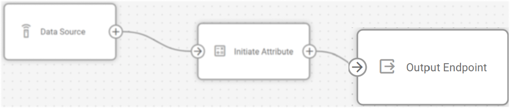
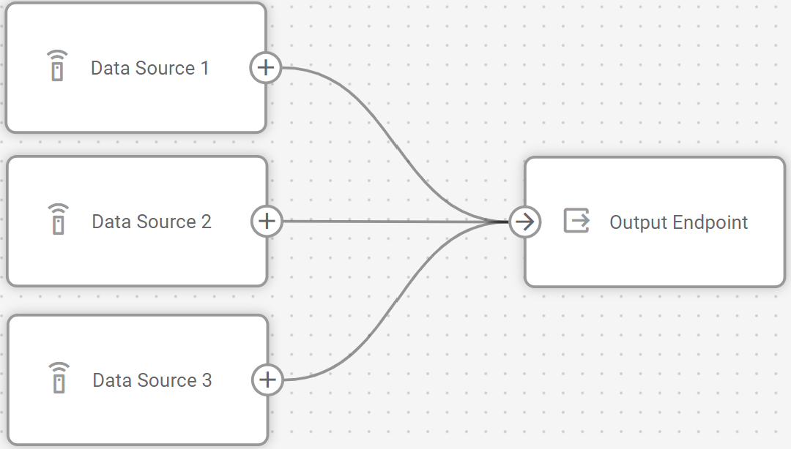

# Output Endpoint node

## Technical overview and capabilities


{% column width="58.333333333333336%" %}



{% column width="41.666666666666664%" %}




**Output Endpoint node** serves as the data transmission component within IoT Logic flows, defining where processed device data is sent. Its primary function is to standardize heterogeneous device data into a consistent format before transmitting it to external systems or services. All data is transferred in a unified format, enabled by [Navixy Generic Protocol](https://app.gitbook.com/s/tx3J5BxnWyPV0nP2xr0z/technologies/navixy-generic-protocol).

For details on the format in which data is transmitted, see [Output data format](https://squaregps.atlassian.net/wiki/spaces/USERDOCSOLD/pages/3216933239/Output+Endpoint+node#Output-data-format).

### Flow architecture integration

<figure><figcaption></figcaption></figure>

A single IoT Logic flow can contain multiple output nodes, each with independent configurations. This architecture enables:

* Multi-destination data transmitting to different external systems simultaneously
* Multiple data sources handling with different incoming data formats
* Selective data routing that enables flexible data flow scenarios


Each flow includes a default Navixy endpoint node. It is recommended to maintain connections between your **Data Source** nodes and this output. The connection ensures device data is sent to the platform, enabling monitoring capabilities using Navixy tools. If the Navixy output is removed, data from the devices involved in the flow will no longer reach the platform.


### Node capabilities

The **Output Endpoint** node by itself offers:

* **Secure transmission**: Implements SSL encryption and authentication mechanisms for data protection during transit
* **Configurable delivery assurance**: Provides MQTT QoS level selection to balance between delivery guarantees and network overhead
* **Configuration reusability**: Supports creating endpoint profiles that can be reused across multiple flows, ensuring configuration consistency
* **Concurrent processing**: Accepts inputs from multiple data sources within a flow, allowing consolidated data transmission
* **Transport protocol version selection**: Supports both MQTT 3.1.1 and 5.0 to accommodate various broker implementations

## Configuration options

Setting up an **Output endpoint node** determines how and where data will be delivered from a particular flow. Each configuration option serves a specific purpose in establishing reliable data transmission.

<figure><figcaption></figcaption></figure>

Let's see what elements this node uses and what you can configure when working with it:

### Configuration steps



Select Endpoint type

Choose what type of transmitting to use for this endpoint

* **Default endpoint** - standard configuration for sending flow data to the Navixy platform that cannot be edited
* **MQTT endpoint** - custom configuration that uses MQTT as transport for sending flow data to 3rd-party systems.



Select a **Preset** (optional)

Open the **Preset** dropdown and select a template that fits your needs. Several ready-made configurations are available for common destinations, like Navixy servers.


After an endpoint is saved, it can be used as a preset for creating new outputs.




**Specify Endpoint Name**

Enter a unique, descriptive name for this endpoint configuration

* Use a name that helps you identify the destination the data is sent to
* This name will be displayed in the flow diagram for easy identification



**Select protocols**

Choose a protocol for data transmission to third-party services from a dropdown list. Currently, only the **Navixy Generic Protocol (JSON)** is supported. In the future, other formats can be considered as additional options for data transmission.



**Configure connection parameters**

* Enter the target **IP/Domain** in the format: _123.123.123.123_ or _example.example.com_.
* Specify the **Port** number. By default, _1883_ is used for standard MQTT, _8883_ – for SSL).
* Toggle **Enable SSL** for secure connections. This action automatically sets the port to _8883_ if it wasn’t changed manually.



**Set MQTT parameters**

* Enter **Client ID**. The receiving side has a fixed list of clients. In this field, the correct value must be specified so that the data is not rejected.
* Select **MQTT Version**: 3.1.1 or 5.0.
* Specify **Topics** in the form of tags that will be used for data transmission.
* Choose **QoS** level that determines the logic of data transmission:
  * **QoS 0** – no delivery confirmation.
  * **QoS 1** – guaranteed delivery with possible duplication.
  * **QoS 2** – guaranteed delivery without duplication.



**Configure MQTT authentication** (optional)

* Toggle **MQTT Authentication** on.
* Enter **MQTT Login** and **MQTT Password** for the receiving party in the appeared fields.



**Save** your configuration.




Make sure to connect the relevant data nodes to your new output; otherwise, it won’t receive any data.


## Output data format

The node's primary capability is data format standardization through [Navixy Generic Protocol](https://app.gitbook.com/s/tx3J5BxnWyPV0nP2xr0z/technologies/navixy-generic-protocol). This standardization solves a fundamental challenge in IoT implementations - the diversity of device-specific protocols that require custom integration work.

Usually, each device type uses its own data format, requiring dedicated protocol handlers on receiving systems. This approach increases development and maintenance overhead exponentially as device fleets expand. IoT Logic addresses this by normalizing all device data into a standardized JSON structure, regardless of the original manufacturer or protocol.

The [Navixy Generic Protocol](https://app.gitbook.com/s/tx3J5BxnWyPV0nP2xr0z/technologies/navixy-generic-protocol) specification includes standardized fields for device identification, location data, telemetry values, and metadata. This format supports bidirectional communication, allowing both data transmission from IoT Logic to external systems and data ingestion from external sources into the platform.

By implementing a single protocol, the **Output Endpoint** node enables:

* A single integration pattern for receiving systems instead of multiple device-specific handlers
* Consistent data structure that remains uniform across all connected devices
* Reduced server-side processing overhead through protocol normalization
* Simplified scaling when adding new device types to existing deployments
* Bidirectional data exchange capabilities with external systems

The node implements MQTT as the transport protocol for this standardized JSON payload, providing a reliable, lightweight transmission mechanism suitable for IoT deployments.

## Frequently asked questions

#### Can I connect multiple data sources to a single Output Endpoint node?

Yes. The **Output Endpoint** node accepts inputs from multiple **Data Source** nodes simultaneously. All processed data, including location coordinates, device identifiers, telemetry parameters, and calculated attributes, is serialized according to the [Navixy Generic Protocol](https://app.gitbook.com/s/tx3J5BxnWyPV0nP2xr0z/technologies/navixy-generic-protocol) specification before transmission.

<figure><figcaption></figcaption></figure>

#### What happens if I modify an endpoint that's used in multiple flows?

Endpoint configurations are stored as reusable resources across the entire client account. Modifications to an existing endpoint configuration will affect all nodes referencing that endpoint across all flows. This behavior facilitates configuration standardization but requires careful change management when updating endpoint parameters.

#### What security practices are recommended for production deployments?

For implementations requiring high security standards (healthcare, financial, etc.), enable SSL and implement MQTT authentication. While this increases protocol overhead slightly, it provides necessary data protection during transmission. Standard implementations should use at minimum QoS level 1 to ensure delivery confirmation.
