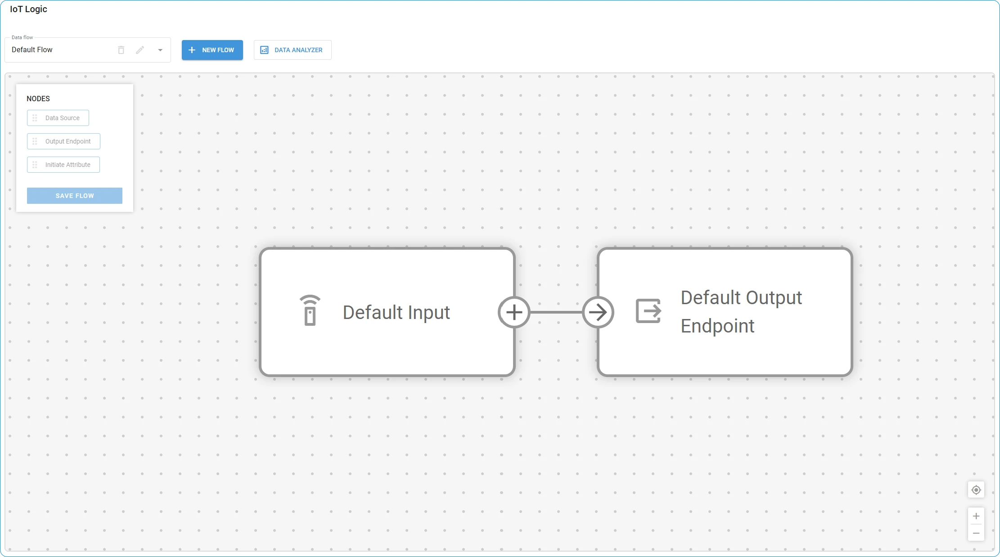
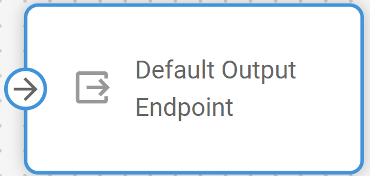
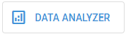

# Workspace and default flow

## IoT Logic workspace

The workspace consists of three sections: **Flow settings bar (1)**, **Node pane (2)**, and **Canvas (3)**.

<figure><figcaption></figcaption></figure>

### 1 - Flow settings bar

The main controls for managing your data flows are gathered in the top menu bar:

* **Data flow:** Shows a list of existing flows. If you have some data flows created already, you can select the necessary flow from the dropdown to open its configuration.
  * **Pencil icon:** Allows editing flow information like **Flow name** and **Description**, and also switching it on/off. The button becomes active only if a flow is selected and is not default.
  * **Bin icon:** Deletes the current flow configuration. If you don’t need a flow anymore, you can delete it from the platform completely.
* **New flow:** This button opens the [flow creation window](flow-management/) where you can specify all information about your new flow.
* **Data analyzer:** This button opens the [Data Stream Analyzer tool](data-stream-analyzer.md), which will help you see data from different sources and attributes and will be useful for diagnostics.

### 2 - Nodes pane

Available nodes are located in a separate pane on the left. You can drag-and-drop them onto the canvas of the current flow. The option to save the current flow configuration is also located on this pane. At the moment, the following nodes are available:

* [Data Source](flow-management/data-source-node.md)**:** A node that defines where the data is coming from to the current flow. A flow can contain multiple actual sources.
* [Initiate Attribute](flow-management/initiate-attribute-node/): A node that handles data enrichment through custom calculations before sending to a destination.
* [Logic](flow-management/logic-node/): A node that creates conditional branching based on logical expressions, routing data through different paths depending on real-time conditions.
* [Action](flow-management/action-node.md): A node that performs automated operations on device data, such as sending commands back to devices or triggering external system actions based on defined conditions.
* [Output Endpoint](flow-management/output-endpoint-node.md): An outbound transmitting node that defines where the data is sent from the current flow.

A flow can contain multiple nodes of each type. Combining various nodes in the same flow allows you to create complex data pipelines.


The **Save flow** button saves the current flow configuration. If you edit something in the flow, don’t forget to save the changes. Unsaved changes can be discarded by the page reload.


### 3 - Canvas

This is the main interactive element of the workspace where your flows are visualized:

* **Node blocks**: All nodes you drag-and-drop to the canvas appear as blocks. You can place them however you like to make the image of your flow clear and intuitive. Hovering your mouse over a node displays an edit window.\
  **Note**. You can also open the editing window by double-clicking a node.
* **Transitions**: The arrows represent connections between nodes, defining the path your data follows within the flow. Node blocks also show hints on which connection directions they support. To create a transition, simply click a connection element on a start node and drag it to the target one. If you try to connect nodes in an unsupported direction (e.g. from an **Output Endpoint** to a **Data Source**), the attempt will fail. This way, the platform prevents an accidental configuration of an incorrect data flow.
* **Center** : This button allows you to quickly focus on the canvas area that contains actual elements, ensuring that the whole flow is visible. It is especially helpful for large and complex flows, but at the same time offers a handy shortcut to autosize the flowchart to fit the window.
* **Zoom in/out** : Common functionality to manage the scale of the flowchart. You can also zoom in or out using your mouse wheel.

## Default flow

<figure><figcaption></figcaption></figure>

Navixy offers a pre-configured data flow that includes all devices connected to the account and sends their data directly to the platform. This flow is available in every account and cannot be edited. It consists of two basic nodes: **Default Input** and **Default Output Endpoint**.

The default flow serves as a foundational data transmission path in the Navixy system. Its primary purpose is to ensure that data from devices not included in any custom flow is not lost and is transmitted to the default destination - the Navixy platform.

### Key characteristics of the default flow

* Present in every Navixy account regardless of whether IoT Logic is actively used
* Cannot be deleted, edited, or modified in any way
* Automatically includes all devices not assigned to custom flows
* Provides direct data transmission without transformations
* Maintains system stability by protecting the default data transmission path

When you create custom flows and assign specific data sources to them, those devices are automatically removed from the default flow to prevent data duplication. This ensures each device's data is processed through exactly one flow at any given time.

### Default input

The **Default Input** node serves as the universal data collector for your account. It automatically receives data from all active devices that are not explicitly assigned to custom flows.

This node functions as a dynamic container that adjusts its scope based on your custom flow configurations. As you create new custom flows and assign devices to them, those devices are removed from the default input's scope. Similarly, if you delete a custom flow, any devices previously managed by that flow return to the default input's scope.

This dynamic behavior ensures complete data coverage across your account while preventing duplicate data processing.

### Default Output Endpoint


{% column width="58.333333333333336%" %}
The **Default Output Endpoint** node provides a pre-configured destination for sending device data to the Navixy platform. This node is pre-configured with optimal settings for direct transmission to Navixy's servers.


{% column width="41.666666666666664%" %}

<figure><figcaption></figcaption></figure>




The endpoint ensures that all data collected through the default flow is properly formatted and transmitted to the Navixy platform, enabling full visibility of your devices in the main Navixy interface.


The **Default Output Endpoint** node is also available for use in custom flows. Each custom flow should maintain connections to this output node to ensure device data is sent to the platform, enabling monitoring capabilities using Navixy tools. If the Navixy output is removed from a custom flow, data from the devices involved in that flow will no longer reach the platform.


## Using Data Stream Analyzer with the default flow

**Data Stream Analyzer** is flow-responsive, which means that it monitors only the data within the flow where it was opened. Using the tool within the default flow allows you to troubleshoot and monitor data transmission for all the devices in this account that are not assigned to any custom flows. In case there are no custom flows in the account at all, you can monitor every device in the account through the default flow. This functionality is particularly useful for diagnosing connectivity or data issues with devices that are not assigned to any custom flows.

To access this feature, select the default flow and click  button in the top menu.

For detailed instructions on using the tool, refer to [Data Stream Analyzer](data-stream-analyzer.md).

## Understanding flow relationships

The relationship between the default flow and custom flows follows these principles:

1. **Every device in your account must have a path to transmit data** - The IoT Logic system ensures that all devices connected to your account always have a defined route for their data. This guarantees no device data is ever lost due to routing configuration issues, maintaining complete visibility of your device fleet.
2. **Each device can only be assigned to one flow at a time** - To prevent duplicate data processing and ensure consistent handling, devices are exclusively assigned to a single flow. This creates clear data pathways and eliminates potential conflicts between different processing configurations.
3. **The default flow automatically handles any device not explicitly assigned elsewhere** - The default flow serves as a "catch-all" mechanism that automatically manages all devices not specifically configured in custom flows. This ensures that newly added devices or devices removed from custom flows always have an immediate path for data transmission.
4. **Custom flows take precedence over the default flow for device assignment** - When you create a custom flow and include specific devices, those devices are automatically removed from the default flow. This prioritization system allows you to implement specialized processing for selected devices while maintaining the default handling for others.

This systematic approach ensures complete data coverage while allowing for customized data processing where needed.
