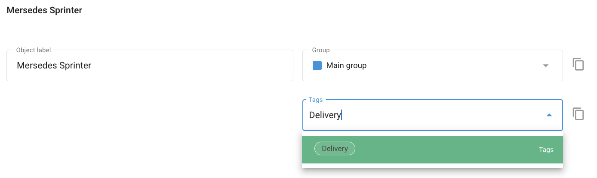

# Tags

A **“Tag”** is a label that allows for convenient and fast searching of the desired information. In Navixy, tags help you quickly locate information related to Places, Employees, Vehicles, and Tasks. You can create custom tags according to your needs, and a single object can have multiple tags.

## Using Tags for Search

To find objects with the same tag:

- Type the tag name into the search box.
- The system will display all search results associated with that tag.

Here are some examples:

- **Vehicles.** To find vehicles with specific tags such as “Dump truck” or “Leased” type the corresponding tag name into the search box in the vehicle list.
- **Employees.** If you have tagged employees based on their roles or projects, type the relevant tag, such as “Project Alpha” or “Field Technician,” into the search box to see all employees associated with that tag.
- **Locating a Task.** For tasks tagged with “Urgent” or “Maintenance,” entering these tags in the search box will help you quickly access all tasks marked as urgent or related to maintenance.

## Creating and Assigning Tags

You can create an unlimited number of tags to suit your organizational needs; however, you can assign a maximum of 5 tags to each GPS device or object.

### Method 1. In-context

To create or assign a tag to an object, simply type the tag label in the **Tags** field. If tags with similar starting inputs already exist, they will appear in a dropdown list from which you can select.

### Method 2. In the Tags Directory

Navigate to **Account Settings → Tags**:

- Click on the **“+”** button to add a new tag.
- Enter the desired tag name.
- Optionally, assign a color to the tag for better visual differentiation.

## Managing Tags

To manage your tags, navigate to **Account Settings → Tags**. This will bring you to the Tag Management screen where you can view, create, edit, and delete tags.

When you delete a tag, it removes the link from the associated object but does not delete the object itself.