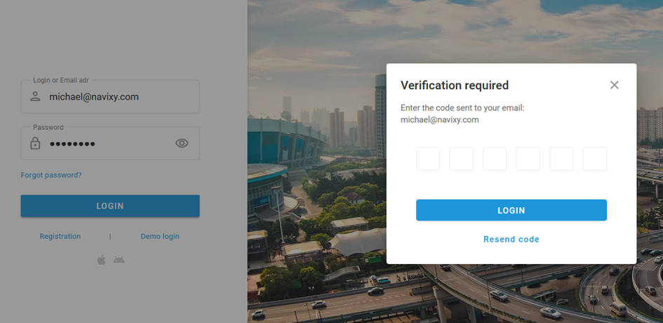

# Two-factor authentication

Navixy offers two-factor authentication (2FA) to bolster security across web and mobile applications. With increasing amounts of sensitive telematics data being managed, 2FA provides a vital layer of security by requiring both a password and a one-time passcode (OTP) sent via email. Your GPS/telematics service provider determines whether 2FA is enabled and configures the related settings.

**How it works**

The OTP is sent to your email and must be entered to complete the login process. The extra step ensures that even if your password is compromised, unauthorized users cannot access your account without having access to your email.

1. **Login with your password**: enter your username and password to start the login process.
2. **Receive a one-time code**: after verifying your password, you will receive a one-time passcode at the email associated with your Navixy account.
3. **Enter the code**: enter this OTP to complete your login.
4. **Access your account**: if the OTP is correct, you will gain access to your account.

Each passcode is valid for 5 minutes, limiting the opportunity for misuse. Additionally, you can request a new code if needed, but only once per minute to prevent abuse.
