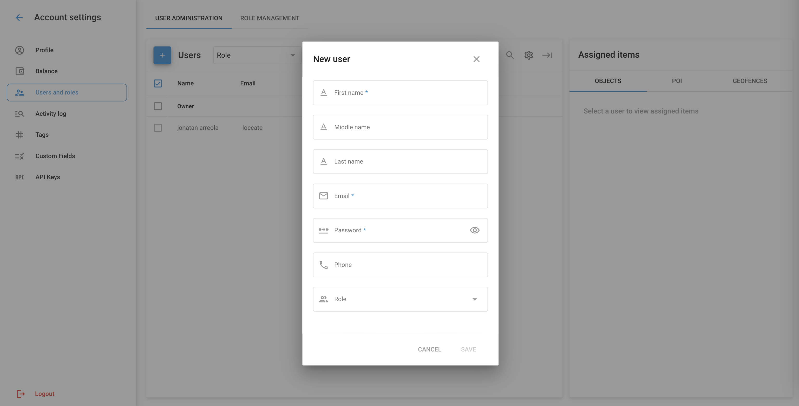

# User Administration

The users of the organization’s account include the Owner and Users. The Owner is the main account holder with full control and administrative rights, while Users are additional accounts with specific roles and permissions assigned by the Owner.

## Owner and users

The Owner in Navixy is the main account holder with full access and control over the platform. This account has the highest level of permissions and can perform all administrative tasks. The Owner has exclusive rights that cannot be transferred to other accounts, ensuring they maintain ultimate control over the account.

The owner can limit the operations available to users by:

* [Defining user roles](role-management.md) — specifying what actions users can perform;
* [Limiting user access to information](restrict-access.md) — controlling which GPS devices and data users can access.

Users are additional accounts granted access by the Owner. As a subordinate accounts, users cannot have specific owner rights, including:

* Creating, editing, or removing other users
* Editing GPS devices, Geofences or Places that are not accessible to them
* Limiting the Owner’s access to their account

### **View and Edit User List**

To add a new user or edit the list of users, navigate to Account Settings → Users and Roles in the main menu.

1. **Adding a New User**:

* Click the “+” button to add a new user.
* Fill in the required fields: First name, Middle name, Last name, Email, Password, Phone, and [Role](role-management.md).
* Click “Save” to create the new user.

3. **Editing User Information**:

* Select a user from the list to view their details.
* Modify the necessary fields and update the user’s information.
* Click “Save” to apply the changes.

4. **Assigning Items to Users**:

* After selecting a user, you can [assign specific objects, POIs, and geofences](restrict-access.md) to them.
* Choose the items from the respective tabs (Objects, POI, Geofences) and assign them to the user.
