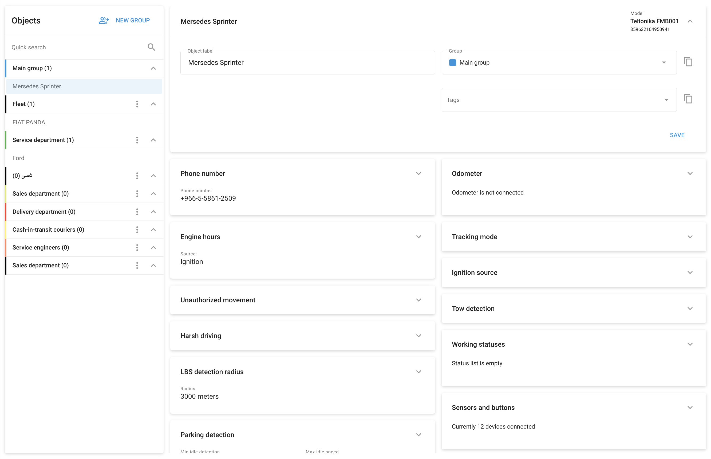

# Devices and settings

The **Devices and settings** section in Navixy is a comprehensive interface that allows fleet managers to configure and manage their tracking devices remotely. This section is essential for fine-tuning device performance, setting up sensors, and applying specific settings tailored to each asset within the fleet.

#### Key features and configuration options

1. **Object label:**
  - This is the label assigned to each device. It helps in easily identifying and managing devices within your fleet.
2. **Group:**
  - Objects can be grouped based on department, function, or any other categorization that suits your fleet's needs. This organization aids in managing multiple devices efficiently.
3. **Tags:**
  - Tags provide a quick and easy way to categorize and search for devices within the platform. This feature enhances the organization and retrieval of device information.
4. **Phone number:**
  - Displays the phone number associated with the SIM card installed in the device, which is crucial for communication and data transmission.
5. **Tracking mode:**
  - Configure the tracking behavior based on time, distance, or cornering. This allows you to fine-tune how frequently the device reports its position, balancing data accuracy with transmission costs.
6. **Parking detection:**
  - Set parameters to define when the vehicle is considered parked. This includes conditions like minimum idle time and maximum idle speed after movement stops.
7. **Harsh driving:**
  - Use the built-in accelerometer to detect and report harsh driving events such as rapid acceleration, harsh braking, or sharp cornering. These settings help monitor driver behavior and enhance safety.
8. **Tow detection:**
  - For devices that support tow detection, configure the sensitivity to ensure accurate detection while minimizing false alarms.
9. **Sensors and buttons:**
  - Map device inputs to connected sensors and define sensor types. This includes setting up fuel level sensors, applying calibration data, and configuring other connected inputs.
10. **Data forwarding:**
  - Forward data from the GPS tracking device to other servers in your preferred format or protocol. This feature is vital for integrating Navixy with other platforms, for compliance or for custom real-time data processing.
11. **Connection state:**
  - Adjust the connection status of the device, including the timeout settings for when the device is considered disconnected.
12. **Additional features:**
  - Depending on the device model, additional configuration options may be available, such as engine hours tracking, ignition source settings, unauthorized movement detection, and more.