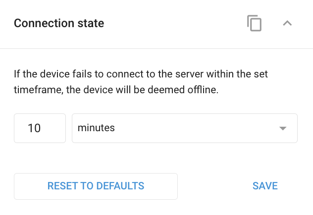

# Connection state widget

Connection state settings allow you to define the time interval after which a GPS device is considered disconnected if it stops transmitting data.

You may need to adjust these settings for devices that report data less frequently. This prevents them from being marked as offline, ensuring their status is shown accurately, especially for devices in power-saving modes.


You can monitor the [Connection state](../gps-tracking/objects-list/connection-state.md) of your GPS devices in the [Objects list](../gps-tracking/objects-list/) in the **Tracking module** of the web interface and the **X-GPS Monitor** mobile app. The connection state is displayed as a color-coded circle indicator within each device's widget, giving you a quick visual reference to assess whether the device is currently connected, not connected, or has lost its connection.


The connection state widget in **Devices and settings** has only one setting:

* **Time interval**: Set the duration after which a device is considered disconnected if it stops transmitting data. You can choose from minutes, hours, or days.

The **Reset to defaults** button reverts the settings to the default timeout if changes were made. Typically, this is 10 minutes, but it may vary depending on the device model.

## See also

* [**Connection state**](../gps-tracking/objects-list/connection-state.md) — explains the connection statuses of GPS devices on the platform, including their meanings, color-coded indicators, and how they help users monitor the real-time connectivity and data transmission of their devices.
