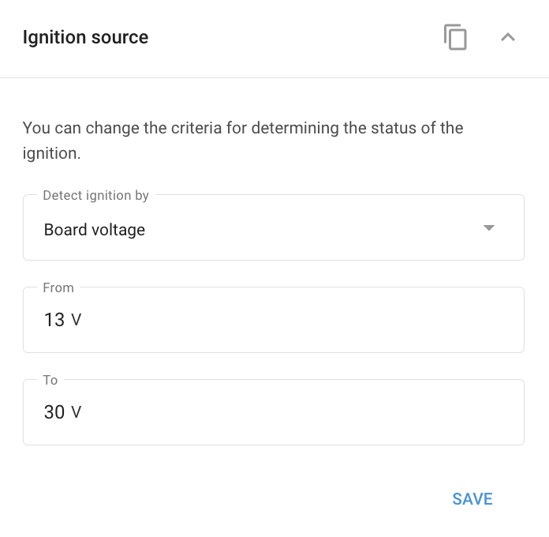

# Ignition source widget

Many advanced GPS devices offer the flexibility to determine the ignition status not only with a direct ignition cable connection but also by using a virtual ignition source based on readings from the motion sensor or the vehicle's onboard voltage.

## Virtual ignition source options

* **Voltage-based ignition detection**: When the engine is running, the vehicle's generator supplies power at a higher voltage than the battery to keep it charged. By monitoring this voltage increase, the device can accurately determine when the ignition is on.
* **Motion sensor-based ignition detection**: This option is useful when the device isn't connected to the vehicle's electrical system. The ignition status is inferred from the vehicle's movement. However, note that this method may also detect ignition when the vehicle is being towed, even if the engine isn't running.

## Virtual ignition source configuration

To configure the ignition source in Navixy, use the **Ignition source widget** in the **Devices and settings** module:

1. Select the desired ignition source from the drop-down list in the **Ignition source** **widget**.
2. If using the vehicle's on-board voltage, specify the voltage range within which the ignition is considered "on."

This configuration allows for flexible and accurate monitoring of the vehicle's ignition status, adapting to different installation scenarios.

#### Example configuration

The **Ignition source widget** allows users to choose the criteria for determining the ignition status. You can select from the following options:

1. **Board voltage**: Detects ignition based on the vehicle’s on-board voltage, useful when the voltage increases as the engine runs.
2. **#1 input state**: Uses the status of a specific input, typically an ignition cable, to determine if the ignition is on or off.
3. **Movement**: Detects ignition based on vehicle movement, ideal for scenarios where the device isn’t directly connected to the vehicle’s electrical system. However, this method may also register ignition during towing or other non-engine-related movements.
