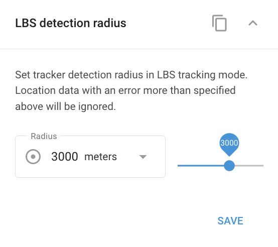

# LBS detection radius widget

The **LBS (Location-Based Service) detection radius** determines how far the system will search for signals from cellular base stations or Wi-Fi points to pinpoint a device's location. This setting is crucial for ensuring accurate location tracking based on the environment where the device operates.

- **Rural areas**: In rural locations with fewer base stations, it's advisable to increase the LBS radius. This allows the system to utilize more distant base stations, improving the chances of locating the device.
- **Urban areas**: In cities with a high density of base stations, the LBS radius should be kept smaller. The proximity of multiple base stations provides sufficient signals for accurate location tracking, so a smaller radius will help maintain higher precision.

Adjust the LBS detection radius based on the device's operating environment to balance between accuracy and signal coverage.

In Navixy, LBS locations are displayed on the map as circles. The center indicates the estimated location, while the radius shows the possible inaccuracy. A smaller circle suggests higher accuracy, typically seen in urban areas, while a larger circle indicates more inaccuracy, common in rural areas.