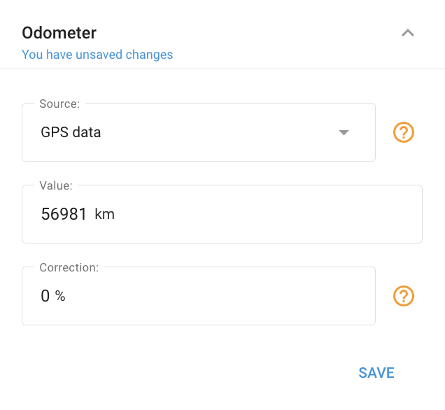

# Odometer widget

The **Odometer widget** allows you to monitor a vehicle’s mileage in real-time. The mileage readings can be derived from data received via a GPS tracking device or the CAN bus. Additionally, the odometer function integrates with the [Fleet maintenance](../../fleet-management/maintenance.md) feature, enabling you to schedule service works for a vehicle and receive timely reminders.

## Odometer activation

To activate the odometer:

1. Open the “Devices and settings” section, select the desired object, and navigate to the Odometer widget.
2. Click the "Add odometer" button.
3. Choose the appropriate data source. Additional sources may become available after creating a mileage measurement sensor.
4. Set the initial mileage value.
5. Press "Save."

## Correcting odometer

- **Correction factor.** You can set a correction factor to automatically adjust the odometer readings either upward or downward. Enter a percentage value in the “Correction” field. A positive value will increase the odometer readings, while a negative value will decrease them based on the input sensor.
- **Updating value.** You can also update the odometer value whenever necessary. Previous odometer values can be viewed by generating the “Report on all events” in the Reports app.
- **Quick access in the Object widget.** For quick access, the Odometer value can be accessed and configured in the dedicated section of the [Object widget](../../gps-tracking/objects-list/object-widget.md).

## Changing odometer sources

The types of odometer sources you can use depend on your specific device model. Understanding and utilizing multiple sources can enhance the accuracy of your vehicle's mileage tracking.

To add additional odometer sources:

1. **Create a new measurement sensor:** Depending on your device's capabilities, you can create sensors such as CAN Mileage or hardware mileage. These sensors collect data directly from your vehicle's systems, ensuring precise mileage readings.
2. **Integration with the Odometer widget:** After creating the sensor, it will appear as an option in the Odometer widget within the Navixy platform. This allows you to choose the most appropriate source for your mileage data.

By leveraging different odometer sources, you can improve the reliability of your mileage tracking, which is especially useful for maintenance scheduling and accurate reporting. Understanding the different types of sources and how to integrate them into your system is key to optimizing your telematics setup.