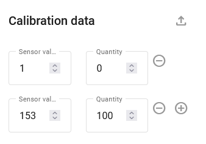

# Measurement sensors

To add a measurement sensor, click  and select **Measurement sensor** in the pop-up menu.

Configure the required sensor parameters:

* **Label**: Enter the name of the sensor in the system. It can be any name of your choice.
* **Parameter**: Choose the input to which the sensor is connected (number and types of inputs available are determined by device model).
* **Sensor type**: Choose the sensor type.
* **Units**: Choose the measurement units. You can select available units from the drop-down list or specify custom ones.
* **Additional parameters**: Only appear when the specific type of sensor is chosen. For example, for a fuel sensor, you can adjust the accuracy and threshold parameters for use in drain detection.

### Adding calibration data

After all parameters are set, you must enter the calibration data. Learn more about this process in the [Sensors setup and configuration guide](https://app.gitbook.com/s/IgDb43gtyXcm1Av4h1np/vehicle-telematics-technology/fuel-management/fuel-control-in-navixy/sensors-setup-and-configuration).

1. First, create a corresponding list of raw values of the measuring sensor (e.g., volts) and the actual value that the sensor is measuring (e.g., liters).&#x20;
2. Click  to add rows to the table.
3. In the created line, fill in the **Sensor value** field with the obtained value and the **Quantity** field with the corresponding measured quantity.
4. Click  to delete a row.

5. Click  to upload the calibration table file.

Click **Advanced settings**   to access additional settings, such as **Ignore values** and **Multiplier**.

* **Ignore values:** Allows you to adjust a "valid" range of raw measurement values. Any values above and below the range will be omitted. For example, this can be used for skipping the fuel sensor's zero values when the ignition is off.
* **Multiplier:** Used to correct raw data values from the sensor by multiplying them by some number.

#### **Filtering order**

Please keep in mind that the **Less than** and **More than** restrictions are applied before the **Multiplier.** The entire order of filtering:

1. Ignore values (**Less than** and **More than**)
2. **Multiplier**
3. **Calibration table**

For example, incoming raw value is 1000, boundaries are 3000 and 100, multiplier equals 0.2.

In this case, the value passes through the min/max filter, is multiplied by 0.2 and becomes 200. This is where the calibration table is applied. The table takes 200 as the sensor value (source value) and converts it into the target quantity value to be displayed in the user interface facilities. If an incoming data packet contains sensor data with a value more than 3000, the value doesn't pass the boundaries and is discarded. In this case, no multiplication or calibration apply.

The numbers here are given as a sample. You may have other settings, but the principle remains.

#### **Graph**

As you enter data into the table, the graph will be plotted.

To confirm your changes, click **Save**.

#### **Raw sensor data storage**

By default, raw sensor data is stored on the platform. This allows users to recalibrate the represented sensor data of the past tracker sensor history. Whenever the multiplier, maximum ("less than"), minimum ("more than"), or calibration table data are changed, the platform recalculates the history and represents the data according to the new settings. The advantage of this approach is that the user can always recalibrate the table, change the sensor settings, and build a report based on the recalculated data "on the fly".

