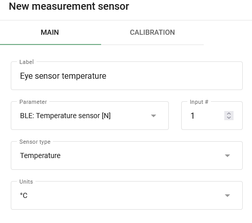

# Eye sensor configuration

As one additional example of the use of virtual sensors, we would like to introduce you to [Teltonika Eye Sensors](https://teltonika-gps.com/products/accessories/sensors-beacons/eye), that are capable of recording valuable data such as temperature, humidity, motion and magnet condition. Motion state information, in particular, was previously unavailable but can now be accessed through the use of virtual sensors. If you're interested in learning more about these sensors and how to set them up to retrieve important insights, we're happy to provide you with detailed instructions.

### Sensor configuration on a device

To configure data transmission from the sensor to the platform, we recommend using the [Teltonika Configurator](https://wiki.teltonika-gps.com/view/Teltonika_Configurator_Introduction). Make sure to [download the version](https://wiki.teltonika-gps.com/view/Teltonika_Configurator_versions) that corresponds to the current firmware and device model. Once you've downloaded and launched the configurator, navigate to the system settings and select the Codec 8 Extended data protocol.

\[

]\(https://www.navixy.com/wp-content/uploads/2023/03/1-4.png)

Enabling Codec 8 Extended in the Teltonika configurator.

In the Bluetooth 4.0 section, we recommend disabling the Non-Stop Scan feature and setting the "Update Frequency" and "Scan Duration" to every 30 seconds. By adjusting these settings, you will experience optimal results for BLE scanning, ensuring reliable and accurate data collection.

\[

]\(https://www.navixy.com/wp-content/uploads/2023/03/2-4.png)

Scan frequency for BLE sensors.

Next, select the Connection # and set the operating mode to Advanced. This will provide access to detailed settings for the sensor. Look for the buttons located in the top right-hand corner and select the Preset list. This will enable you to streamline the setup process for the sensor.

\[

]\(https://www.navixy.com/wp-content/uploads/2023/03/3-2.png)

Setting the Advanced mode for the sensor and the location of the Preset list button.

Once you click the preset list button, a new window will open displaying a selection of available sensors. Simply choose the one that you're currently using, such as the EYE SENSOR. This table will automatically configure all the necessary settings. Afterwards, navigate to the I/O tab to configure data transmission from these sensors within your device packets.

To configure data transmission from these sensors within your device packets, navigate to the I/O tab. Here, you will need to set the appropriate parameters for your desired settings. For example, if your sensor connection number is 1, configure the parameters with the same number. In most cases, it's best to set the priority to Low for parameters that need to be monitored on the platform. It's also important to ensure that all other settings are left at their default values, unless you have changed something previously. In such cases, the recommended settings are as follows:

* Priority = Low
* Low level = 0
* High level = 0
* Event Only = No
* Operand = Monitoring

\[

]\(https://www.navixy.com/wp-content/uploads/2023/03/4-2.png)

Setting up the sending of sensor data in device packets.

### Configuration on the platform

#### Motion status sensor

The reading of this sensor is fully configurable with virtual sensors with [the Bit index calculation method](https://squaregps.atlassian.net/wiki/spaces/USERDOCSOLD/pages/2909013892/Virtual+sensors#Bit-index). The motion state data comes in bit 16 of the BLE 1 Custom 1 field. Configuring the motion state will require the following steps:

1. Create a virtual sensor and specify its name.
2. Select the [appropriate AVL ID](https://wiki.teltonika-mobility.com/view/Full_AVL_ID_List#BLE_Sensor_I.2FO_elements) as the input. For example, for BLE 1 Custom 1, use the number 331.
3. Define the Bit Number that corresponds to motion state data. In this case, Bit 16 of the BLE 1 Custom 1 field should be selected.
4. Define the state names as needed. For example, "Standstill" and "Moves" can be used.
5. Specify the corresponding values, where 0 indicates no movement and 1 indicates movement recorded by the sensor.

Setting up the Virtual Sensor to read the Eye sensor's motion status.

At this point, you have successfully retrieved the current motion state. However, keep in mind that information can only be obtained in reports and rules if the motion state is set as ignition.

Getting reports and rules for non-ignition virtual sensors aren’t supported at this moment.

#### Temperature and Humidity Sensors

Setting up these sensors is similar to configuring standard [measuring sensors](../measurement-sensors/). Let's take a look at an example setup for each of these sensors:

The humidity is transmitted by the device in %.

* Specify the desired sensor name.
* Select the appropriate input BLE: Humidity \[N] and specify its number.
* Select the sensor type Custom.
* Specify the unit of measure in %.
* Other settings are not required.

Setting up the BLE humidity sensor.

The temperature is transmitted by the device in °C.

* Specify the desired sensor name.
* Select the appropriate input BLE: Temperature \[N] and specify its number.
* Select the sensor type Temperature.
* Specify the unit of measure in °C.
* Other settings are not required.

Setting up the BLE temperature sensor.

Using sensor readings, you can generate a Measuring Sensors report that provides useful insights into the data collected by the sensor. Additionally, you can track readings by configuring alerts using the "Parameter in Range" rule, which allows you to receive notifications when specific parameters fall outside of predetermined ranges.

In addition, virtual sensors can be created and provide understandable names for receiving sensor values in widgets. To achieve this, use [the Value in Range calculation method](https://squaregps.atlassian.net/wiki/spaces/USERDOCSOLD/pages/2909013892/Virtual+sensors#Value-in-range). This will allow you to customize the sensor data being displayed and make it easier to interpret the information being presented by the sensor.

#### Magnet state sensor

Configuring magnet state sensors is a simple and straightforward process. In fact, no additional configuration is required beyond connecting the sensors to the platform. The magnet state data is transmitted to the platform as status fields and is displayed as soon as it is received from the connected device.

Using virtual sensors with the [Source value calculation method](https://squaregps.atlassian.net/wiki/spaces/USERDOCSOLD/pages/2909013892/Virtual+sensors#Source-Value), you can customize your status field values to be displayed as either "open" or "closed" and give them names that are easily recognizable.

By configuring the "Status Field Value" rule, you can track the status fields and receive alerts when specific events occur.

Example of setting the magnet state sensor with its values and name.

You've successfully obtained information from the Eye sensor and it's now at your fingertips. You're now equipped to easily track this valuable data.
