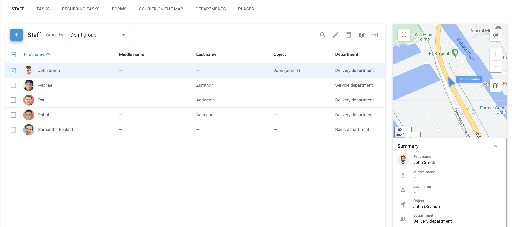

# Staff

The **Staff** section in the **Field service** application is specifically designed to manage and organize information about your field staff effectively. This tool ensures that you have everything you need to coordinate your mobile workforce efficiently.

To access the Staff section, log in to the Navixy platform and select "Field service" from the main menu. From there, click on the "Staff" tab. This section provides an overview of all employees in your organization, displaying their essential information in a list format.

## List of employees

The employee list is designed for fast and convenient management of your workforce. It is especially useful in conjunction with the "[Tasks](tasks.md)" application, where you can easily assign tasks, communicate with employees, and monitor their progress.

Each employee's information includes the following details:

* **Employee name:** Basic identification information for each employee.
* **Photo:** A profile picture for easy visual identification.
* **Phone and email:** Contact details that allow for quick communication directly through the app.
* **Location address:** The employee's primary location, which may differ from the office or branch address.
* **Driver license information:** Essential for employees who drive as part of their job.
* **Department:** Indicates the department or branch to which the employee belongs.

The list view can be customized by adding or removing columns to display the most relevant information, such as driver license details, employee ID, hardware key, and more.

### Adding a new employee

To add a new employee to the system, follow these steps:

1. **Click the Add Button:** Located at the top left corner of the "Staff" section.
2. **Fill in Employee Details:** Enter the employee's name, contact information, location, and any other relevant details.
3. **Assign to a Department:** Select the appropriate department or branch from the dropdown menu.
4. **Save the Information:** Once all the details are entered, click "Save" to create the employee record.

### Importing employees

To efficiently add multiple employees to your Field service application, follow these steps:

1. **Open the Staff section**: Go to the “Staff” section in the Field Service application.
2. **Start the Import Process**: Click the “+” button and select “XLS” from the dropdown.
3. **Upload the Excel file**: Download the example file and input the information you need. Once done, click “Browse” to select your Excel file (XLS, XLSX, or CSV). Ensure the “Use file headers box” is checked if your file includes headers.
4. **Review and Continue**: Verify required fields like “First Name” and additional fields. Click “Continue” to complete the import.

This process quickly adds employees to your directory, saving time and ensuring accuracy.

## Managing employee records

Once employees are added to the system, you can easily manage and update their information as needed. The Staff section provides a summary view of each employee's details, with options to:

* **Edit employee information:** Update details such as contact information, department, or assigned tasks.
* **View employee location:** See the real-time location of employees who are assigned to a specific object or vehicle.
* **Customize employee list view:** Adjust the columns displayed in the list to show the most relevant information for your operations.
