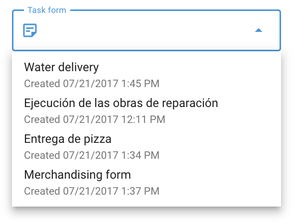

# Forms

**Forms** are electronic documents that can be attached to tasks, allowing employees to submit task results directly through the **X-GPS Tracker** mobile app. These forms can include various types of fields such as text fields for client orders, inspection reports, and media sections for uploading photos and videos.



## Getting started

### Create a form

To begin using forms in Navixy:

1. Open the **Field service** module from the main menu.
2. Click on the **Forms** tab to open the form management interface.
3. Start the form creation process by clicking the **+** icon.
4. Choose the necessary components (e.g., text fields, checkboxes, dropdowns, date, rating, image, file attachment, signature, and section separators) from the left side of the screen. Customize the form to suit your company's specific workflow and tasks.

This process allows you to create as many forms as needed, ensuring they are tailored to the tasks your employees perform.

Two toggles are available when creating a form:

* **"Use by default when creating a task"**: If enabled, this form will automatically be attached to new tasks unless another form is selected. In the form list, this form will be marked with a “star” sign.
* **"Submit form only in the zone"**: If enabled, the form can only be submitted when the employee is within a predefined geographic zone, ensuring that task reporting occurs at the correct location.

After saving, created forms can be accessed in the form list.

### Attaching a form to a task

To attach a form to a task, follow these steps:

1. Open the Task creation window: navigate to Tasks tab and click the "+" button to create a new task.
2. Under the “Task form” field, choose the form you created earlier from the dropdown list.
3. Provide other task details, such as selecting the employee responsible for completing the task.
4. Finalize the task creation by clicking "Save."

The selected employee will receive the task with the attached form in the X-GPS Tracker mobile app, ensuring all necessary documentation is available during task execution.

### Completing a form in X-GPS Tracker

Employees are required to fill out forms during or after completing a task. Here's how they can complete and submit a form:

1. Open X-GPS Tracker Mobile App on a mobile device.
2. Switch to the "Tasks" section to view the list of assigned tasks.
3. Select the task that needs to be completed.
4. Click on the form within the task description and fill in all mandatory fields.
5. Once all fields are filled, the form is automatically sent to the monitoring service, marking the task as completed.

### Configuring notifications for form submission

To ensure timely notifications when a form is submitted, configure alerts by following these steps:

1. Navigate to the [Rules and notifications](../events-and-notifications/) section in the platform.
2. Start creating a new notification rule by clicking the "Add rule" button.
3. Select the objects (e.g., vehicles, employees) to which this rule will apply.
4. Choose [Task performance](../events-and-notifications/scheduling-and-dispatching/task-performance.md) from the list of events and proceed.
5. In the “Rule options” section, tick the “Form submitted” checkbox.
6. On the “Notifications” tab, choose how you want to be notified (e.g., SMS, email).

These settings ensure you stay informed about task progress and form submissions in real time.

### Viewing completed forms

You can review and compare completed forms to assess employee performance and task outcomes:

1. Navigate to the “Field service” application.
2. Click on the "Forms" tab to view all available forms.
3. Hover over the form you wish to review and click “Submissions” on the right side.
4. Choose the specific form submission from the list at the bottom.

**Submissions functionality:**

* **Download forms:** Export the forms in Excel, CSV, or PDF formats.
* **Filtering:** Use filters to narrow down submissions based on parameters like task creation date or employee name.
* **Table customization:** Add or hide columns and form fields to focus on the most relevant data.

### Task form data report

The “Task form data” report provides insights into employee performance based on completed forms. To generate this report:

1. Go to the [Reports](../reports/) section.
2. Click on the “Create report” button.
3. Choose the “Task form data” option.
4. Tick the relevant objects (e.g., employees, tasks) for which you need the report.
5. Specify the timeframe for the report.
6. Click the “Build report” button to generate the report.

**Report details:**\
The report shows form statistics, including the frequency and types of components selected. This data helps you evaluate employee performance and task outcomes more effectively.
