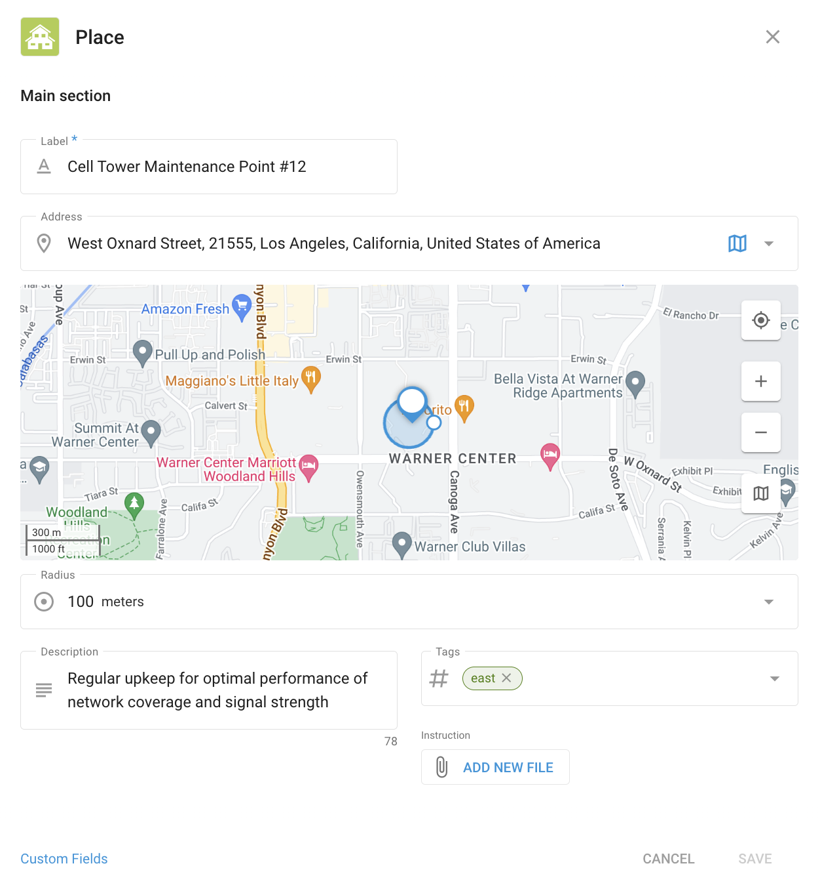

# Places — Field service

**Places** in the **Field service** application can be used for organizing and managing key locations that your field staff need to visit, such as customer addresses, company sites, or other important points of interest. This helps streamline task assignments, optimize routes, and ensure efficient field operations.

Upon entering the Places section, you will see a list of all available places along with their details, including custom fields you've added.

## Creating and Managing Places

When you create a new Place in Navixy's Field Service application, you can enter all the necessary information to make it easy to identify and manage. Start by giving the Place a name, specifying its address or selecting its location on the map. You can also add details like a description, tags, and any instructions relevant to the site.

### Custom Fields

Custom fields let you add extra details that aren't covered by the standard options. These fields are tailored to your business needs, ensuring you have all the important information at your fingertips. For example:

* **Equipment type**: Record what equipment is at the site, like "4G antenna" or "Power generator."
* **Maintenance schedule**: Note how often the site needs maintenance, such as "Monthly" or "Quarterly."
* **Access code**: Store any security codes or instructions needed to access the site.
* **Manager contact**: Include the contact details of the person responsible for the location.

Using custom fields ensures that all the necessary information is organized and easily accessible, making field operations more efficient.
