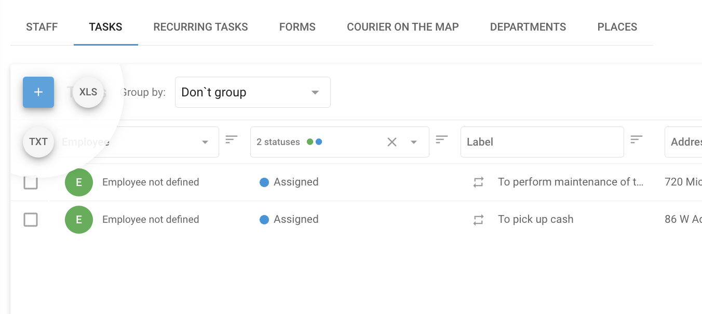

# Tasks

A **Task** in Navixy refers to a specific assignment or job that needs to be completed by an employee or field worker. It includes detailed instructions about what needs to be done, where it should be done, and within what timeframe. Tasks can range from simple, one-off assignments like delivering a package to a single location, to more complex operations like visiting multiple checkpoints along a route to perform inspections, installations, or other services.

Tasks are essential for managing and coordinating field operations, ensuring that employees are clear about their responsibilities, and allowing managers to monitor progress, optimize routes, and ensure that all jobs are completed efficiently.

## How to create a task

1. Navigate to **Tasks** tab in **Field service** module
2. Click the **“+”** button to begin the process of creating a new task.
3. **Define the task name:**

* Enter a descriptive task name that helps identify the purpose of the task. This could be the name of the customer or a brief description of the task, such as "Install Equipment" or "Inspect Communications."

4. **Specify the task address:**

* Enter the task address manually, select a point on the map, or use geographic coordinates. This will define the primary location for a single task or the first checkpoint for a route task.

5. **Set the task time:**

* Define the date and time range during which the employee should complete the task. This ensures that the task is completed within the designated timeframe.

6. **Add Checkpoints for Route tasks:**

* To create a route task, click “Add New Checkpoint” after setting the initial location. Each checkpoint represents an additional stop along the route, and they will be automatically connected in sequence. The employee must complete these checkpoints in the specified order.

7. **Assign the task to an Employee:**

* Select the employee who will be responsible for the task. If necessary, you can assign the task later using the task list or utilize additional tools provided in the interface to make the assignment easier.

8. **Additional task details:**

* **Task description:** Provide any additional details that might be useful to the employee, such as contact information or special instructions.
* **Form:** Select the form that the employee needs to complete while performing the task. Forms can be filled out directly in the X-GPS Tracker app.
* **Tags:** Add relevant tags to the task to facilitate easy searching and categorization later.
* **Order ID:** Assign an order ID that the client can use to track the status of the task via the “Courier on the Map” feature.

9. Click **“Save”** to finalize and send the task to the employee’s mobile device.

### Single and Route tasks

* **Single tasks:** These are straightforward tasks where the employee visits a single location to perform the assigned duties. The task is completed once the employee has arrived at the specified address and performed the required actions.
* **Route tasks:** These involve multiple checkpoints that the employee must visit in a specific order. This type of task is ideal for situations where the employee needs to visit several locations along a planned route, such as deliveries or inspections.

The interface is designed to be intuitive, allowing managers and dispatchers to quickly create and manage both single and route tasks with ease, ensuring that all field operations are handled efficiently and effectively.

### Route optimization feature

Navixy’s **Route Optimization** feature helps couriers deliver packages efficiently by determining the best sequence for visiting multiple addresses across a city. It considers the location of each address, specific delivery time windows, and the starting point of the task to create the most optimal route.

#### Key benefits:

* **Fuel savings:** Minimizes travel distance, reducing fuel consumption.
* **Faster deliveries:** Optimizes the sequence for quicker task completion.
* **Enhanced productivity:** Automates route planning, allowing couriers to focus on deliveries.

The platform can optimize up to 25 points in a single route task, ensuring all deliveries are made on time and in the most efficient order.

## Tasks import

When managing a large workforce or numerous tasks, importing tasks from an Excel file is more efficient than manually creating and assigning them one by one. This is particularly useful when tasks are generated by external systems such as CRMs.

### Import from Excel file

While developers can use an API for task import, there’s a simpler method available—importing tasks from an Excel file. Data should be presented in XLS, XLSX, or CSV spreadsheet formats.

#### How to import tasks from an Excel file

1. **Start the import process:**

* Hover your mouse over the “+” button in the tasks section.
* Click on the **XLS** option.

2. **Tasks import window:**

* In the "Tasks import" window, you can download a **File example** template.
* Set task parameters as needed.

3. **Required fields:**

* Fields marked as "Required" must be filled in for the import to succeed. The system will reject the import if any required fields are missing.

4. **Address vs. Coordinates:**

* You can specify an address instead of coordinates; the system will automatically determine the location.

#### Import settings

In addition to individual task settings, you can configure the following global settings:

* **Default Radius:** Defines the permissible deviation from the specified location. If the employee (or vehicle) arrives within this radius, the task will be considered completed even if they don’t reach the exact location.
* **Auto-Assign Tasks:**
  * **Ignore Address:** Tasks are evenly assigned to all employees.
  * **Use Employee Address:** Tasks are assigned based on proximity to the employee's home address.
  * **Use Department Address:** Tasks are assigned according to the distance from the employee's department._Note:_ The addresses of departments and employees should be specified on their respective profile cards.

By using these settings, you can streamline the task assignment process, ensuring tasks are efficiently distributed and completed.

### Import from TXT file

#### How to import Tasks from a TXT file

1. **Start the Import Process:**

* Hover your mouse over the **“+”** button in the tasks section.
* Click on the **TXT** option.

2. **Tasks import window:**

* You will see the “Tasks import” window, which contains a large field.
* Paste the task list from your spreadsheet directly into this field using clipboard (copy-paste).

This process allows you to efficiently import multiple tasks at once, streamlining your task management workflow.
