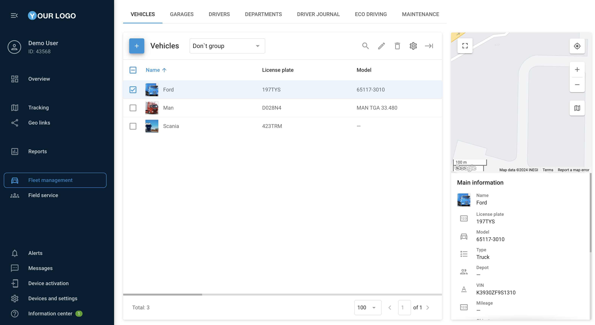

# Fleet management

## Overview

The Fleet Management section within Navixy platform offers streamlined management of your organization's vehicles, providing detailed insights and control over all aspects of your fleet, from fuel consumption to vehicle specifications, to enhance your operational efficiency.

All the information about vehicles of your organization is in **Fleet management**.

It makes your work easier and much more convenient. For example, you enter data on fuel consumption per 100 km (or miles), and monitoring system will calculate fuel consumption based on this indicator to compare it with the actual readings.

### Vehicles

The **Vehicles** tab displays information about the user's vehicles as a table and an additional visualized menu on the right side of the screen.

In this tab it is possible to add and edit vehicles, attach them to the depots and link them to trackers activated on the platform.

<figure><figcaption></figcaption></figure>

### Adding a new vehicle

Press  button to add a new vehicle.

Button  allows adding an image of the vehicle.

The **Main** tab contains all main information about the vehicle and additional information, such as tags or text notes.

The **Specification** tab is required to fill in additional information about the vehicle, such as vehicle dimensions, size and number of wheels in the wheelbase, as well as the permitted speed, availability of a trailer and its year of manufacture.

The **Fuel** tab is used to fill in information about the type of fuel, tank capacity and consumption rate per 100 km, which is necessary for further calculations in fuel reports.

The **Insurance** tab allows entering the number of insurance with the date of expiration.

<figure><figcaption></figcaption></figure>

### Garages

Information on fleet owners is available on the **Garages** tab.

<figure><figcaption></figcaption></figure>

### Adding a new garage

Press  button to add a new garage.

The popup contains its name, address, name of the mechanic and name of the dispatcher. This data can be used for more convenient and efficient task management.

<figure><figcaption></figcaption></figure>
