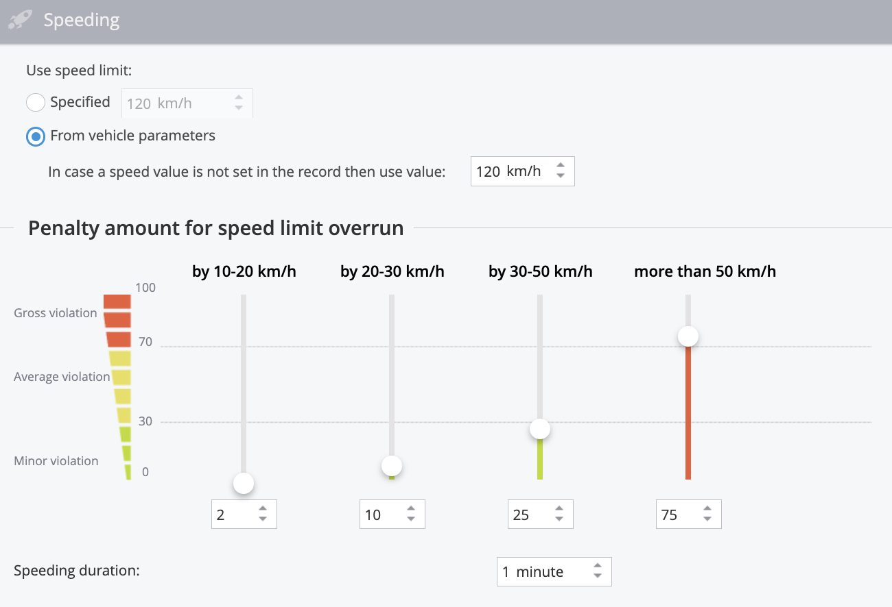

# Eco Driving

The **Eco Driving report** in Navixy is a powerful tool designed to analyze and improve the driving behavior of your fleet's drivers. By assigning a score between 0 and 100 to each driver, the system provides a clear metric of driving performance based on penalty points accumulated from various driving violations. These violations are assessed according to their frequency and severity over every 100 kilometers driven, ensuring a comprehensive evaluation of each driver’s habits.

To access the Eco Driving report, navigate to the **Fleet Management app** and select the **"Eco-Driving" tab.**

## Understanding penalty points

Penalty points are a key component of the Eco Driving report, allowing you to gauge the impact of different types of violations on driver performance. The system tracks three main categories of driving violations: speeding, harsh driving, and excessive idling. Each violation type contributes to the overall score, with lower scores indicating more frequent or severe violations.

## Customizing the report

The Eco Driving report can be tailored to fit your specific needs, enabling you to set your own criteria for what constitutes a violation and how severe it is. You can assign different penalty points to various infractions, allowing you to prioritize certain aspects of driving behavior according to your organization’s standards.

**Key features**

* **Speeding violations:** Monitor instances where drivers exceed set speed limits, with penalties adjusted based on the extent and duration of the speeding.
* **Harsh driving:** Track aggressive maneuvers such as harsh braking, acceleration, or sharp turns, with customizable thresholds based on your fleet's devices.
* **Excessive idling:** Identify and penalize drivers for long periods of idling, which can waste fuel and reduce vehicle efficiency.

Calculations in the Eco Driving report

The Eco Driving report in Navixy is designed to evaluate and score the driving behavior of employees based on a set of criteria. The score for each driver ranges from 0 to 100 and is influenced by penalty points assigned for various violations.

Below are detailed explanations of how these penalty points are calculated and how they affect the overall driver score. These detailed calculations and reports allow fleet managers to assess driving behavior comprehensively, promoting safer and more efficient driving practices across their fleet.

#### Speeding violations

Speeding violations are penalized based on how much a driver exceeds the speed limit and for how long. You can either set a universal speed limit or use vehicle-specific speed limits.

**Calculation of speeding penalties:**

The penalty points for speeding are calculated using the following formula:

`Time Factor × Penalty Points = Total Penalty Points`

For instance, if a vehicle exceeds the speed limit by 21 km/h for a duration of 1 minute and 37 seconds, the system will exclude the first minute (not penalized) and calculate the penalty for the remaining 37 seconds. If the penalty for exceeding the speed limit by 20-30 km/h is set at 10 points, the formula would be:

`0.616 × 10 = 6.16 penalty points`

#### Harsh driving violations

Harsh driving events, such as rapid acceleration, sudden braking, and sharp turns, are recorded by GPS trackers equipped with acceleration sensors. The severity of each harsh driving event can be customized, and penalty points are assigned accordingly.

**Calculation of penalties for harsh driving**

Each harsh driving event automatically incurs a preset number of penalty points. These points are deducted from the driver’s overall score based on the frequency of these events.

#### Excessive idling violations

Excessive idling is monitored when a vehicle remains stationary with the engine running for an extended period. Penalty points are assigned based on how long the vehicle idles beyond a predefined threshold.

**Calculation of penalties for idling**

For example, if a vehicle idles for 8 minutes and 14 seconds and the threshold is set at 5 minutes, the penalty calculation would exclude the initial 5 minutes and only penalize the remaining 3 minutes and 14 seconds. If the penalty for idling is set at 5 points per minute, the calculation would be:

`3.23 × 5 = 16.17 penalty points`

#### Total for the period page

The "Total for the period" section provides an overview of all penalties and scores for each driver or vehicle over the selected period. It includes a graphical representation and detailed tables.

**Graph of penalty amount**

This graph displays the cumulative penalty points, color-coded by the type of violation (red for speeding, blue for harsh driving, and green for idling).

**Rating graph**

This graph shows the scores of each driver or device, calculated per 100 kilometers traveled. Scores are adjusted based on penalties, providing a clear understanding of each driver’s performance.

#### Tables with detailed information

Each type of violation is further broken down into detailed tables, offering insights into specific events such as speeding, harsh driving, and idling.

**Speeding table**

This table lists all speeding events, with penalty points assigned based on the most severe speed exceeded during the event.

**Harsh driving table**

Events recorded within a 5-minute window are grouped, and penalties are calculated for each group.

**Idle intervals table**

This table provides details on each instance of idling with the engine running, including the duration and corresponding penalty points.

## Analyzing results

The Eco Driving report provides both graphical and tabular data, making it easy to see at a glance which drivers are performing well and which may need further training. The graphical interface uses color-coding to distinguish between different types of violations, while the tables offer detailed breakdowns of penalties by driver or device.

### Settings and customization

You can fine-tune the Eco Driving report to focus on specific time periods, days of the week, or times of day that are most relevant to your operation. Additionally, the system allows you to choose whether to generate reports based on individual drivers or the vehicles they use, providing flexibility depending on your tracking preferences.

### Scheduling the Eco Driving report

The Eco Driving report in Navixy can be scheduled to run automatically at specified intervals, allowing you to regularly monitor and evaluate driving behavior without manual intervention. This feature ensures that you receive consistent and timely insights into your fleet's performance, helping you to identify trends and address issues proactively.

To schedule the report, navigate to the "Schedule" tab within the Eco Driving section, set the desired frequency, and specify the recipients. The system will generate the report according to your settings and deliver it directly to your inbox or make it available for download on the platform.

### Practical applications

The Eco Driving report is particularly useful for companies that need to monitor driver behavior closely, such as those in passenger transport, hazardous material transport, or emergency services. By analyzing this report, organizations can extend vehicle lifespans, reduce the likelihood of accidents, and ensure that vehicles are used efficiently and responsibly.

Overall, the Eco Driving report is an essential feature for any fleet manager looking to maintain high standards of driver safety, efficiency, and regulatory compliance.
