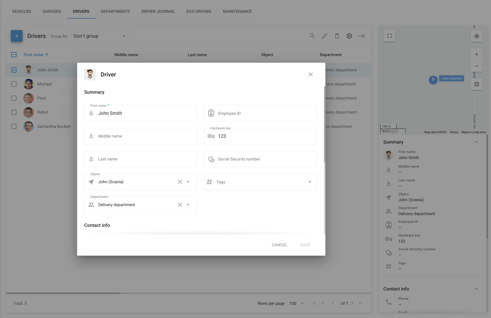

# Drivers

The **Drivers** section in the Navixy platform is designed to help fleet managers efficiently manage and monitor their drivers. This section allows you to create and manage detailed driver profiles, linking them to specific objects in your fleet. By maintaining comprehensive driver records, you can streamline fleet operations, improve driver accountability, and enhance overall fleet performance.

## Driver list

In the **Drivers** tab, you can view a list of all drivers associated with your fleet. Each driver profile contains essential information, such as the driver's name, assigned object, department, and other critical details like their employee ID, hardware key, and contact information. This data is displayed in a table format for easy access, and a visual summary is provided on the right side of the screen for quick reference.

### Adding a Driver

To add a new driver, click the **Add driver** button. This opens a form where you can enter all relevant details about the driver, including their contact information, location, and driver license details. You can also link the driver to a specific vehicle or department within your organization. Additionally, you can upload a photo of the driver to enhance their profile.

### List customization

By clicking on the **Columns** option, you can select which fields you want to be visible, such as the driver's first name, last name, object, department, and more. This feature provides flexibility in how you view and manage driver information, allowing you to tailor the interface to your specific needs.

### Sidebar with detailed information

When you select a driver from the list, a summary of their profile appears on the right side of the screen. This summary includes key details such as the driver’s name, associated device, department, employee ID, hardware key, and social security number, if applicable. Additionally, it provides contact information, including phone numbers and email addresses, which are crucial for maintaining clear communication with your drivers.

## Driver identification

Efficient driver identification is essential for accurate fleet management, ensuring that each driver is correctly assigned to the appropriate vehicle. Navixy offers robust solutions for both automatic and manual driver identification, catering to the diverse needs of fleet managers.

### Automatic driver identification

Navixy supports automatic driver identification through the use of electronic keys, such as an i-Button or RFID devices. This feature allows for seamless assignment of drivers to vehicles.

#### **Setting up automatic identification**

1. **Assigning the hardware key:**

* To enable automatic identification, the driver’s electronic key must be linked to their profile. This involves manually entering the unique Hardware key code, found on the i-Button or RFID device, into the designated field within the driver’s employee card.

2. **Automatic assignment:**

* Once the electronic key is specified in the driver’s profile and connected to the vehicle’s i-Button reader, the platform will automatically identify the driver and assign them to the appropriate vehicle upon key detection. If they were assigned to another device, they will be removed from the previous one and assigned to the most recently scanned device.

**Requirements for automatic identification:**

* The "Hardware key" feature must be enabled for the specific tracker model, which can be verified on the [Navixy supported devices page](https://www.navixy.com/devices/). If the "Hardware key" option is available in the **State fields** section for your device, then it supports the Driver Identification feature.

### Manual driver Identification

In scenarios where automatic identification is not possible or preferred, Navixy offers a manual driver assignment process:

#### Assigning drivers manually

* After creating employee cards for your drivers, you can manually assign them to objects within the Navixy platform. To do this, navigate to the Tracking app, select an object, and assign a driver using the widget panel.

### Driver-based reporting

For fleet operations where multiple drivers use the same vehicle, Navixy provides detailed driver-specific reporting. This feature enables fleet managers to generate travel reports organized by driver, as well as shift change reports, offering a clear overview of each driver’s trips and working hours.

These reports are invaluable for monitoring driver performance, managing workloads, and ensuring compliance with working hours regulations.
