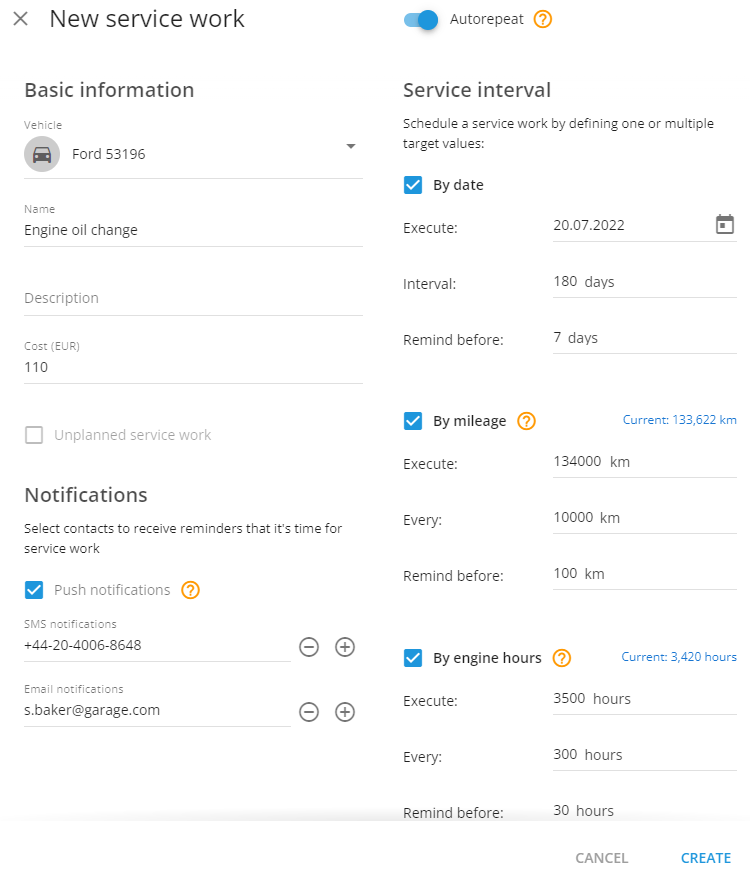
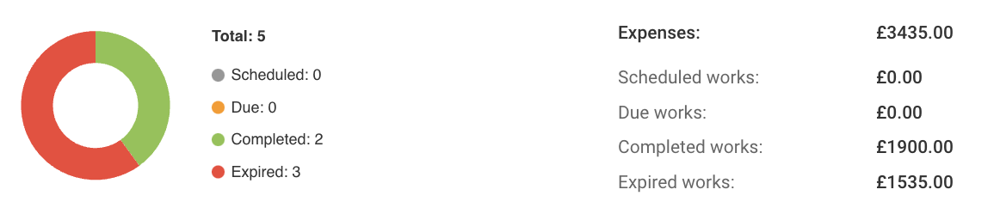

# Maintenance

The **Maintenance works** functionality within the Navixy Fleet Management application is a comprehensive tool designed to manage vehicle service tasks efficiently. This guide explains how to create, manage, and monitor service tasks to keep your fleet in top condition.

## Add service work

To ensure optimal fleet performance, begin by scheduling and managing your service tasks.

1. **Go to maintenance:**

* Navigate to the **Fleet management** application and click on **Maintenance**.

2. **Create new service work:**

* Click **Add** in the top left corner.
* Select the vehicle you want to service.
* Choose one or more of the following conditions:
  * **By date:** Set a date for the service and get reminders before the due date.
  * **By mileage:** Enter the mileage at which the service should occur and set a reminder.
  * **By engine Hours:** Specify engine hours for the service and get notified in advance.

3. **Add details:**

* Optionally, add a **Description** and **Cost**.
* Set up notifications via push, SMS, or email.
* Attach files like invoices if needed.

4. **Save the task:**

* Save the service task, and the system will send notifications based on your settings.

## Manage service work

After creating service tasks, you may need to modify, remove, or duplicate them. Here’s how to manage these actions effectively:

#### Edit a task

* Find the task in the **Maintenance** section and update the details as needed.

#### Delete a task

* If a task is no longer needed, delete it from the Maintenance section. Remember, deleted tasks cannot be recovered.

#### Copy a task

* To assign similar tasks to other vehicles, use the copy function and adjust the parameters as needed.

## Set up repeatable service work

Streamline your fleet's maintenance by configuring repeatable tasks, a feature that automatically generates new service tasks at predefined intervals. Follow these steps to set it up.

1. **Activate auto-repeat:**

* Turn on the **Auto-repeat** option by toggling the switch.

2. **Select the vehicle:**

* Choose a vehicle for the service task. The system will use data from the GPS tracker to monitor engine hours and mileage.

3. **Enter task details:**

* Add a **Name**, and optionally, a **Description** and **Cost**.

4. **Set notifications:**

* Choose who should receive notifications.

5. **Define the service interval:**

* **By date:** Schedule the first service and set intervals for future tasks.
* **By mileage:** Enter the target mileage and set up recurring intervals.
* **By engine Hours:** Specify engine hours and set intervals for repeating the service.

6. **Attach files:**

* Attach any relevant documents if needed.

The system will automatically create new tasks based on the intervals you set.

### Monitoring service tasks

Monitor your fleet's maintenance activities effectively with the comprehensive status overview:

* **Scheduled:** Tasks that are planned but not yet due.
* **Due:** Tasks that are coming up soon.
* **Completed:** Tasks that have been finished.
* **Expired:** Tasks that were not completed on time.

The dashboard offers a concise summary, allowing you to instantly view the status of all maintenance tasks at a glance.
