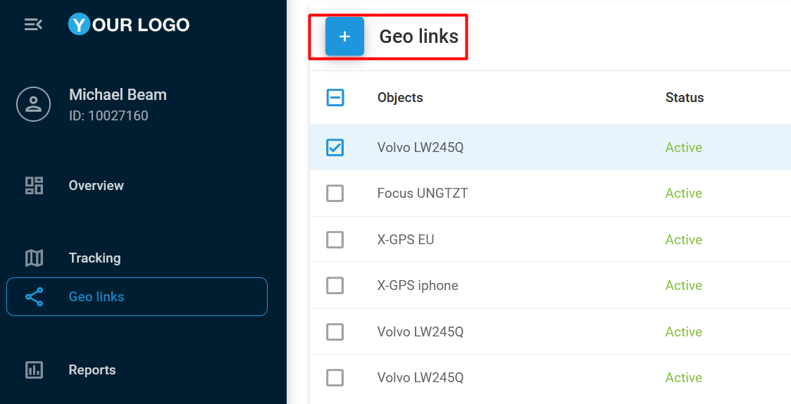
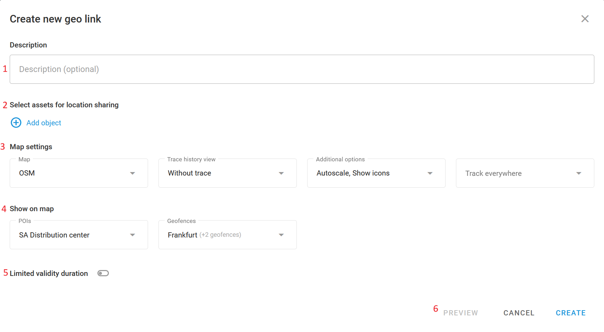
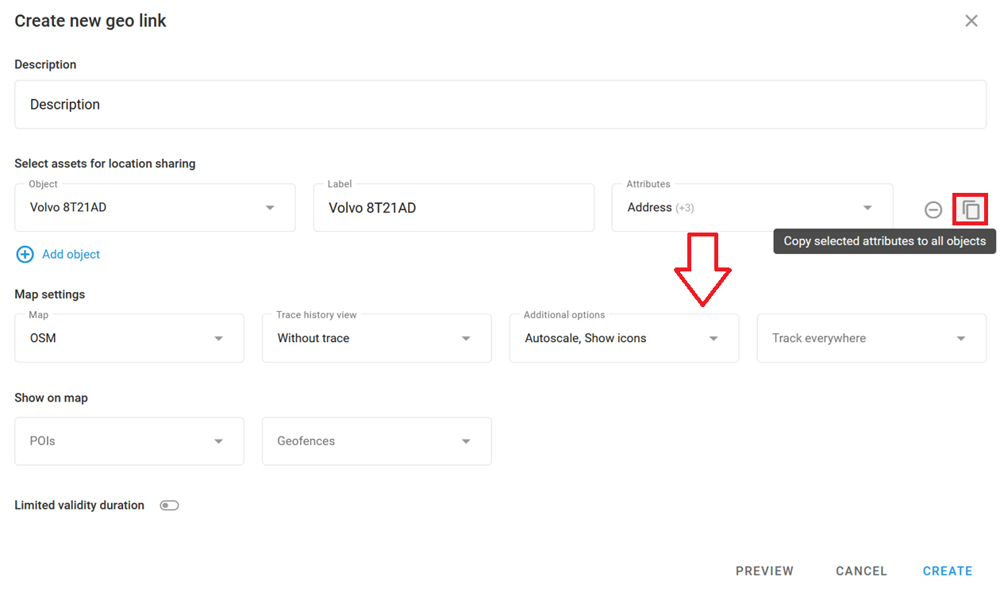

# Creating geo links

To create a geo link, simply click **+** at the top of the page.

The creation dialogue window contains the following options:



#### Description (optional)

An information field that stores additional custom information about the link. The maximum length is 100 characters.



#### Select objects and data

The list of objects available through the link. Each object has the following list of options to be specified upon adding the object:

**Object:** The object to be tracked.

**Label:** The specific label that will be displayed in the geo link interface, overwriting the currently set label in the cabinet.

**Attributes:** The attributes of the tracker to be displayed in the geo link interface. The attributes include:

* Speed
* Address
* Movement status
* Driver name
* Phone number
* Vehicle name
* License plate
* Connection status
* Sensor readings


Sensor readings depend on the device’s model. To learn more about sensors and their types, see [Vehicle sensors](../devices-and-settings/vehicle-sensors/).


Use the copy button to apply the same attribute list to all other objects in the geo link. This function may save a significant amount of time when configuring attributes for multiple objects.




#### Map settings

**Map provider:** Select the map that you want your geo link end users to see by the generated geo link. The list of maps is specified by the platform service provider.

**Trace history view**: The tracking period. This is what a trace might look like if it’s set for 5 minutes:

**Additional options:**

* **Autoscale:** The map will auto-adjust its zoom and position to accommodate multiple device movements.
* **Show icons**: Enables or disables icons for the object.

**Tracking options:** You can either show or hide the object location based on the geofence. For instance, if **Track outside geofence** is selected, objects will be shown on the map only when they are outside of the selected geofences. This function may be useful for scenarios such as shipping or delivery, where the end user should not see the asset being loaded with goods before departure. Respectively, **Track inside geofences** will show objects only when they are inside the selected geofences.




#### Show on map

Choose which stationary entities you want to show on the geo link’s map.

**POIs:** The list of Places available for showing on the map. To learn more about this feature, see [Places (POIs)](../tracking/map-tools/places-pois.md).

**Geofences:** The list of geofences available for showing on the map. To learn more about this feature, see [Geofences](../tracking/map-tools/geofences.md).

* **Limited validity duration**: Specify the link's lifetime. This can be quickly selected from predefined periods or set to a custom period of time. If the lifetime duration is set to start from a future moment, the link will remain inactive until that time arrives. Leave the option unselected for a permanent geo link configuration.
* **Preview**: Check what the configured geo link looks like from the geo link web interface from the end user's perspective. The preview feature enables quick swapping between the user and geo link interfaces for a more accurate representation of the geo link configuration.



#### Save Geo link

Click **Create** to open a pop-up dialogue with the generated link. The link can be copied and provided to end users or shared via the social network buttons:



