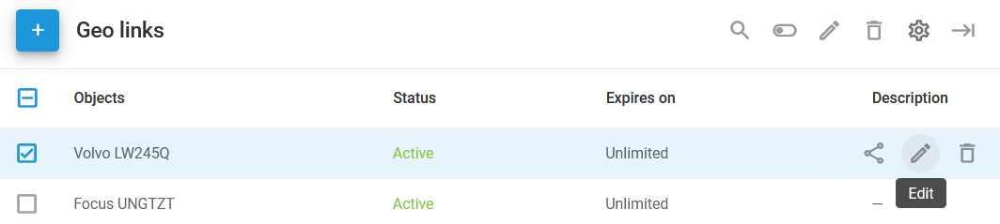
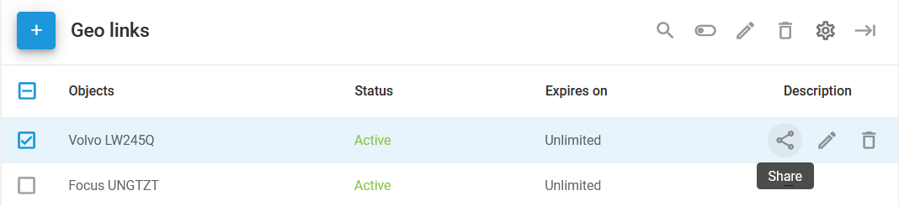
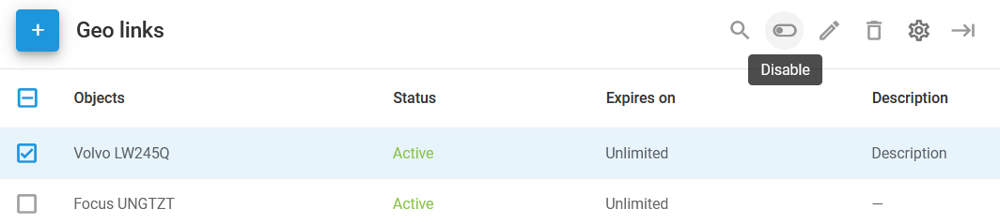
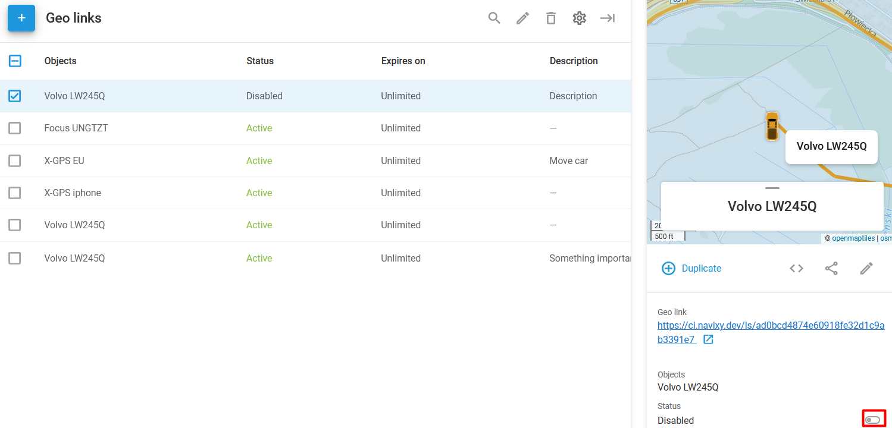

# Updating and sharing geo links

Any update to a geo link preserves the generated URL. To change the URL, you must create a new geo link.

To edit a geo link, select it and use the **Edit** button at the top of the page or hover the mouse cursor over the link’s name. This will reveal the additional buttons, including **Edit**:

To share an existing geo link, hover the mouse over the link (or select the checkbox) and click **Share**:

To disable a geo link, select it via the checkbox and press the **Disable** switch at the top of the page:

To re-enable the geo link, use the switch in the sidebar:

