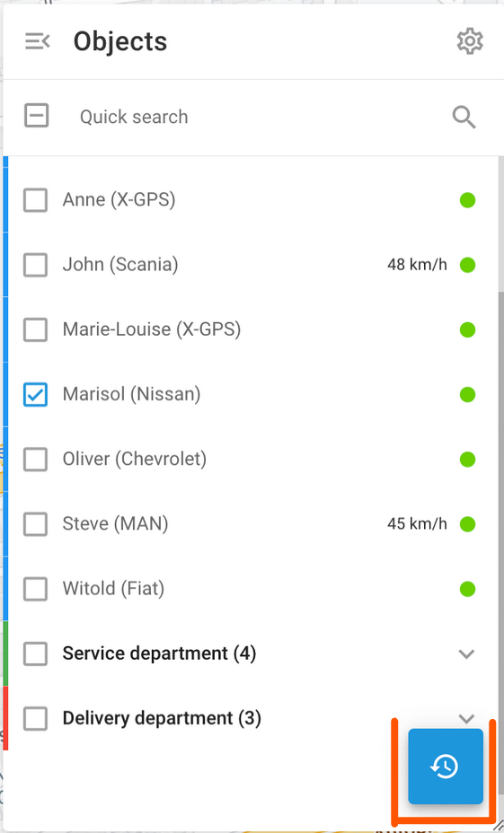

# Trip history

Trip history in Navixy allows you to review past activities and routes taken by your fleet vehicles. This feature provides a detailed log of trips, including timestamps, locations, distances, and duration, helping you monitor vehicle activity and optimize fleet management.

> [!NOTE]
> **Navigation**
> To view your trip history in Navixy, select the objects you're interested in and click 
> 
> . You will be prompted to choose a time and date range. Select the desired date range to proceed.

The top menu contains the following options:

| **Option** | **Description** |
| --- | --- |
| **Route replay** | Use the play button to animate trips on the map, showing object movement over time. Adjust playback speed by x1, x3, x10, x30, x100, or x300. This feature helps to understand travel patterns and duration. |
| **Select color mode** | You can choose between different color schemes for visualizing trip data:  - Color manually: Manually assign colors to different trips. - Color by tracks: Automatically color-code trips based on their route. - Color by status: Differentiate trips by their status, such as moving or stopped. - Color by speed: Visualize trips based on speed variations. |
| **Download trips as KML file** | Download trip data as KML files for use in other GIS applications, enabling further analysis and sharing. |
| **Print selected trips** | Print detailed trip reports directly from the interface for documentation or sharing with team members. |
| **Switch view** | Toggle between a collapsed summary view and a detailed expanded view of trips to see more or less information as needed. |
| **Set track width** | Adjust the width of tracks displayed on the map. This is useful in spheres like agriculture to visualize field coverage by tractor tracks more clearly. |
| **Settings** | Additional settings include showing stops, LBS data, clustering data points for clarity, using smart filters to reduce noise, and splitting trips by stops for detailed analysis. |

## Trips list

The Trips list provides an overview of your objects' activity and travel history for the selected period.

Select a date range to see a summary of trips for the chosen objects, grouped by object. By default, each entry’s trips are collapsed. Click the object’s name to expand the view.

## Trip details

An object’s trip list contains a detailed breakdown of each trip taken during the selected period, including:

- **Trip date**: The trip’s starting day
- **Start and end time**: The date and time when the trip started and ended
- **Mileage**: Total distance covered during the trip
- **Fuel consumed**: The amount of fuel consumed during the trip
- **Travel time**: Total time spent on the trip
- **Parking information**: Detailed information about each stop, including the location and duration of the stop

To learn more about each segment of the trip, such as traveling periods and stops, click the **\>** button to the right of the segment.

## Route display

Route display varies depending on the technology used to determine the location and the tracking mode set in the device configuration. To learn more, see [Tracking mode in Devices and Settings](https://squaregps.atlassian.net/wiki/spaces/USERDOCSOLD/pages/2909015343#tracking-mode).

- **Continuous tracks**: These are the most common tracks, typically used in vehicle tracking applications. They are represented as polylines with clear start and end points.
- **Interval tracks**: For autonomous GPS trackers, the location is often updated at relatively long intervals, such as once per hour or once per day. These tracks are shown as numbered landmarks (1, 2… N). To aid in visualization, they are connected with transparent grey lines, which may not accurately represent the real path.
- **LBS locations**: When location data is determined using alternative LBS technologies such as GSM or Wi-Fi signals, it may lack precision. These locations are visualized with circles, where the radius indicates the accuracy.
- **Clustered landmarks**: When an object stays in the same place for an extended period, numerous interval or LBS messages can clutter the map. To enhance readability, the server consolidates these into a single clustered landmark, showing only one point on the map. The start/end time and duration will be added to the note for this landmark.