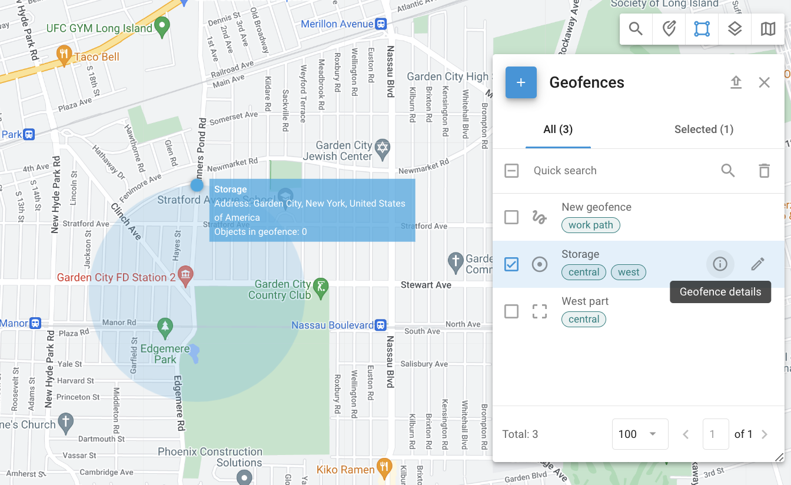
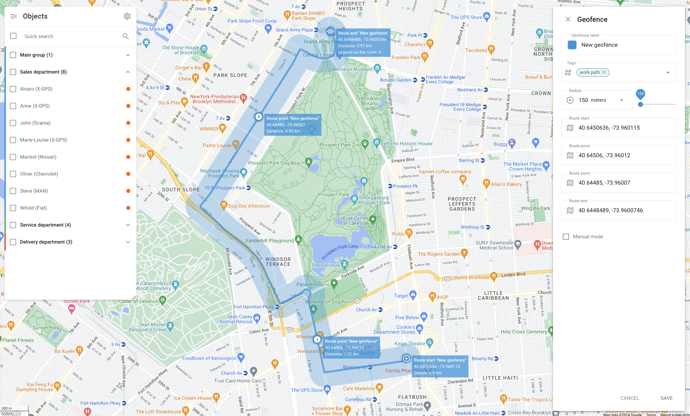

# Geofences

Geofences are virtual perimeters that allow the system to monitor whether an object has crossed the geofence border ("in" or "out"). These events are logged, enabling users to generate geofence reports and [receive alerts](../../rules-and-notifications/movement-monitoring/geofence-entrance-or-exit.md). Geofences can also be related to specific [rules for events](../../rules-and-notifications/) within particular areas, such as receiving speeding alerts only within a city or along a route.

To access the **Geofences** tool, click  in the upper-right corner of the map. Selecting any of the geofences will display the objects currently located within its borders.

## Types of geofences

Three types of geofences are available:

* A **circular geofence** is a geographic area with a given center and a circular shape with a minimum radius of 50 meters. Users can define the radius and center of the circle.
* A **polygonal geofence** is an area defined by an arbitrary polygon with multiple vertices (up to 500), allowing for the creation of complex shapes. This type of geofence is particularly useful for accurately defining irregularly shaped areas, such as neighborhoods, parks, or any specific zones that do not fit into a simple circular boundary.
* A **route geofence** creates a virtual perimeter between two or more points. This type of geofence is well-suited for monitoring [adherence to planned routes](../../rules-and-notifications/scheduling-and-dispatching/deviation-from-the-route.md) and ensuring that vehicles do not deviate from their intended path. The route geofence is defined by a series of points that create a continuous route, with a specified radius that determines the allowable deviation from the path.

## Creating, editing, and deleting geofences

### Creating geofences

To create a geofence, follow these steps:



#### Locate the desired area on the map&#x20;

Use **Quick search**.



#### Open the **Geofences** tool

Click  in the top-right corner of the map.



#### Select geofence type&#x20;

Hover the cursor over the  button and select the geofence you want to create:

* **Circle**:
  1. Drag the circle over the map to set its location.
  2. Use the resize handle on its border to adjust its size. You can also adjust it manually in the **Radius** menu. The drop-down list contains several common options for quick selection.
* **Polygon**:
  1. Start with a pentagon.
  2. Adjust it by dragging vertices or adding new ones.
* **Route**:
  1. Select the start and end points. The system will build the route.
  2. Add more route points by clicking and dragging adjustment handles along the route.
  3. Set the radius. Radius determines how far the object can deviate from the path before route deviation is detected. The drop-down list contains several common options for quick selection.
  4. If needed, activate manual mode to adjust the points manually for precise control over the path.



#### Name your new geofence

Enter the name of the geofence into the **Geofence label** field.



#### Select color

Choose the color for better visualization on the map. This is particularly useful when managing multiple geofences, as different colors can quickly differentiate between various zones. The color selection tool allows setting a specific color and viewing its HEX code.



### Use tags

Add or modify tags to categorize and organize geofences. Tags like "Central" and "West" help in sorting and managing multiple geofences.



Save the geofence



### Editing geofences

To edit a geofence, click  next to the geofence you want to edit in the **Geofences** tool. When editing a geofence, you can adjust the same fields as during its creation.\
For the description of those fields, see [Creating geofences](geofences.md#creating-geofence).

### Deleting geofences

To delete a geofence, select it and click  in the top-right corner next to **Quick search**.


Only geofences not included in any **Alert** rules can be deleted. To remove the geofence from an **Alert** rule, go to **Alerts** → **Set rules** and select the rule that contains the geofence. Open the **Settings** tab and click ⨂ next to the geofence name.


## Geofence details

To see details about the selected geofence, click  next to it.

* **Tags**: Tags associated with the geofence, such as “Central,” help categorize and organize geofences for easy identification and management.
* **Location**: The geographic location of the geofence, such as “Queens County, New York, United States of America.”
* **Objects**: A list of objects within the geofence.

## Importing geofences

When you need to add a large number of geofences, it’s quicker to import them from a file rather than creating them manually. You can import geofences from Excel or KML files.

### Importing circle geofences from Excel

1. Open the **Geofences** tool.
2. Hover the cursor over the  button and click the **Circle geofences import** button.
3. Download the provided file example.
4. Add information about your geofences to the file as detailed in the example.
5. Upload the edited file to the monitoring service.
6. If your file has headers, enable the **Use headers from file** option.
7. Verify the header fields and click **Next**.
8. Check the records and click **Proceed**.
9. Once the import is completed, the new geofences will appear in the list.

### Importing polygonal geofences from KML

1. Open the **Geofences** tool.
2. Hover the cursor over the  button and click the **Geofences import from KML** button.
3. Click **Browse** to select the KML file on your computer.
4. Change the default radius if necessary.
5. Click **Upload**.
6. Once the import is completed, the new geofences will appear in the list. Note that the default radius is only used for route geofences. For other types, this step can be skipped.

## Exporting geofences

You can export your geofences into a KML file for further use. To do this:

1. Open the **Geofences** tool.
2. Click  on the tool panel.
3. Download the KML file for further use.


Please note there is a 500-point limit per geofence.

