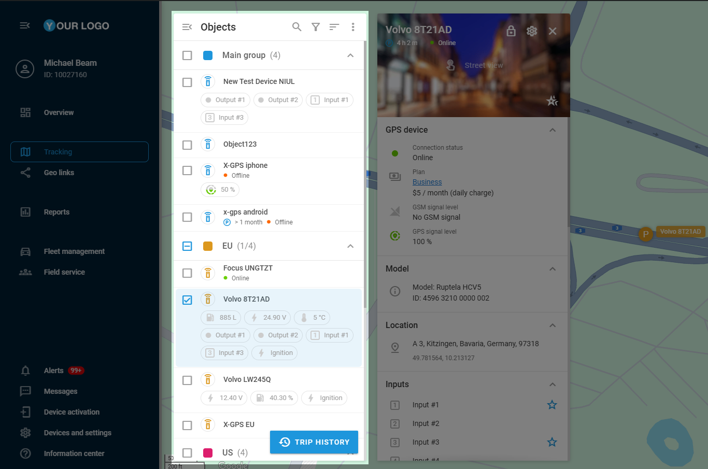

# Objects list

The **Objects list** is your central hub for monitoring all connected devices in real time. It provides a clear, at-a-glance view of every tracked object, displaying its current status and selected key parameters. Designed for efficiency, it opens automatically when you navigate to the **Tracking** module, ensuring instant access to the information you need. From here, you can dive deeper into each entity through its dedicated object widget, making it easy to track, analyze, and manage your objects.

## List overview

### **Visibility and access control**

The **Objects list** is responsive to user roles and visibility settings within the platform:

- **Owners** can see all objects within the organization's account.
- **Users** see only the objects they have personally created or those assigned to them by the owner.

This role-based access control ensures data security while keeping the necessary information accessible. For more information about the platform’s roles, see [Users and Roles](../account/users-and-roles.md).

### **Structure**

By default, objects are displayed in **groups**, structured the same way as in [Devices and Settings](../devices-and-settings.md) to ensure consistency across the platform. Objects cannot be moved between groups from the **Objects list** — such modifications can be made only in **Devices and settings**. Groups are collapsible for convenient interaction with multiple objects.  
To learn more about object groups, see [Groups in Devices and Settings](https://squaregps.atlassian.net/wiki/spaces/USERDOCSOLD/pages/2909015343#group).

> [!NOTE]
> Grouping can be disabled by the **Do not group** option. For details, see [Additional settings](#additional-settings).

### Navigation

The **Objects list** includes several features to help you navigate your fleet:

- **Quick search** 
: Allows you to find specific objects by entering their name, [tag](../account/tags.md), or IMEI.
- **Filter** 
: Allows you to display only specific objects depending on their **movement status** (e.g., show only moving or stationary objects).
- **Sorting options**
: Changes the order of entries in the list based on certain parameters:
  - By name (A to Z or Z to A)
  - By status
  - By distance (useful for tracking proximity)

> [!NOTE]
> Filtering and sorting do not affect the group structure but reorder objects within them. Groups with no matching objects are hidden from the list.

### Additional settings

The **Objects lis**t also contains the 

 menu that provides access to additional settings influencing object visibility and map interactions. It helps you to configure map behavior related to objects and adjust visibility preferences for a more focused tracking experience.

Three-dot menu options

- **Clusterize object markers**: Groups multiple objects in close proximity into a single icon displaying the number of objects within. This helps declutter the map when many objects are in one area. This feature is automatically enforced when more than 300 objects are in view.
- **Objects labels**: Displays the object’s name near its icon on the map.
- **Trace**: Displays a movement trail behind the object as it changes location.
- **Animation**: If enabled, object movement is smoothly animated on the map. If disabled, the object's position updates statically at intervals based on data reception.
- **Show only selected objects**: By default, all available objects are visible on the map. When enabled, only the objects selected from the list are displayed.
- **Show info by click**: Defines how the **Object widget** is opened. If enabled, the widget opens after a single click on an object. If disabled, you need to click 
 or double-click the object’s icon on the map to open the widget. This button appears to the right of the object when it’s selected.
- **Do not group**: Displays all entries in the list individually instead of grouping them. If enabled, sorting and filtering rules apply to the entire list.
- **Follow the selected object**: Keeps the map centered on the selected object as it moves, preventing it from moving off-screen.

### Trip and event history

**Trip and event history** is accessible through the 

 button in the **Objects list**. This feature allows you to review past movements and events of a tracked object, providing insights into its activity over a selected period. It helps you analyze routes, detect anomalies, and improve operational efficiency.  
For more details about this feature, see [History view](history-view.md).

## Objects

Each entry in the **Objects list** represents a tracking device connected to the platform and includes critical details:

- **Object label:** Displays the device’s name.
- **Additional information**: Displays the information from the data blocks marked as Favorites in the Object widget.  
To learn more about displaying this data, see [Favorites](https://squaregps.atlassian.net/wiki/spaces/USERDOCSOLD/pages/2909015126#favorites).
- **Status indicators**: A connection state indicator displaying the up-to-date status for the device. For a detailed status indicator breakdown, see [Connection State](objects-list/connection-state.md).

### **Object actions**

Clicking on an object in the list centers the map on that device.  
Each object has a 

menu offering more quick actions:

- **Share location**: Instantly share the object’s location using the [Geo links](../geo-links.md) tool.
- **Change icon**: Modify the object’s visual representation by selecting [Object icons](objects-list/object-icons.md).
- **Open Alert rules**: Manage alerts for specific conditions in the [Alerts](../rules-and-notifications.md) module.
- **Device settings**: Quickly navigate to the particular device’s configuration in the [Devices and Settings](../devices-and-settings.md).
- **View reports**: Access reports related to the object’s activity in the [Reports](../reports.md) module.

These actions allow quick access to essential management tools directly from the list.

### **Object widget**

This widget is a detailed view of a selected object, displaying available device parameters, status indicators, and customizable data blocks. To access the **Object widget**, double-click the object’s icon on the map or hover over the object and click the 

 icon that appears.

> [!NOTE]
> If the **Show info by click** option is enabled in the [Additional settings](#additional-settings), clicking on an object also opens the [Object widget](https://squaregps.atlassian.net/wiki/spaces/USERDOCSOLD/pages/edit-v2/2909015397#Object-Widget).

The widget provides access to essential metrics such as battery level, signal strength, and movement status, with options to configure displayed data. Since many of these parameters can be essential for tracking overview purposes, it offers a **Favorites** mechanism that allows displaying a selection of device data blocks in the **Objects list**, right under a device’s label.  
For more details on the widget’s functionality, see [Object widget](objects-list/object-widget.md).

## Section content

- [Object widget](objects-list/object-widget.md)
- [Connection state](objects-list/connection-state.md)
- [Object icons](objects-list/object-icons.md)