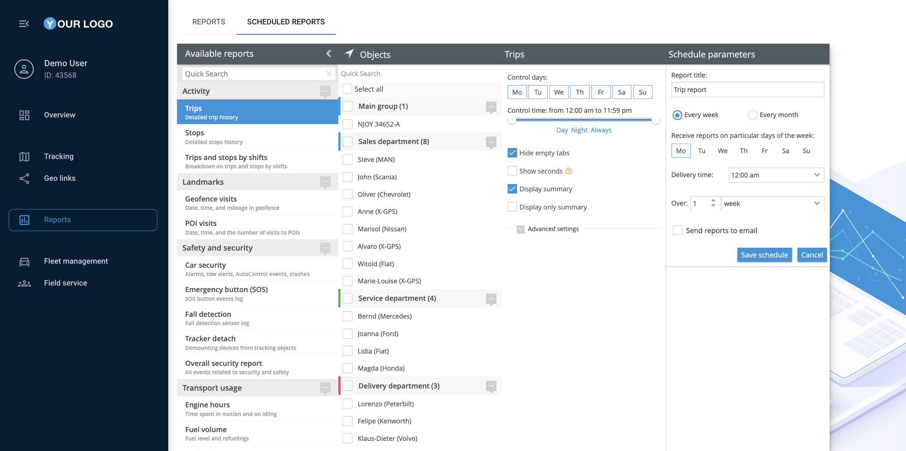

# Reports

Navixy offers a powerful reporting feature that allows you to generate detailed reports on various aspects of your fleet's operations. This guide will walk you through the steps of creating, scheduling, and managing reports using the Navixy platform, ensuring you can easily access and analyze the data you need.

## Accessing the reports section

1. **Navigate to the Reports application:**\
   From the main menu on the left side of the Navixy interface, click on the "Reports" item. This will take you to the section where you can view, create, and manage your reports.
2. **Viewing generated reports:**\
   The "Generated reports" section displays a list of the previous 10 reports that have been created. You can quickly access and review any of these reports by clicking on their titles.
3. **Creating a new report:**\
   To generate a new report, click on the "Create report" button at the top of the generated reports list. This will open the report creation interface.

## Generating a single report

A single report is a custom-generated document that provides detailed insights into specific aspects of your fleet's operations, such as vehicle activity, fuel consumption, or driver behavior, based on selected criteria and time frames. Here’s how to generate a single report:

1. **Choose a report type:**\
   In the "Available reports" panel, you will find various report types grouped by categories such as Activity, Landmarks, Safety and Security, and Transport Usage. Select the report you want to generate by clicking on it.
2. **Select objects:**\
   After choosing the report type, you will need to select the objects (vehicles, drivers, etc.) for which the report will be generated. Use the "Objects" panel to check the appropriate boxes next to the desired items.
3. **Customize report settings:**\
   In the report settings panel, enter a title for the report and select the date range. You can also choose specific control days and times, and decide whether to include summaries or advanced settings.
4. **Build the report:**\
   Once all settings are configured, click the "Build report" button. The report will be generated and added to the top of the "Generated reports" list for immediate access.

## Scheduling reports

Scheduled reports are automated reports that are generated at predefined intervals, such as daily, weekly, or monthly, allowing you to regularly receive insights on your fleet's operations without manual intervention. Here’s how you can schedule a report:

1. **Access scheduled reports:**\
   In the “Reports” application, click on the "Scheduled reports" tab next to the "Reports" tab. This section allows you to automate the generation of reports based on a set schedule.
2. **Add a new schedule:**\
   To set up a new scheduled report, click on "Add new schedule for report."
3. **Configure schedule parameters:**\
   Select the report type, objects, and customize the schedule parameters such as control days, time of delivery, and the interval (e.g., every week, every month). You can also opt to send the reports directly to specified email addresses.
4. **Save the schedule:**\
   After configuring all the settings, click "Save schedule." The scheduled report will now be automatically generated according to the specified parameters and can be accessed or modified in the "Scheduled Reports" section.

## Managing reports

1. **Download reports:**\
   To download a report, simply click on it from the "Generated reports" list and choose the download option. You can save the report in various formats such as XLS or PDF.
2. **Print reports:**\
   If you need a hard copy of a report, you can print it directly from the browser without downloading it by clicking the "Print" button.
3. **Delete reports:**\
   To remove a report that is no longer needed, select it from the list and click the delete option. Confirm the deletion when prompted.

## See also

* [Report types](report-types.md)
* [How to read and understand reports](read-and-understand-reports.md)
* [Specific report details](specific-report-details/)
