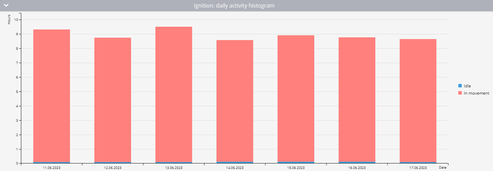

# Equipment working time report

The **Equipment working time** report in Navixy provides essential data on the uptime of any equipment connected to your vehicles via discrete or virtual inputs. This report is crucial for fleet managers who need to monitor the operational efficiency of equipment, analyze idle times, and ensure optimal usage of assets. Below is a detailed guide on how this report works, the parameters involved, and how to interpret the data effectively.

## Overview

The Equipment Working Time report tracks the operational time of equipment, distinguishing between periods of activity while in motion and during idling. This report includes detailed statistics, daily activity data, and visual representations such as activity diagrams and histograms to help you understand and analyze the data easily.

## How the report works

The report calculates equipment working time based on data points received by the Navixy platform. It considers the state of discrete inputs or virtual sensors and the parking status to accurately distribute working time between motion and idle periods. For accurate calculations, the following configurations and conditions must be met:

1. **Discrete input configuration:**

* The discrete input on the device must be correctly wired and capable of registering the input state accurately.

2. **Virtual sensor configuration:**

* [Virtual sensors](../../devices-and-settings/vehicle-sensors/virtual-sensors/) with two states can also be used. The sensor must be correctly configured to register these states.

3. **Parking detection settings:**

* Parking detection settings are crucial in differentiating between operating time in motion and idle time. If the input state is "on" while the platform detects the vehicle as parked (e.g., moving at less than 3 km/h for over 5 minutes), this time is recorded as idle.

4. **Minimum on-time:**

* The platform calculates the operating time only if the equipment is on for a minimum duration, which you can specify (e.g., 60 seconds).

### Example calculation

| Point | Time     | Input State | Equipment Uptime                        |
| ----- | -------- | ----------- | --------------------------------------- |
| 1     | 10:00:00 | Off         | 0 minutes                               |
| 2     | 10:01:00 | On          | 0 minutes (input was off at last point) |
| 3     | 10:01:32 | On          | 0 minutes (less than 60 seconds)        |
| 4     | 10:05:32 | Off         | 4 minutes and 32 seconds                |

## Report parameters

The Equipment Working Time report includes several configurable parameters that allow you to tailor the output to meet your specific needs:

* **Minimum working period duration:** Specifies the minimum number of seconds that a discrete sensor must be on for the time to be recorded in the report. For virtual sensors, the value must be greater than 0.
* **Show idle percent:** Tracks the parking status and distributes the equipment operating time between motion and idling.
* **Use smart filter:** Excludes short trips from the report. Short trips are defined as journeys under 300 meters where the device sends fewer than four data points.
* **Device selection:** The report only includes devices with at least one discrete or virtual sensor configured.

## Visualizations

### Overall activity diagram

* This diagram provides an overview of the total working time of the equipment for the selected period. It shows how long the equipment was off, on, and if idle percentage tracking is enabled, it differentiates between time spent in motion and idle time.
* For virtual sensors, the state corresponding to a value of 0 is shown as gray, and any other value is shown as red.

### Daily activity histogram

* The histogram breaks down the equipment's working time into daily segments. If idle percentage is tracked, it also shows the division between motion and idle time. Hovering over each day provides a more detailed view of that day’s activity.

### Daily sensor operation time table

* This table presents daily statistics on equipment operation, including:
  * **Date:** The specific day for which the information is calculated.
  * **Operation Time (Duration of Virtual Sensor State):** The total operational time for the day.
  * **Average Interval:** The average duration the equipment was operational after each switch-on.
  * **Mileage:** The distance traveled with the equipment turned on.
  * **Average Speed:** The average speed for the day.
  * **Intervals:** The number of times the equipment was turned on during the day.
  * **In Motion (if idle percentage is enabled):** The duration of work in motion and its percentage of the total work time.
  * **Idle (if idle percentage is enabled):** The operation time without motion and its percentage of the total operation time.

## Interpreting the report

To effectively use the Equipment Working Time report, consider the following:

* **Analyzing data:** Use the report to monitor how frequently and efficiently equipment is used. Identify patterns of excessive idling or underutilization.
* **Operational efficiency:** Assess the balance between active and idle times to determine the operational efficiency of your equipment.
* **Maintenance planning:** The report helps in planning maintenance by identifying periods of high usage or frequent starts and stops, which can wear down equipment faster.
* **Cost management:** Recalculate fuel and lubricant costs by considering idle times along with active usage, which is especially relevant for heavy machinery.
