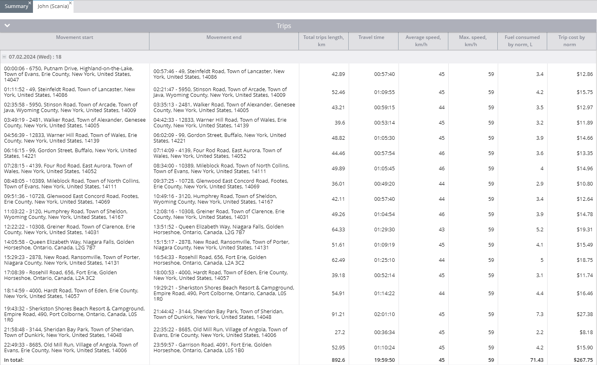

# Trip report

The **Trip report** in Navixy provides a comprehensive analysis of your vehicle's travel history, offering insights into distance traveled, travel time, stop durations, speeds, and fuel consumption.

This report is invaluable for fleet managers who need to monitor vehicle usage, calculate operational costs, and assess driving efficiency. Below is a detailed guide on how the Trips Report works, the parameters involved, and how to interpret the data effectively.

## Overview

The Trip report details each journey taken by your vehicles, including start and end times, distances, speeds, and fuel consumption. The report also offers a summary of all trips during the selected period, allowing for an easy overview of vehicle performance.

## How the report can be useful

The Trip Report provides valuable insights that can be used in several ways:

* **Operational analysis:** By reviewing vehicle usage patterns, you can evaluate trip frequencies, distances, and durations. This data is essential for calculating depreciation and predicting future vehicle usage.
* **Cost management:** The report could help identify unexpected or unauthorized trips that could lead to increased expenses. It also provides detailed information on fuel consumption, allowing you to assess costs based on different routes and loads.
* **Driver performance:** The report highlights the time drivers spend on specific routes, their average and maximum speeds, and how long vehicles remain idle after trips.
* **Efficiency assessment:** You can assess fuel usage for different types of trips, such as heavily loaded trips versus light or no-load trips, to optimize fuel expenditure.

## Report parameters

The Trip Report offers several configurable parameters to tailor the report to your needs:

* **Display summary:** Toggles the visibility of a summary page that provides an overview of all devices.
* **Display only summary:** Generates a summary sheet for all selected devices without detailed trip information. Requires at least two devices to be selected.
* **Divide by stops:** Separates trips based on parking intervals. If not selected, the report will consider the first recorded point of the day as the trip start and the last recorded point as the trip end.
* **Show stop duration:** Displays the duration of parking time following each trip.
* **Show coordinates:** Includes GPS coordinates for the start and end points of each trip, in addition to addresses.
* **Use smart filter:** Excludes brief trips (under 300 meters, fewer than four data points, or within a small radius) from the report.
* **Group by drivers:** Organizes trips by [drivers](../../fleet-management/drivers.md). If a driver was not assigned during the report period, trips will be attributed to an unidentified driver.

### Report columns

The report organizes information into the following columns:

<table><thead><tr><th width="215.8182373046875">Column Name</th><th>Description</th></tr></thead><tbody><tr><td><strong>Movement start</strong></td><td>Details when and where the trip began, including the time and address. If coordinates are hidden, only the time and address are shown.</td></tr><tr><td><strong>Movement end</strong></td><td>Shows when and where the trip concluded. If the trip ends within a geofence or POI, its name is included.</td></tr><tr><td><strong>Total trips length</strong></td><td>Indicates the entire distance of the trip as measured by GPS.</td></tr><tr><td><strong>Travel time</strong></td><td>Shows the total time taken for the trip.</td></tr><tr><td><strong>Average speed</strong></td><td>The average speed during the trip.</td></tr><tr><td><strong>Max speed</strong></td><td>The peak speed reached during the trip, as recorded by the device.</td></tr><tr><td><strong>Fuel consumed by norm</strong></td><td>Estimated fuel consumption for the trip based on standard rates, requires vehicle fuel consumption data per 100 km in the <a href="../../fleet-management/vehicles.md">vehicle's profile</a>.</td></tr><tr><td><strong>Trip cost by norm</strong></td><td>Displays the fuel cost based on the standard consumption rate provided in the <a href="../../fleet-management/vehicles.md">vehicle's profile</a>.</td></tr><tr><td><strong>Fuel consumption (sensor)</strong></td><td>Shows actual fuel consumption if a fuel sensor is installed and transmitting data to the platform. The sensor must measure in liters or gallons.</td></tr><tr><td><strong>Parking time</strong></td><td>Lists the duration of parking between this trip and the next.</td></tr></tbody></table>

**Example:**

A row in the report might indicate:

* **Start time and location:** February 7, 2024, at 00:00:06, 6750 Putnam Drive, Highland-on-the-Lake, Town of Evans, Erie County, New York, USA, 14047.
* **End time and location:** February 7, 2024, at 00:57:46, 49 Steinfeldt Road, Town of Lancaster, New York, USA, 14086.
* **Distance traveled:** 42.89 kilometers.
* **Travel time:** 57 minutes and 40 seconds.
* **Max speed:** 59 km/h.
* **Average speed:** 45 km/h.
* **Fuel consumption:** 3.4 liters (based on standard rates), with a cost of $12.86.

### Summary block

The report also provides a summary of all trips during the selected period. For example:

* **Total trips:** 34
* **Total distance:** 1514.9 kilometers
* **Total travel time:** 33 hours, 56 minutes, and 45 seconds
* **Max speed:** 59 km/h
* **Average speed:** 45 km/h
* **Estimated fuel consumption:** 121.2 liters, costing $454.50
* **Odometer reading at the end of period:** 762052.8 km
