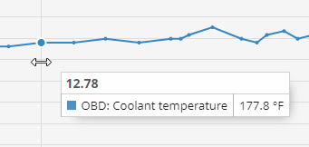

# Vehicle CAN / OBDII readings report

The **Vehicle readings report** in Navixy offers detailed insights into the data received from your vehicle’s instruments through CAN/OBD sensors or virtual sensors over a selected period. This report includes information such as mileage, engine RPMs, speed, fuel consumption, coolant temperature, and other critical metrics, helping fleet managers and vehicle operators monitor and optimize vehicle performance.

## Requirements for generating the report

To generate the **Vehicle readings report**, the following prerequisites must be met:

* **Device compatibility:** The device must support CAN/OBD readings on the platform. You can check if a specific type of sensor is supported by reviewing the list of supported inputs for your [device model](https://www.navixy.com/devices/).
* **Vehicle capability:** The vehicle must be capable of transmitting the required CAN/OBD data to the installed device model. This can be confirmed with the vehicle manufacturer.
* **Active data transmission:** The device and sensors must be configured to transmit data and actively sending it to the platform.
* **Sensor configuration:** The CAN/OBD or virtual sensors must be properly configured on the platform.

## Report parameters

The report uses several parameters to customize the output:

* **Detail interval:** Displays the received readings in the data detail table in increments of 30 minutes, 1 hour, 3 hours, or 6 hours. The graph will display all points received from the sensor.
* **X-axis on the graph:** Choose whether to display the information on the graph relative to time or mileage.
* **Smooth graph:** Apply smoothing to the graph to filter out peak values and average the data when there is significant variance.

For each device, you need to select the sensor for which to generate a report. Only devices with configured CAN/OBD or virtual sensors will appear in the list. If a virtual sensor uses a calculation method other than [source value](../../devices-and-settings/vehicle-sensors/virtual-sensors/), the report will indicate "This is not a measurement sensor."

## Visualizations

### Graph with sensor readings

The **graph** displays CAN/OBD or virtual sensor readings in a visual format, providing a clear view of data trends over time or distance.

* **Hovering over points:** When you hover over a point on the graph with the X-axis set to time, you will see the exact time and sensor value recorded. If the X-axis is set to mileage, you will see the sensor value along with the mileage at which it was recorded.











### Statistics data table

The report includes a **statistics data table** that summarizes sensor readings by day.

**Columns in the statistics data table:**

* **Date:** The specific date for the recorded data.
* **Minimum:** The lowest value recorded by the sensor on that date.
* **Maximum:** The highest value recorded by the sensor on that date.
* **Average value:** The average of all sensor readings for that date.

Note: The units of measure will vary depending on the type of sensor being used.

### Data breakdown table

The **data breakdown table** presents sensor readings over specified time intervals, starting from the set time and moving to the next increment. For example, if the report uses 30-minute increments, the data in the 00:00 row pertains to the time between 00:00 and 00:30.

* **Interpreting the table:** If "No data" appears, it indicates that no readings were received during that time interval. Possible reasons include:
  * The device did not send CAN/OBD or virtual sensor data during that period due to sensor settings.
  * The device was not transmitting data at all, possibly due to being turned off or disconnected from the object.
