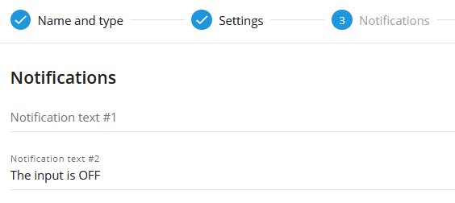

# Input triggering

Input triggering (or, input change) refers to a change in the status of an input on a vehicle tracking device. This input can be connected to various sensors or switches in the vehicle, such as door sensors, ignition status, or other vehicle components. When the input changes state, for example, from on to off or vice versa, the GPS device detects this change and can trigger an event or notification accordingly.

> [!INFO]
> The input change type of the rule applies to discrete inputs that take two logical positions (0 or 1). For inputs indicating continuous values (e.g., analog inputs showing a voltage range), there is a specific rule type called Parameter in Range.

## Overview

Many vehicle GPS trackers come equipped with inputs that can be connected to different tools, such as a car tracker opening sensor, ignition status, or an emergency button. By configuring the system accordingly, users can receive notifications for input triggers through the user interface, push notifications, SMS, or email.

The rule is designed to monitor specific discrete inputs and notify users whenever there is a change in their status. These discrete inputs can only have two values: 0 or 1, hence the term "discrete." The rule waits for the specified input to transition from true (1) to false (0), or vice versa, and generates notifications for each change detected.

This functionality enables users to stay informed about the status of connected tools or sensors, providing real-time updates on various events, for example, activation of an SOS button. The ability to receive timely notifications enhances monitoring capabilities and facilitates quick responses to critical situations or events detected by discrete inputs.

## Rule settings

#### Input number

The input number field specifies the hardware or virtual hardware number of the input being used. To determine which input corresponds to a specific functionality, refer to the GPS tracker’s manufacturer’s documentation. The input number should match the discrete sensor created in the “Device and Settings” → “Sensors and Buttons” widget.

## System operation details

### System Operation Details

- **Reset timer**: The "Inputs change" alert has a 10-second reset timer, ensuring that the alert will not trigger more often than once every 10 seconds. If an event occurs during this reset period, it will be omitted by the platform, including in reports.
- **Multiple tracker assignments**: Multiple trackers can be assigned to a single rule. The specified input number in the rule settings is used as a data source for each tracker. For example, if the 2nd input is chosen and multiple trackers are selected, the rule will notify the user whenever any of the selected trackers send a change in their input #2.
- **Event validity**: If the platform identifies an input event (1 true/high level or 0 false/low level) from a packet of tracker data with no valid coordinates, it will count the event as valid and display it, regardless of whether the event occurred within or outside the bound geofences. The logic of the Inside/Outside radio buttons is ignored in this case, as displaying a controversial event once more is better than omitting it.
- **Selective alerts**: Users can choose to receive input-triggering alerts only for specific changes in input (e.g., from 1 to 0 or from 0 to 1) by clearing the notification text for the respective field they do not want alerts for. For instance, users can configure alerts to receive notifications only for changes from "ON to OFF" while ignoring events from "OFF to ON."

