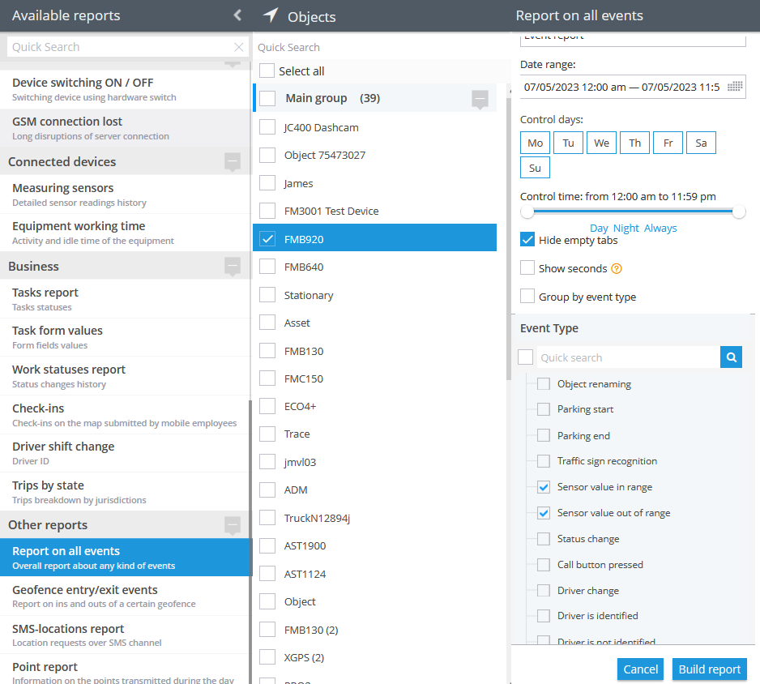

# Parameter in range

## Description

This rule is specifically designed for the use of measurement sensors and serves the purpose of generating notifications when the sensor data received by the platform falls within or outside the specified range. The rule constantly monitors the sensor readings and triggers notifications whenever the data values cross the defined thresholds. By setting up this rule, users can receive real-time alerts regarding sensor measurements, allowing them to stay informed about any deviations or changes in the measured values. This feature enhances monitoring capabilities and enables proactive responses based on the sensor data, ensuring efficient management and control of the measured parameters. For example, if a user needs to monitor the temperature or voltage in a specific range, the rule can help set up the range and notify the user whenever the units exceed the specified boundaries.

## Settings

**Sensor:**

The source of data for alerts. There can be specified only a single measurement or virtual sensor (only for virtual sensors with “Calculation method: Source Value”). Therefore, each tracker requires a separate rule.

**More or equal:**

The parameter describes the lowest boundary of the range.

**Less or equal:**

This parameter describes the highest boundary of the range.

**Value threshold:**

* is a buffer which is added upon the “**More or equal**” and “**Less or equal**” boundaries from both sides of each parameter. This value helps the platform distinguish between **IN** and **OUT** range states, even in cases of 'loose' data (such as sensor noise or inaccuracies). It does this by creating a larger range around the '10' and '24' points, allowing for more tolerance and reducing the risk of false alerts. Hard to get an analogue sensor that hits the exact specified value, at the same time, inaccuracies will trigger the event too frequently. There may be two cases of incoming value occurrences. The behaviour of the platform will depend on the rule (event) **state** for a given moment of time. The event has two states:

1. **IN** range
2. **OUT** range

Case#1, From the **IN** to the **OUT** state:

Whenever the event (the rule) is in the **IN** range state, this state will only change to the **OUT** range when the incoming value hits outside (#**4**) the outer buffers (#**3**).

Case#2, From the **OUT** to the **IN** state:

Whenever the event (the rule) is in the **OUT** range state, this state will only change to the **IN** range when the incoming value hits **in range** (#**1**) but outside the inner buffers (#**2**).

If the “Value threshold” parameter is not specified, it becomes equal to 0.03 (absolute value) by default. So, as for the example above, the buffers' space would be from 9.97 to 10, from 10 to 10.03, from 23.97 to 24, and from 24 to 24.03.

**Geofence:**

Fill out the section if the rule needs to work only inside/outside of the selected geofences.

**Bind zone to rule:**

Enables geofence rule binding.

**Map button:**

Shows bound geofences on the map.

**Virtual sensor as a source for a Parameter in range rule:**

Virtual sensors enable control of state field values, while measurement sensors only allow control of non-state data, such as fuel level, voltage, etc. Users still can select a non-state data input in the virtual sensor and utilise it in the rule.

In case, where a virtual sensor is selected as a data source, the user specifies the range according to the virtual sensor source (original) value:

This can be useful if users need to specify a state field source within a parameter range rule. Say, there is a tracker with an event code range of 1-100, and it is needed to control the codes from 20 to 30. Create the parameter in the range rule and specify the event code as a source for the virtual sensor:

> \[!INFO] The "Parameter in range" notification may contain one or all of the values specified in the rule's range, but it does not include translations from the virtual sensor. For example, if events with values from 20 to 30 occur, each individual event within that range will trigger a separate "Parameter in range" notification, regardless of whether specific values are absent in the virtual sensor table mentioned above.

For example, let's consider a case for a logistics company. The company sends multiple trucks on various routes, and there's a critical section with potential problems, like severe traffic or accidents. To monitor this risky area effectively, they set up a "Parameter in range" rule with virtual sensors using the "event code" as the data source. They define a range from 20 to 30 for events on that particular road section. Whenever a truck encounters an event within this critical range (20-30), they receive notifications. This enables swift actions to tackle potential issues, ensuring safety and efficiency in their operations. This approach allows them to stay informed about critical events that traditional sensors couldn't address, enhancing their control and decision-making.

> \[!INFO] If a user changes the Calculation method of a virtual sensor specified as the data source in a "Parameter in range" rule to any method other than "Source value," the rule will reset its source and stop functioning.

## Notifications

**Emergency notification:**

is used for important events. A message on the screen and the sound signal can only be disabled by clicking on the notification. Please note, some browsers can block notification sound until user activity is recorded on the page.

**Push notifications:**

Receive push notifications on the mobile app and web interface.

**Add geofence name to the notification:**

Adds names of the specified geofences to the notification text. This option is available only when the "Inside" geofence binding radio button is selected on the "Settings" tab.

**SMS notifications:**

List of recipients for SMS notifications when the event occurs.

**Email notifications:**

List of recipients for email notifications when the event occurs.

## Schedule

Set a schedule for when the rule will run. If your schedule indicates that the event should not run some day or time period, it will not appear as a notification in the user interface, and notifications via SMS or email will not be sent. Additionally, you can choose a default template for quick scheduling.

## The platform specifics:

* Whenever the platform identifies an **IN** **range** or an **OUT** **range** event from a packet of tracker data with no valid coordinates in it, the platform counts the event as a valid one and displays it regardless of whether the event occurred within or outside the bound geofences. The logic of the **Inside/Outside** radio buttons is also ignored in this case. This behaviour is due to the fact that showing a controversial event once more is better than omitting it.
* The rule supports only one device per rule. This is due to the fact that multiple different sources of measurement sensors can not be cross-referenced with multiple trackers, calibration tables and other aspects of measuring and filtering data.
* The "Parameter in range" alert has a 10-second reset timer, meaning the alert event will not occur more often than once every 10 seconds. If this type of event occurs in time the rule has been waiting for the reset, this event will be omitted by the platform, including the reports.

## Event reports

To view the dates when the events were received, you can build the "Report on all events" report.

For a graphical representation of a measurement sensor usage over a period of time, use the "Measuring sensors" report.
