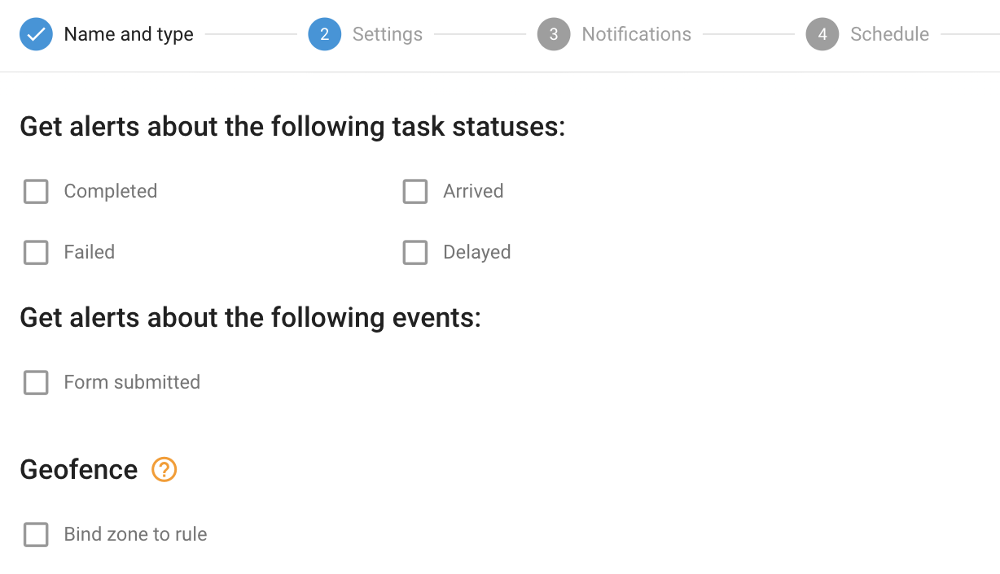

# Task performance

## Overview

The Task Performance rule is designed to help companies track and manage the progress and completion of tasks assigned to field employees. Whether you're overseeing a large remote workforce or a smaller team, this rule ensures you stay informed about critical task-related events, such as task completion, delays, failures, and form submissions.

The system provides timely notifications via SMS, email, push notifications, or directly within the web user interface. By using this functionality, businesses can maintain control over the task completion process, leading to improved efficiency and decision-making.

## Rule settings

#### Task Events and Statuses

In the rule settings, specify the task statuses and events for which you want to receive notifications. You can choose from options such as task completion, delays, failures, arrivals, and form submissions. By selecting the relevant options, companies can stay informed about key developments in their field operations, helping to minimize disruptions and ensure smooth task execution.

For common settings, please refer to [Rules and Notifications](../).

## System operation details

* The "Task Performance" alert is triggered every time a task-related event occurs, with no reset timer, meaning the alert will notify you immediately with each event. This differs from other rules on the platform that have reset timers to limit notification frequency.
* This rule is cloud-processed and is not dependent on specific hardware, allowing it to be applied to multiple trackers simultaneously. This flexibility enables users to manage several trackers within a single rule efficiently.
