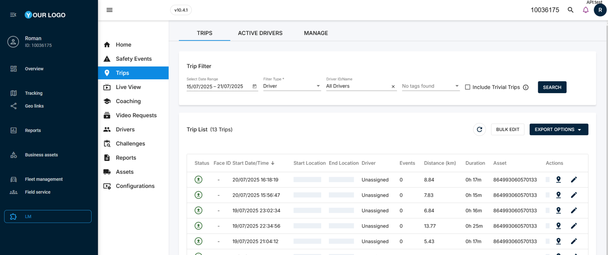

# Lightmetrics integration for video telematics

Lightmetrics is a leading provider of AI-powered video telematics solutions, specializing in edge AI technology and no-code platform deployment. Their flagship RideView platform is designed specifically for telematics service providers (TSPs) and OEMs, enabling deployment of advanced video telematics in just 3 weeks. With hardware-agnostic capabilities, RideView works across multiple dash camera types, including exclusive access to Suntech ST9730 and support for the popular Jimi JC450, while delivering efficient edge AI for real-time driver coaching and fleet safety management.

By integrating Lightmetrics with Navixy, you get intelligent video analytics with edge AI processing combined with fleet management in a single interface. Let's examine how to implement this combination and embed the Lightmetrics dashboard into your Navixy interface.

## 1\. Establishing integration

To establish the integration, you'll need to set up your Lightmetrics Master account and configure proper account matching between your Lightmetrics and Navixy systems.

### Request Master account creation (one-time setup)

1. **Contact Navixy**: Send a request to your Customer Success Manager or use [this form](https://www.navixy.com/contact/) to request Lightmetrics Master account creation. Include the following information:
  1. Your Navixy account details
  2. Request for Lightmetrics Master account setup
2. **Wait for confirmation**: Our specialists will coordinate with Lightmetrics to create your Master account and provide you with login credentials.

After you receive the Master account credentials, you can proceed with the account configuration steps below.

### Configure Lightmetrics account (per-customer setup)

Once you have access to your Lightmetrics Master account, you'll need to create and configure accounts for each of your customers. In Lightmetrics, "Accounts" and "Fleets" refer to the same entity but appear with different names in different UI sections.

> [!WARNING]
> The Account ID matching must be configured before proceeding with the User Application setup in Navixy. Account IDs cannot be modified once configured in Lightmetrics. Ensure they match exactly between both systems before proceeding to the next steps. This matching enables the API key authentication to work automatically when embedding Lightmetrics in the Navixy interface.

1. **Create Account (Fleet) in Lightmetrics**: In your Master account, navigate to the Accounts section and create a new account for your customer.
2. **Set Account ID**: In the **Account ID** field, enter your customer's Navixy account ID exactly as it appears in their Navixy interface (found in the upper-left corner, displayed as "ID: \[number\]").
3. **Create Users**: Navigate to the Users section and create user accounts for your end customers who will access the Lightmetrics portal.
4. **Assign Fleets to Users**: In the user configuration, assign the appropriate Fleet (which corresponds to the Account you created) to each user so they can access their data.

> [!TIP]
> After completing these steps, your Lightmetrics Master account is ready for integration with Navixy. You can now proceed to device activation and UI embedding for each customer account you've configured.

## 2\. Adding devices to Navixy

Since Lightmetrics is device-agnostic, you can add any compatible devices to the platform following the standard device activation procedure. The only requirement is that the device should already exist in your Lightmetrics account.

> [!INFO]
> Ensure that your device is properly configured in your Lightmetrics account before proceeding with the activation in Navixy.

1. Go to **Device activation**.
2. Select your device from the list.
3. Select **SIM card purchased separately** option and go to the next step.
4. Enter a correct **Device ID** (device IMEI).
5. Complete the device configuration.

For detailed instructions on how to activate a device in Navixy, see [Activate GPS device](https://docs.navixy.com/user-guide/automatic-device-activation).

> [!TIP]
> Your device and Navixy account are ready for the integration!

## 3\. Embedding Lightmetrics in Navixy UI

At this step, we perform the actual integration by embedding the Lightmetrics dashboard into your Navixy interface.  
Navixy offers [User applications](https://claude.ai/user-guide/user-applications) functionality that allows embedding 3rd-party apps directly in the platform's interface. We will use it to embed Lightmetrics.

> [!NOTE]
> **Navigation**
> **User applications** section is accessible to account **Owners** in the **Account Settings** section. To find it:
> 1. Click the profile icon in the top-left corner of the screen to open your account settings
> 2. In the settings sidebar, select **User applications**

1. Create new application  
Start by clicking the 
 button in the **User applications** list.
2. Configure the new application
  1. Put the link to your Lightmetrics dashboard in the **App URL** field. Use your organization's Lightmetrics dashboard URL (contact your Lightmetrics administrator if you're unsure of the correct URL).
  2. Enter a **Label** for the application (e.g., Lightmetrics dashboard).
  3. Select **Embedded** in the **Show as** field to display Lightmetrics functionality within Navixy.
  4. Select your pre-configured API key from the dropdown menu in the **API key** field. If you don't have an API key set up, refer to the API keys documentation for setup instructions.
  5. **(optional)** Customize redirect path to define which Lightmetrics page opens after login by adding a `redirect_path` parameter to your URL. The redirect path is customizable based on your preferred landing page within Lightmetrics.
3. **Save the configuration** Click **Save** to complete the configuration.

> [!TIP]
> Your new Lightmetrics application appears automatically in Navixy's left sidebar. Open it to access your comprehensive video telematics dashboard with AI-powered event detection, real-time driver coaching, multi-channel video feeds, and advanced safety analytics - all integrated with your existing Navixy fleet management tools.
> 