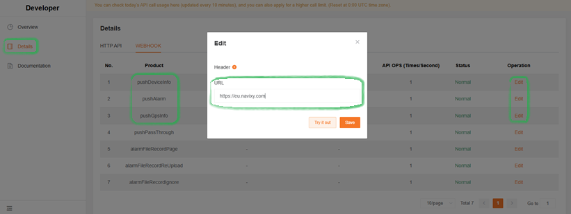

# Mettax

Video telematics is a vital functionality for many businesses. There are proprietary solutions that handle video feed from dashcams but offer limited possibilities for telematic readings of such devices. For this reason, we broadened our approach to integrations so our clients can make use of existing 3rd-party applications for video and benefit from Navixy’s extended telematics features at the same time.

Mettax is a great example of this scenario. Let’s see how easy it is to integrate with its capabilities right inside Navixy UI.



#### Establishing integration

First, you need to make the necessary preparations on the Mettax side.


In Mettax, device data is stored under individual user accounts. If your organization uses a parent account structure, **you will need to perform the following steps for each user account that has devices**. While this may require logging in and out of different accounts, it guarantees comprehensive and targeted coverage across your device fleet.


1. Log in to a user account that contains actual devices.
2. Turn on **Developer** mode to enable the necessary settings for our integration:
   1. Click your account name in the upper-right corner of the window.
   2. Go to **Customer Settings**.
   3. Open the **App Settings** tab.
   4. Enable the **Developer** option.
3. Install **Webhooks** to establish a connection between the two solutions:
   1. Click the apps icon and select **Developer**.\
      
   2. Go to **Details**.
   3. Open the **WEBHOOK** tab.
   4. Find these three webhooks, you will need to edit them:\
      
      1. **pushDeviceInfo**
      2. **pushAlarm**
      3. **pushGpsInfo**
   5. Click **Edit** in the needed webhook’s row to open its parameters.
   6. Fill in the URL field with your Navixy instance address, depending on the region: 1. EU - https://mettax-tracker.navixy.com 2. US - https://mettax-tracker.us.navixy.com
   7. Repeat the URL step for all 3 webhooks.
4. (optional) Repeat the steps above for all required user accounts.


Your Mettax account is ready for the integration!




#### Adding a Mettax device to Navixy

Navixy platform handles the GPS functionality of video devices and their telematic abilities. To make the most of the integration, you need to add your Mettax device to the platform, following the usual procedure:

1. Go to **Device activation**.
2. Select your Mettax device from the list.
3. Select **SIM card purchased separately** option and go to the next step.
4. Enter a correct **Device ID**
5. Complete the device configuration

For detailed instructions on how to activate a device in Navixy, see [Activate GPS device](../quick-start/activate-gps-device.md).


Your device and Navixy account are ready for the integration!




#### Embedding Mettax in Navixy UI

At this step, we perform the actual integration.\
Navixy offers [User applications](../account/user-applications/) functionality that allows embedding 3rd-party apps directly in the platform’s interface. We will use it to embed Mettax.


#### **Navigation**

**User applications** section is accessible to account **Owners** in the **Account Settings** section. To find it:

* Click the profile icon in the top-left corner of the screen to open your account settings
* In the settings sidebar, select **User applications**


1. Create new application\
   Start by clicking the  button in the **User applications** list.
2. Configure the new application
3. Put [https://www.mettaxiot.com/#/dashboard](https://www.mettaxiot.com/#/dashboard) in the **App URL** field.
4. Enter a **Label** for the application (e.g., Mettax dashboard).
5. Select **Embedded** in the **Show as** field to display Mettax functionality within Navixy.
6. Click **Save** to complete the configuration.


Your new application appears automatically in Navixy’s left sidebar. Open it and log in with your Mettax credentials.




