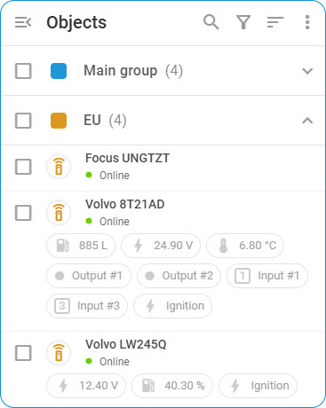

# Connection state

Every GPS device in Navixy has a status that indicates its current connection state to the server. These statuses are color-coded and visible in the [Objects list](./). This state does not necessarily mean the device is broken; it’s merely a visualization of the timing of data the platform receives from a device.

Color-coded indicators provide a quick and easy way for users to assess the status of their GPS devices at a glance.

The following table outlines the possible statuses for GPS devices, providing a description of each status and what it signifies about the device’s connection and activity. This information helps users understand the real-time condition of their devices, identify any issues, and take appropriate actions to ensure optimal performance.

<table><thead><tr><th width="254">Status</th><th>Description</th></tr></thead><tbody><tr><td><strong>Activated devices</strong></td><td></td></tr><tr><td></td><td><strong>Online</strong> The object’s GPS device is connected and has been reporting the coordinates as expected.</td></tr><tr><td></td><td><strong>GPS not updated</strong>  The object’s GPS device is connected to the server but hasn’t transmitted any data or coordinates for at least 5 minutes. Possible reasons include:  - Last GPS update was over 5 minutes ago - Data received from the device’s memory has outdated timestamps - GPS signal loss (e.g., under a roof, in a tunnel, underground parking) - Device in power-saving or sleep mode, sending last known coordinates or heartbeat packets - Device’s time zone setting differs from UTC+0</td></tr><tr><td></td><td><strong>Offline</strong>  The object's GPS device hasn’t sent any information to the platform over the <a href="../../devices-and-settings/connection-state-widget.md">user-specified period</a> (default is 10 minutes). Possible reasons include:  - Weak cellular signal - Device in deep sleep mode - Roaming not enabled on SIM card - Exhausted SIM data limit or SIM card balance - Device is no longer pointing to the platform</td></tr><tr><td></td><td><strong>Suspended</strong>  During the suspension period, no data from the device is accepted by the platform, and data from this period won’t be available even after the suspension is lifted. To resume service, top up your balance or contact support. The device will be automatically unblocked within 15 minutes after payment.</td></tr><tr><td><strong>Devices added, but not yet activated</strong></td><td></td></tr><tr><td></td><td><strong>Activating now</strong>  The GPS device is newly added. This status will be displayed until its activation ends, which typically takes up to 2-3 minutes. (Exception: for the X-GPS Tracker mobile app, this status extends indefinitely).</td></tr><tr><td></td><td><strong>Activation takes longer than expected</strong>  The GPS device was added, but no connection was established with the platform yet. Additional actions may be needed. To learn more, refer to the <a href="../../faq/gps-device-activation-troubleshooting.md">activation issues troubleshooting</a> article.</td></tr><tr><td></td><td>
<strong>Manual configuration needed</strong>  The GPS device requires <a href="../../quick-start/activate-gps-device.md#activate-gps-device-manually">manual configuration</a>, as it doesn’t support <a href="../../quick-start/activate-gps-device.md#activate-gps-device-automatically">automatic activation</a>. Follow the device configuration instructions or contact your service provider's support team for assistance.

💡Note:  - The server address and port are provided in the device’s details and on the <a href="https://navixy.com/device">Navixy website</a>.  - You can set the device’s time zone to UTC+0h for correct data timestamp processing.
</td></tr><tr><td></td><td><strong>No data received from device</strong> The platform hasn’t received any data from the GPS device after it was activated or after a malfunctioning device was replaced.</td></tr></tbody></table>

## Connection state sequence

The diagram below illustrates the sequence of connection statuses for a successfully activated GPS device on the platform, showing the transitions between different states based on the data received and the time elapsed.

Here’s a detailed explanation:

* Initially, the device is **Online**, indicated by a green circle, meaning it is connected to the server and transmitting valid GPS coordinates and a timestamp. If no new GPS coordinates or data are received for 5 minutes, the status changes to **GPS not updated**, represented by a green circle with a hole. This can happen if the device loses GPS signal, enters power-saving mode, or sends outdated data from its memory.
* If the connection timeout period (as set by the user or 10 minutes by default) is reached without receiving any new data, the status changes to **Offline**, shown as a red circle. This may occur if the device is in an area with a poor cellular signal, in deep sleep mode, has issues like SIM card problems, or reached the SIM data limit.
* When the device resumes sending valid GPS coordinates and timestamp, the status reverts to **Online**, and the cycle repeats as long as the device operates, transitioning between statuses based on the data received and the elapsed time.

This sequence helps users monitor their GPS devices' real-time connectivity and data transmission status, ensuring timely action can be taken if any issues arise.
