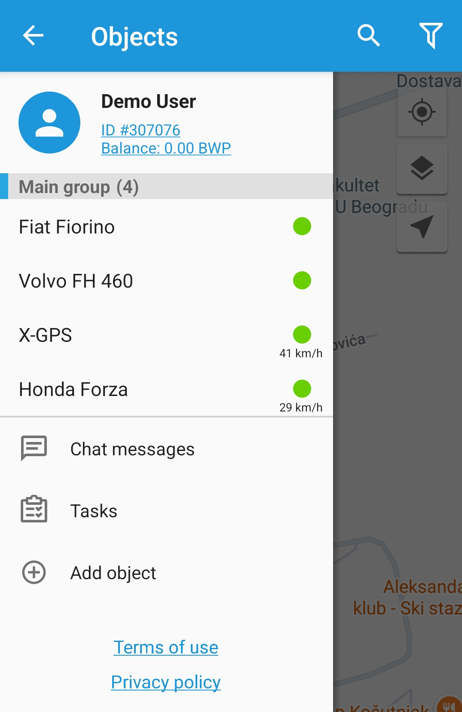
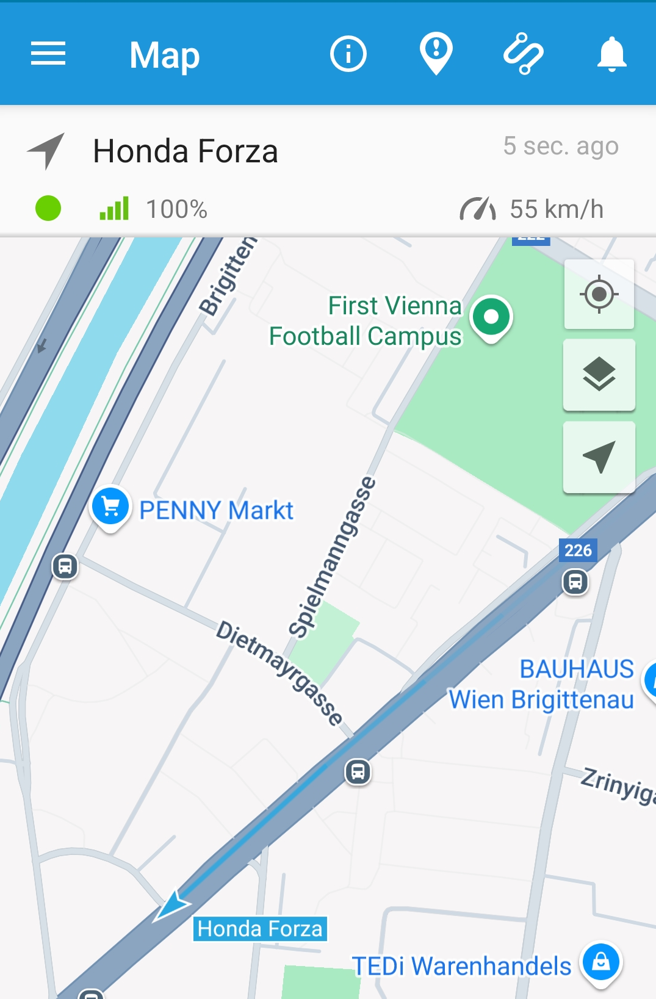
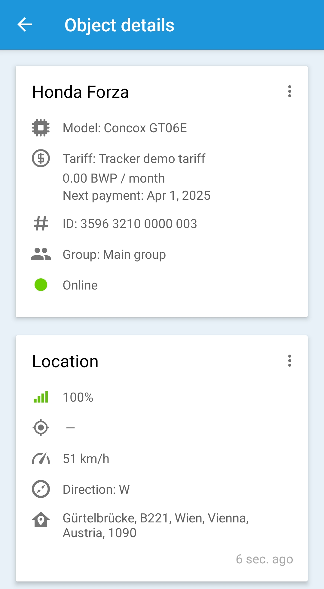

# Features

The X-GPS Monitor mobile application provides a wide range of tools for working with the map, trackers, tasks, etc.

## Object list

Click the 

icon in the upper left corner of the screen to display the side menu.\
The following items are available in the menu:

1. **User information and balance.** Click on your username to get extended information on recent transactions.
2. **Devices list.** All your trackers are displayed here. Using the buttons in the upper right corner, you can search for devices you need or filter the list by various parameters.
3. **Chat messages.** Used for online chatting with employees using the X-GPS Tracker application.
4. **Tasks.** You can view all active and completed tasks and reassign them.
5. **Add asset.** Activate new GPS devices directly from the mobile application.
6. **Settings.** Allows you to configure mobile notifications, sort the trackers list, and specify a different server address.
7. **Log out.** Click to sign out. The next time you start the application, you will have to re-enter your username and password.

## Object view

If you click on the object in the list, the application will show you its location and display brief information—GPS signal level, current speed, and when the device last sent data. Also, additional buttons will appear at the top of the screen:

1. **Object details.** Detailed information about the GPS device and its settings.
2. **Events for the period.** Show all events for a specific time interval.
3. **Tracks for the period.** Show all trips for the selected time period.
4. **Unread notifications.** Show all new events related to the device.

## Object status

By clicking on the 

icon, you will get complete information about the current status of the device and its settings:

1. Tracker model, tariff, IMEI and current status.
2. GPS signal level, coordinates, speed, direction and address.
3. GSM signal level and carrier.
4. Information about the external power and the state of the built-in battery.
5. The status of all digital inputs.
6. Readings of all configured sensors.
7. Engine hours and odometer readings.
8. Outputs switching.
9. Access to tracking settings and others.

And other information specific to certain tracker models.

