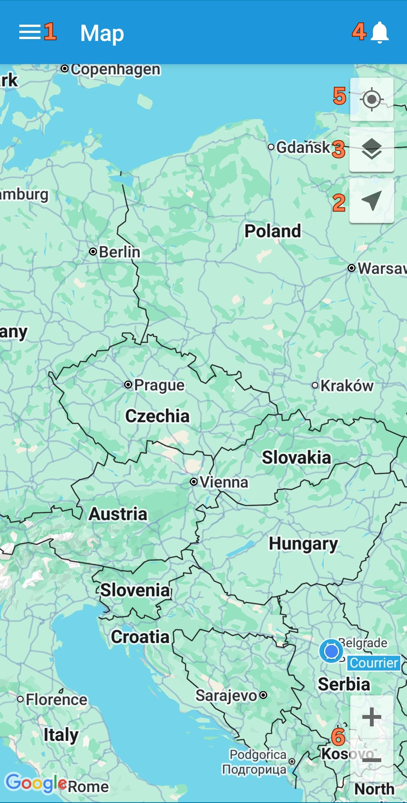

# X-GPS Monitor first start

You can download the application for free from Google Play or App Store.

Go to the store and type X-GPS in the search field.

Select **X-GPS Monitor** and click "Install".

### Log in

At the first launch, the application will offer you to scan a QR code, which can be found on the login page of the web interface.

After scanning the QR code, enter your username and password and click the **"Log in"** button.

If you forgot your password, click the corresponding button, enter your email address, and captcha. After that, you will receive an email with a link to reset your password.

After successful login, you will see the map screen.

### Main tools

The following items are available on the main screen:

1. **Sidebar.** Pressing a button brings up a menu where you can access information about the user, balance, list of devices, and other controls.
2. **Show trackers.** Click to select which trackers to display - all, one, or a group. You can also enable "Follow the object" and the map will automatically center on one device.
3. **Map type.** Allows you to select from the list of available maps, and also enable the traffic display.
4. **Notifications List.** Displays all unread notifications.
5. **Show location.** Center the map at your current location.
6. **Scale.** You can change the map scale with the "+" and "-" buttons.

