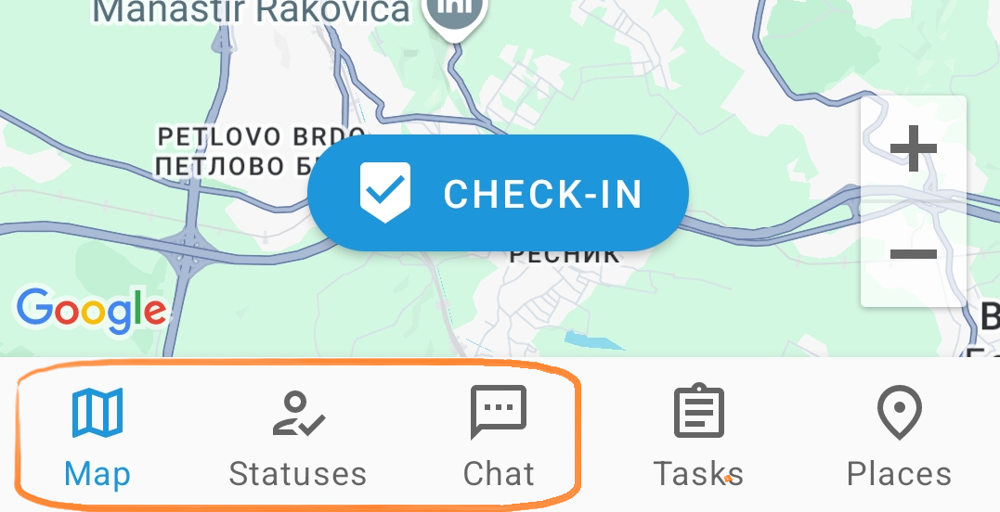
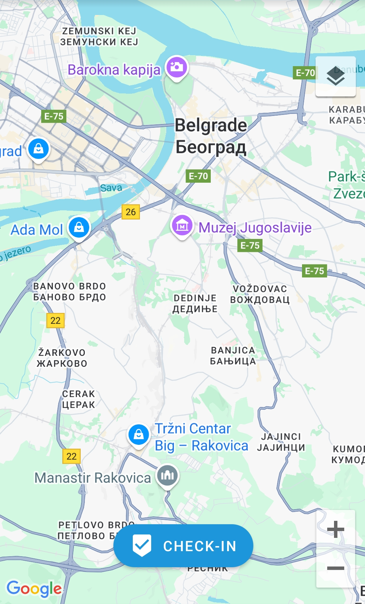
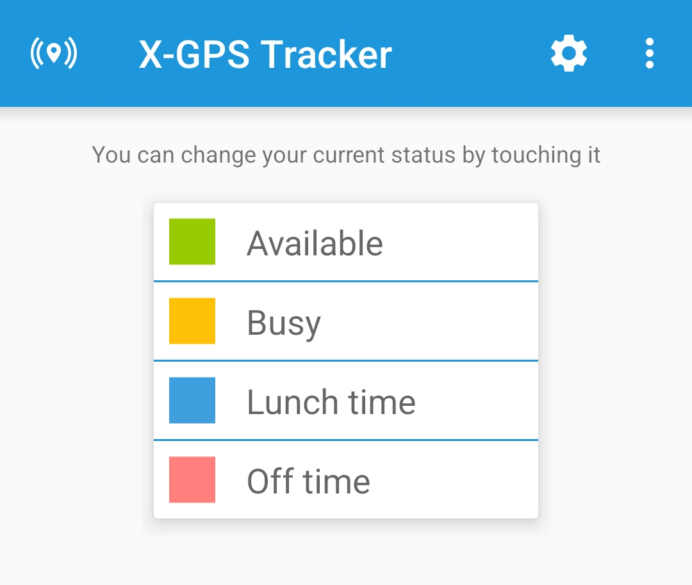
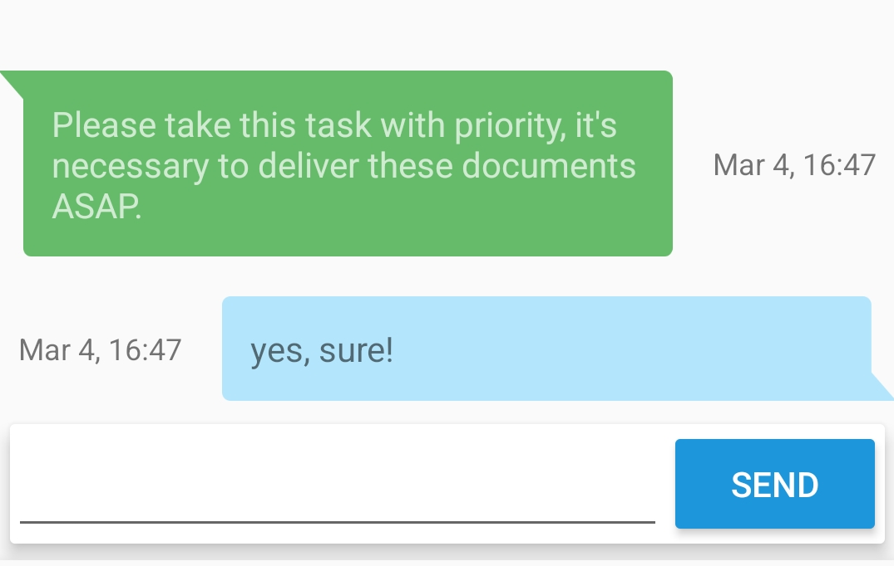

# Main features

The X-GPS Tracker mobile app interface contains five main sections:

1. **Map**
2. **Statuses**
3. **Chat**
4. **Tasks**
5. **Settings**

In this guide, we will cover the first three of them.

## Map

In the **"Map"** section, you have the following options:

1. **Go instantly to your current location.** Available only when the tracking is enabled in the settings.
2. **Zoom Map.** Using the "+" and "-" buttons you can zoom in or out.
3. **Check-in.** More details can be found in [this article](https://navixy.com/docs/user/mobile-view/x-gps-tracker/check-ins/?simple-theme-css=simple\&cacsp_bypass=true).
4. **Map.** You can select one of the available maps by clicking the button in the lower left corner.

## Statuses

The list of available statuses can be assigned by the supervisor via the web interface of the monitoring platform. The statuses allow the supervisor to see the current status of employees and to select those who are currently free.

The supervisor can change status in the web interface or allow the employee to change it himself.

To change the status, simply tap it with your finger.

## Chat

In the **"Chat"** section, an employee can send and receive messages from the supervisor. In large companies, it is often more convenient for the supervisor to chat with several employees than to call each separately by phone.

