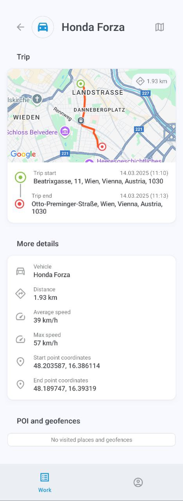

# Asset information

The asset information screen displays detailed information about the asset, including its location on the map, trip and event history, reminders, linked units, assigned GPS device, tags, and other data.

### Map

By default, the map appears at the top of the information screen. Tap and hold the address to copy it, or tap the image to switch to fullscreen view. The map automatically follows the asset’s route if it’s moving. You can also zoom in and out and center the map on your own GPS coordinates.

Tap 

 to display the map options menu, where you can select places, geofences, and map type. Note that map type selection is currently only available on Android devices.

### Trips

Tap **Trips** to display the list of trips taken by your asset. Tap any trip to view its details, including any visited POIs and geofences. You can also view the history of one or several trips on the map in fullscreen.

To filter the display of trips, such as by time period and other parameters, tap 

 and open the **Date range and settings**:

### Events

Tap **Events** to view the asset’s event history, such as leaving or entering a geofence, going idle, speeding, completing tasks, crashing, deviating from the route, arriving at a checkpoint, and more.

The menu below the asset’s name shows your current filters, all of which can be configured: time period, specific vehicles or staff, and event types. The **Unread** filter will display only unread notifications, while **Emergency** will narrow down your search to urgent events.

Tap an event to display its details. You can also tap the map on top of the screen to view it in fullscreen. The 

 button allows switching between different maps.

> [!WARNING]
> Map type selection is currently only available on Android devices.

### Reminders

The **Reminders** button is only displayed when there are pending issues, such as an expiring or expired driver's license or vehicle insurance. Tap it to learn more about the issue.

### Sensors

Tap the **Sensors** button to see the readings provided by the asset’s GPS device or devices, including engine hours, fuel level, temperature, and custom inputs and outputs.

Outputs allow sending control commands to devices, such as stopping the engine. To send a command, tap 

 and choose **Send** in the confirmation prompt.

Vehicle sensors are configured via the main Navixy platform. To learn about them, read [Navixy User Documentation](../../devices-and-settings/vehicle-sensors.md).

### Linked units

Tap the name or label in the **Linked units** entry to access the information screen of the unit linked to the asset, such as the driver or the driven vehicle.

### GPS device

Tap the device label in the **GPS Data** entry to display its details, including the ID, model, connection and movement status, location, speed, and other technical data.

