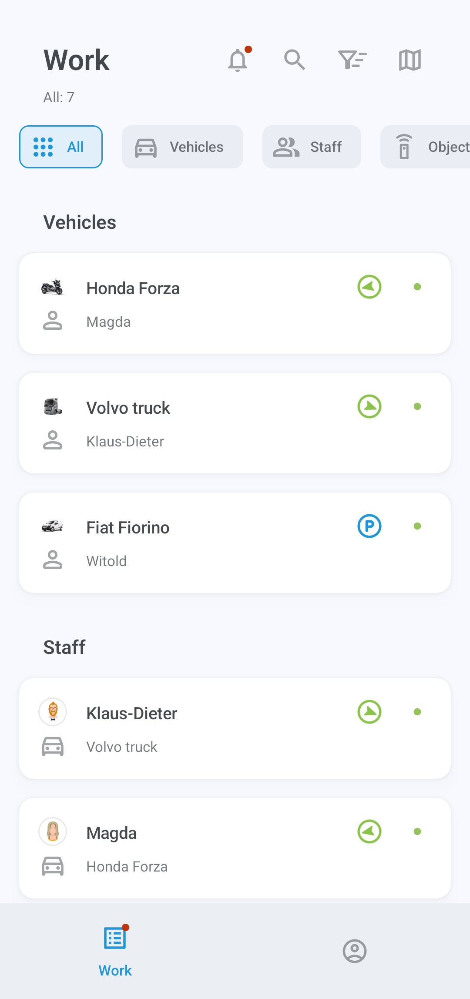
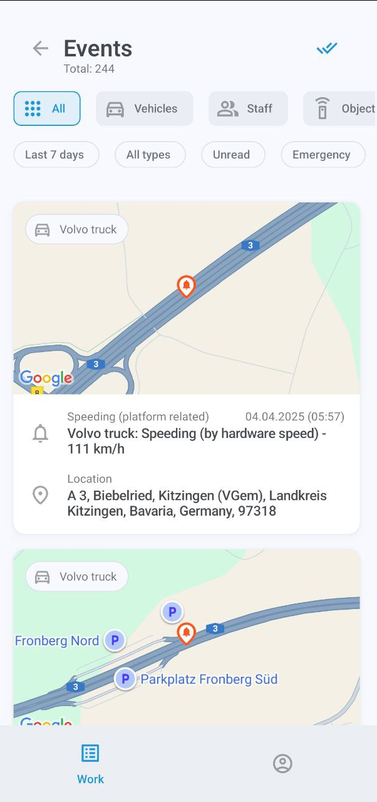
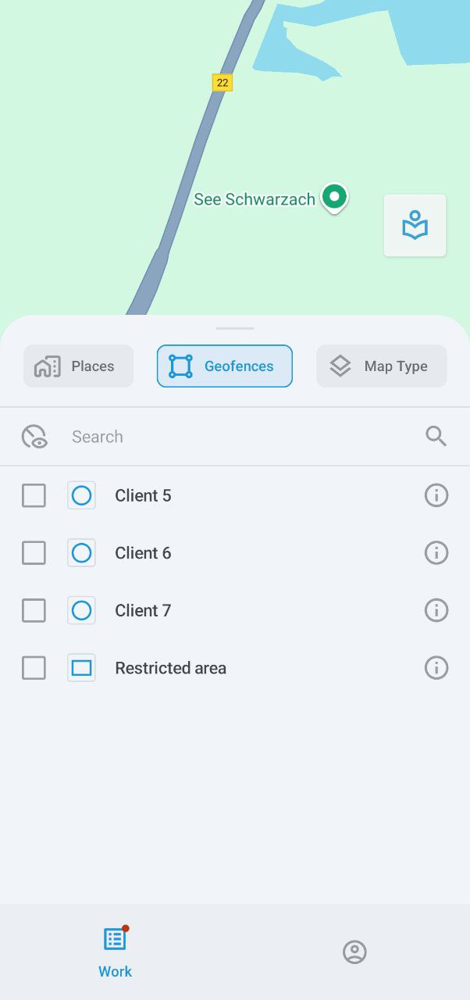

# Assets list

This screen displays all your assets: vehicles, staff, and objects (unassigned GPS devices). To view more information about any of your assets, simply tap its entry. To find a specific asset, tap 

 and enter its name.

The icon to the right of each asset indicates its movement status, such as moving or parked.

### Events

Tap 

 to view the events.

This screen shows various events occurring to your assets, such as leaving or entering a geofence, going idle, speeding, completing tasks, and more. To filter by category type, tap **All**, **Vehicles**, **Staff**, or **Objects**.

The second menu shows your current filters, all of which can be configured: time period, specific vehicles or staff, and event types. The **Unread** filter will display only the unread notifications, while **Emergency** will narrow down your search to urgent events.

### Map

Tap 

 to open an interactive map displaying your assets.

You can zoom in and out and center the map on your own GPS coordinates. Tap the vehicle’s icon to follow its route and view its current status and location. Tap 

 again to open the vehicle’s details.

Tap 

 to display the map options menu:

Here, you can select places (such as client locations for delivery), geofences, and map type. Note that map type selection is currently only available on Android devices.

### Sorting and filtering

The list has two filtering methods: by category and by status.

To filter by category, tap **All**, **Vehicles**, **Staff**, or **Objects**.

To filter by status (moving, stopped, parked, idling, and offline), tap 

 to open the **Filter & Sorting** menu. In addition to filtering, this menu also allows sorting assets by name.

