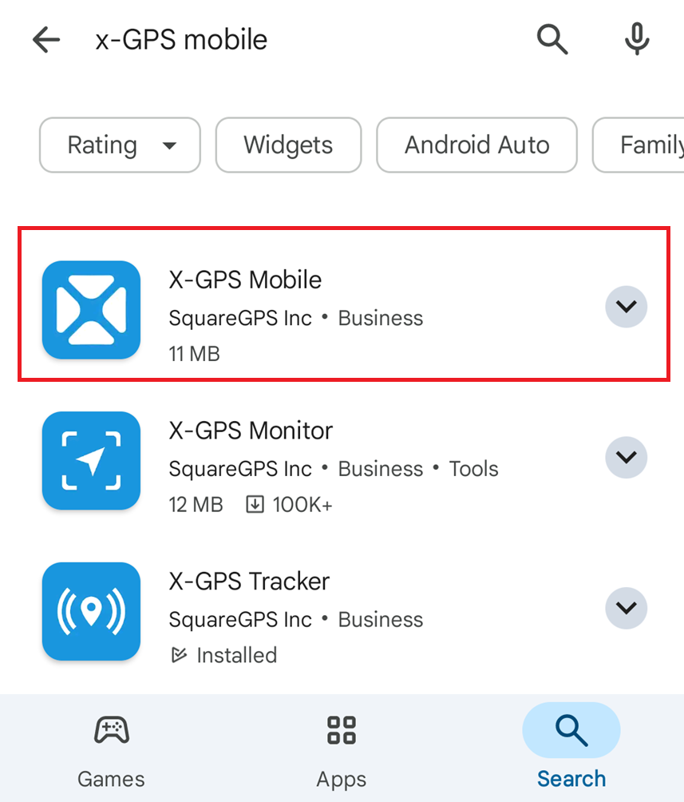

# X-GPS Mobile quick start

Follow these steps to learn how to work with X-GPS Mobile.

### Step 1. Download the app

1. Open Google Play or App Store and enter X-GPS Mobile in the search field.
2. Select it and tap **Install**.

### Step 2. Log in

1. Open the app.
2. Enter your username and password and tap **Sign in**.
3. If required, enter your server URL (by default, the Navixy server is used). Alternatively, use a QR code to bypass entering the URL and automatically configure your settings.

> \[!INFO] If you forgot your password, tap the corresponding button and enter your email address. You will receive an email with a link to reset your password.

!\[Login screen]\(attachments/Login screen.jpg)

### Step 3. Set permissions

Allow the app to send you notifications and access the device’s location while using the app. Note that you will receive push notifications for all assets in your fleet.

### Step 4. Open the main screen

The main screen displays your assets: vehicles, staff, and objects (units representing GPS devices) with icons indicating their movement status.

You can filter them by category or status (moving, parked, etc.) and sort them by name or status.

To sort or filter the list of assets and access the monitoring tools, tap the icons in the top-right corner:&#x20;

|                                                                                                                                                                               |                                                                                                                                                                                    |
| ----------------------------------------------------------------------------------------------------------------------------------------------------------------------------- | ---------------------------------------------------------------------------------------------------------------------------------------------------------------------------------- |
|            | Opens the [event log](https://squaregps.atlassian.net/wiki/spaces/~7120201a6252f8d34242e3bdb7409b5d34d953/pages/3182821465/new+Assets+list#events-list) for all units              |
|  | Allows you to enter a search query                                                                                                                                                 |
|          | Opens the [filtering and sorting](https://squaregps.atlassian.net/wiki/spaces/~7120201a6252f8d34242e3bdb7409b5d34d953/pages/3182821465/new+Assets+list#sorting-and-filtering) menu |
|               | Opens the [map screen](https://squaregps.atlassian.net/wiki/spaces/~7120201a6252f8d34242e3bdb7409b5d34d953/pages/3182821465/new+Assets+list#map-fullscreen)                        |

Use the bottom panel to switch between the main screen and your profile.

### Step 5. Start working

Tap on an asset to view its location, status, trip and event history, sensors, reminders, GPS device details, and other information.

!\[vehicle screen w sensors.png]\(attachments/vehicle screen w sensors.png)
