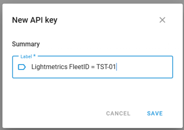
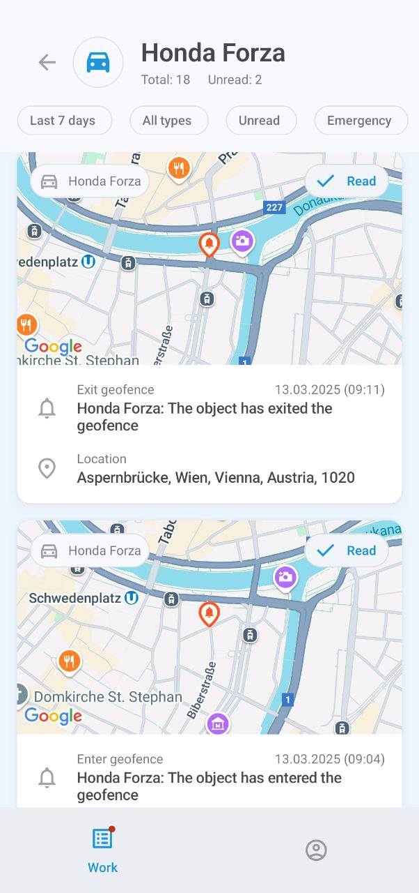

# X-GPS Mobile quick start

Follow these steps to learn how to work with X-GPS Mobile.

### Step 1. Download the app



1. Open Google Play or App Store and enter X-GPS Mobile in the search field.
2. Select it and tap **Install**.



<figure><figcaption>
Search screen
</figcaption></figure>



### Step 2. Log in



1. Open the app.
2. Enter your username and password and tap **Sign in**.
3. If required, enter your server URL (by default, the Navixy server is used). Alternatively, use a QR code to bypass entering the URL and automatically configure your settings.



<figure><figcaption>
Login screen
</figcaption></figure>




If you forgot your password, tap the corresponding button and enter your email address. You will receive an email with a link to reset your password.


### Step 3. Set permissions



Allow the app to send you notifications and access the device’s location while using the app. Note that you will receive push notifications for all assets in your fleet.



<figure><figcaption>
Permission prompt
</figcaption></figure>




### Step 4. Open the main screen


{% column width="50%" %}
The main screen displays your assets: vehicles, staff, and objects (units representing GPS devices) with icons indicating their movement status.

You can filter them by category or status (moving, parked, etc.) and sort them by name or status.

To sort or filter the list of assets and access the monitoring tools, tap the icons in the top-right corner:

&#x20; Allows you to enter a search query

.png>) Opens the [event log ](https://squaregps.atlassian.net/wiki/spaces/~7120201a6252f8d34242e3bdb7409b5d34d953/pages/3182821465/new+Assets+list#events-list)for all units

.png>) Opens the [filtering and sorting](https://squaregps.atlassian.net/wiki/spaces/USERDOCSOLD/pages/3235676161/Assets+list#sorting-and-filtering) menu

.png>) Opens the [map screen](https://squaregps.atlassian.net/wiki/spaces/USERDOCSOLD/pages/3235676161/Assets+list#map-fullscreen)

Use the bottom panel to switch between the main screen and your profile.


{% column width="50%" %}
<figure><figcaption>
Assets list
</figcaption></figure>




### Step 5. Start working



Tap on an asset to view its location, status, trip and event history, sensors, reminders, GPS device details, and other information.



<figure><figcaption>
Vehicle asset
</figcaption></figure>



