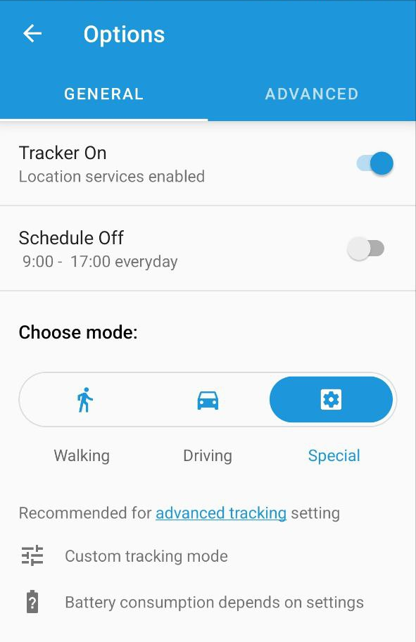
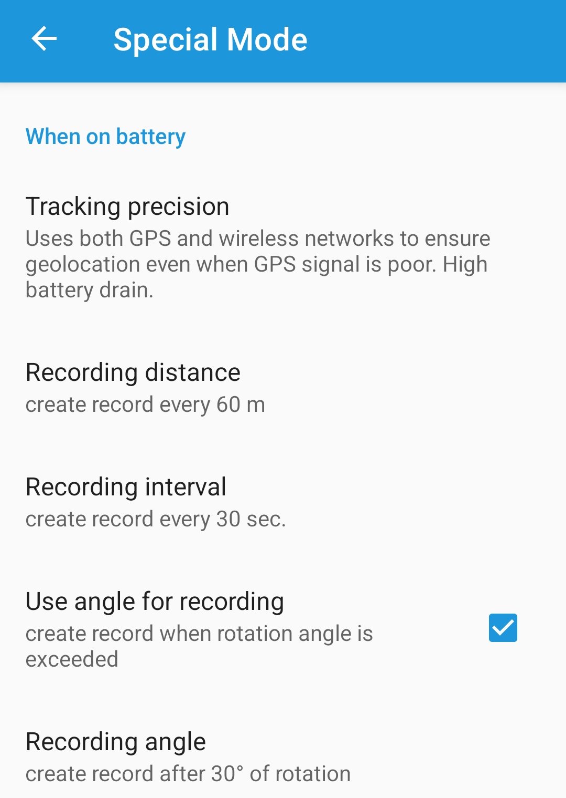
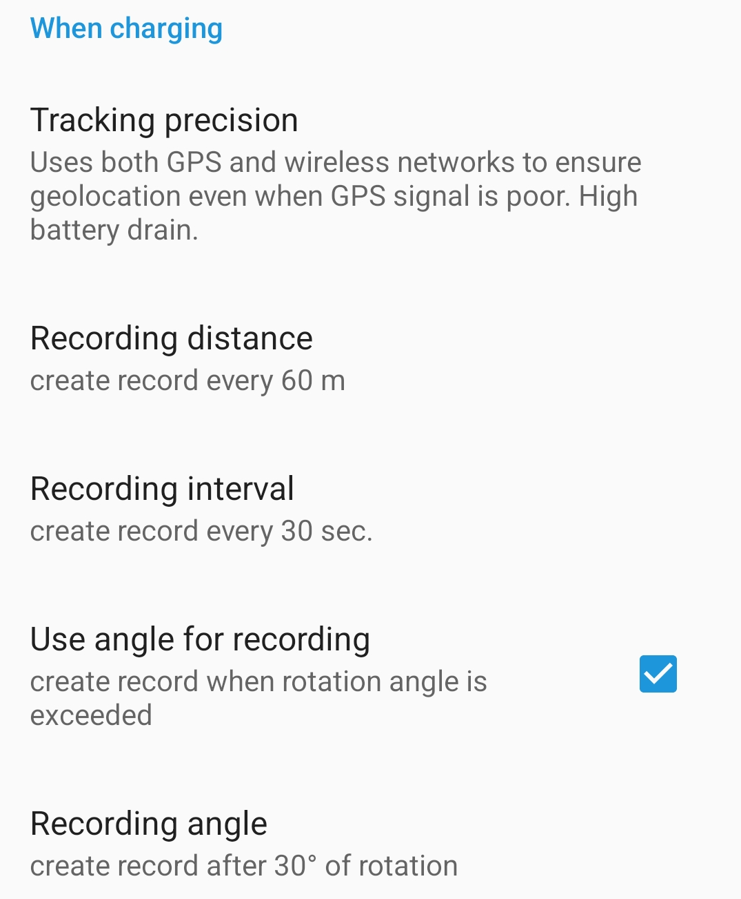
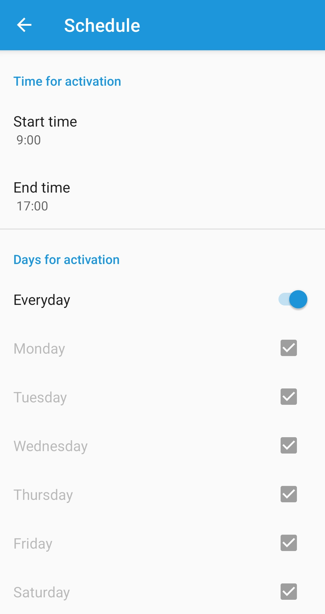
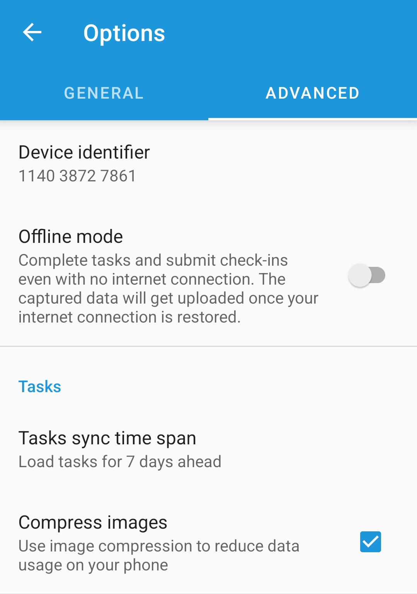
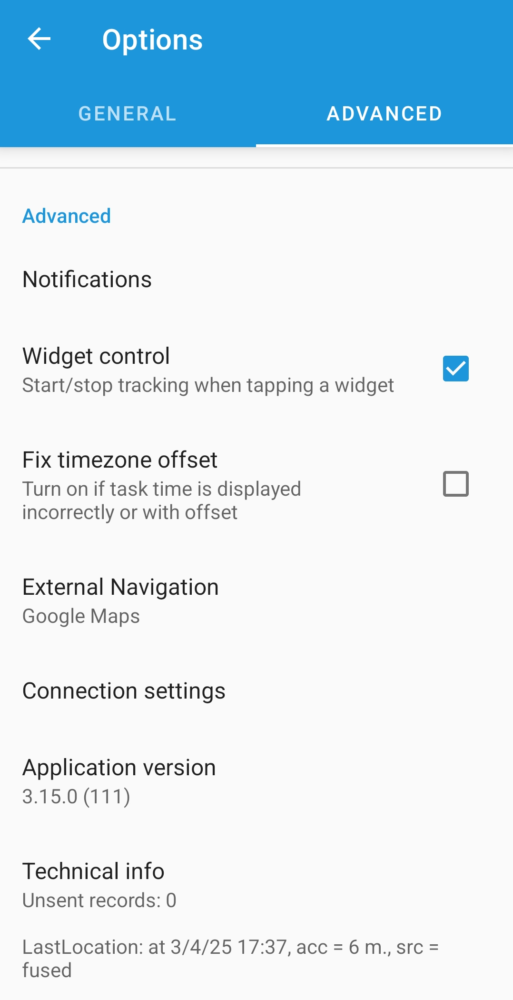

# Application settings

### Geolocation



**Tracking on/off.** Using this switch, you can turn tracking on or off. When it's off, the tracking stops, chat does not work, and new tasks are not loading from the server.

You can choose one of three operating modes:

**Walking.** Recommended when walking or taking public transport. If a phone is plugged in, Driving mode will be activated automatically.

* Sufficient location accuracy - LBS+GPS
* Points are recorded every 100 meters, 180 seconds, or 40-degree turn
* Moderate battery consumption

**Driving.** Recommended when driving a vehicle or motorcycle with the ability to connect a mobile device to external power.

* Maximum location accuracy  - GPS
* Points are recorded every 80 meters, 90 seconds, or 30-degree turn
* High battery consumption

**Special.** Recommended for advanced tracking settings

* Custom tracking mode
* Battery consumption depends on settings







In **Special**, tap **Advanced tracking** to access advanced settings.



**Tracking precision.** You can select a geolocation source - GPS, LBS, or both. Please note that corresponding sources should also be enabled in the phone settings.

\*\*Recording distance.\*\*Specify the distance after which a new point will be recorded.

**Recording time.** Specify the time after which a new point will be recorded.

**Recording angle.** Specify the turning angle after which a new point will be recorded.

Please note that all three conditions work according to the OR function. This means that a new point will be recorded when at least one of the conditions is reached, after which all three are reset to zero.







### Schedule



**Turn on/off** _(_&#x69;n **General settings**_)_**.** You can configure tracking according to a schedule. For example, specify only business hours. The rest of the time, the location will not be tracked, new tasks will not be downloaded, and no new messages will be received in the chat.

**Time for activation.** Choose the start and end time for tracking.

**Days for activation.** Choose which days to enable tracking, according to the "Days for activation" settings.

If tracking is enabled according to the schedule, you can turn it off at any time. It will turn on again automatically in the next time period according to the schedule.







### Advanced settings



**Device identifier.** Here you can specify a different device ID. For example, if you deleted the old one and created a new one, but want to continue to use the same phone as a tracker.

**Offline mode.** Allows sending forms/photos in **Check-ins** and **Tasks** without a network.

**Tasks sync time span.** Determines how many tasks will be downloaded in advance. You can reduce this value to not load too many tasks at once.

**Compress images.** If your SIM card has very expensive or limited Internet traffic, you can enable this feature. All photos sent in forms or check-ins will be compressed. Image quality will be reduced, but the application will use less traffic.

**Notifications.** Will open the phone notification settings for the X-GPS Tracker application. The appearance of the menu and the available functionality may vary depending on the phone model.

**Widget control.** You can add the widget of the **X-GPS Tracker** application to the desktop of your phone. This setting allows you to start tracking with one tap on the widget, without having to launch the application.

**Fix timezone offset**. Use if necessary. Usually required if the phone has a time zone that does not match its location.

**External navigation.** Choose which app will be open to show directions to the **Task** location.

**Connection settings.** Using this menu, you can manually set the IP address and port of the server. Standard server:

* Server address: **52.57.1.136** or **13.52.37.2** (depending on the region)
* Server port: **47770**

**Technical info.** Shows how many points are currently recorded in the device's memory.







