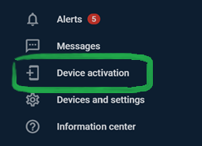

# Invitation to X-GPS Tracker

You can turn a smartphone or tablet into the GPS tracking device by installing our free ‘X-GPS Tracker’ app. Our app is available to download on the Google Play and iOS App Store and absolutely free.

The activation process is common for both iOS and Android devices.

## X-GPS Tracker activation

1. **Login to the user account.**

2. **Click ‘Device activation’ icon** in the application bar.

3. **Enter object name**, e.g. My phone, and select **X-GPS Tracker** model.

4. **Enter the email address** or **phone number** to receive an **invitation** with the link for mobile app download.

5. **Follow the link** and click **'Continue'**.

6. **After installing X-GPS Tracker app,** the configuration will be set up, a cell phone or tablet will be turned into the **tracking device** and will be displayed on the platform.