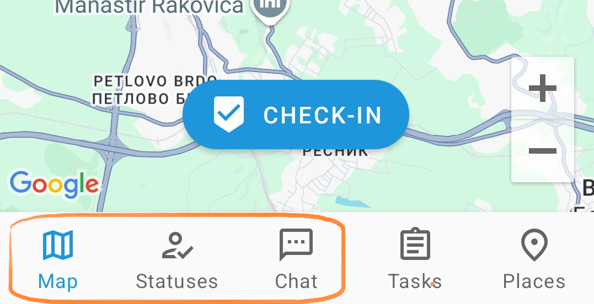
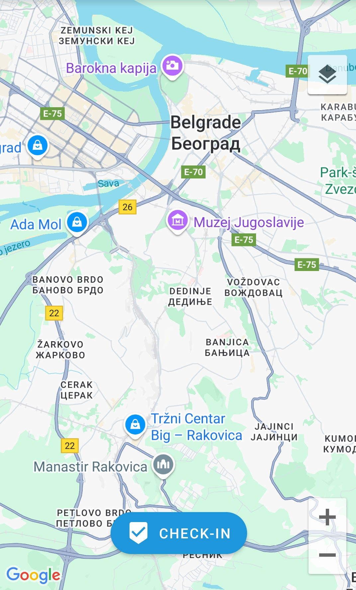
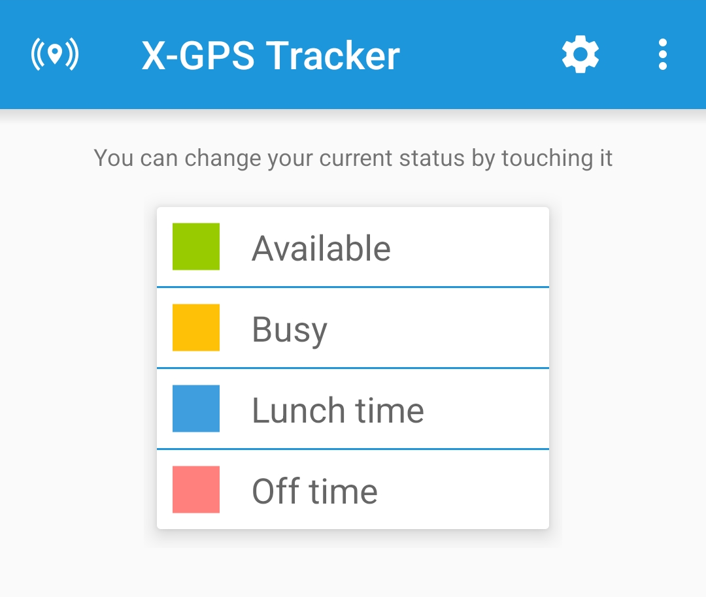
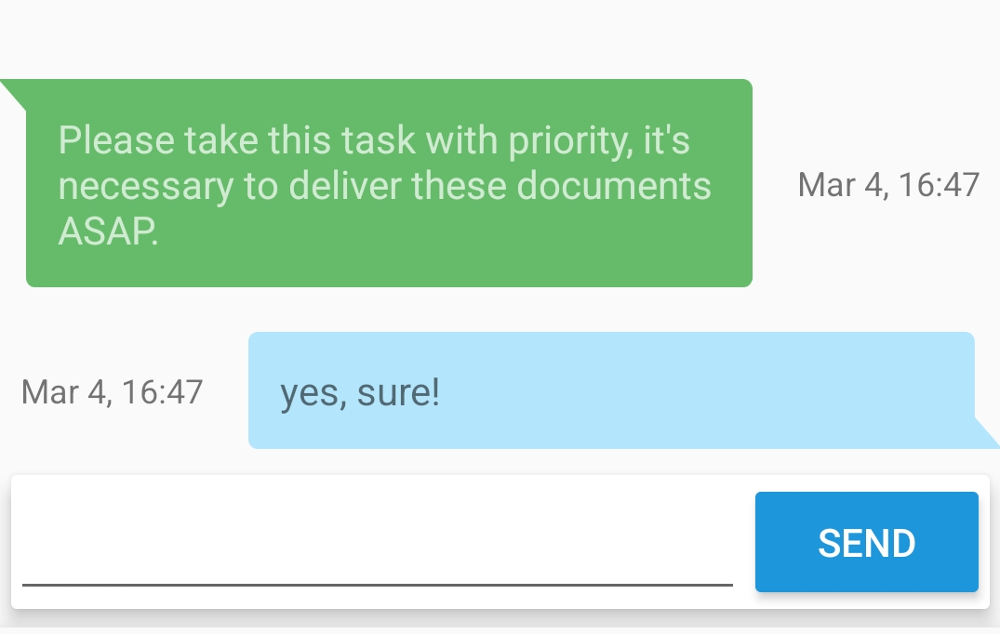

# Main features

The X-GPS Tracker mobile app interface contains five main sections:

1. **Map**
2. **Statuses**
3. **Chat**
4. **Tasks**
5. **Settings**

This guide covers the first three of them.

## Map



The **Map** section contains the following options:

1. **Go instantly to your current location.** Available only when the tracking is enabled in the settings.
2. **Zoom Map.** You can zoom in or out using the **+** and **-** buttons.
3. **Check-in.** To learn more about this feature, see [Developer Documentation](https://www.navixy.com/docs/navixy-api/user-api/backend-api/resources/field-service/checkin).
4. **Map.** Select one of the available maps by tapping the button in the lower left corner.







## Statuses



The list of available statuses can be assigned by the supervisor via the web interface of the monitoring platform. The statuses allow the supervisor to see the current status of employees and to select those who are currently free.

The supervisor can change the status in the web interface or allow the employee to change it himself.

To change the status, simply tap it with your finger.







## Chat



In the **Chat** section, an employee can send and receive messages from the supervisor. In large companies, it is often more convenient for the supervisor to chat with several employees than to call each separately by phone.







