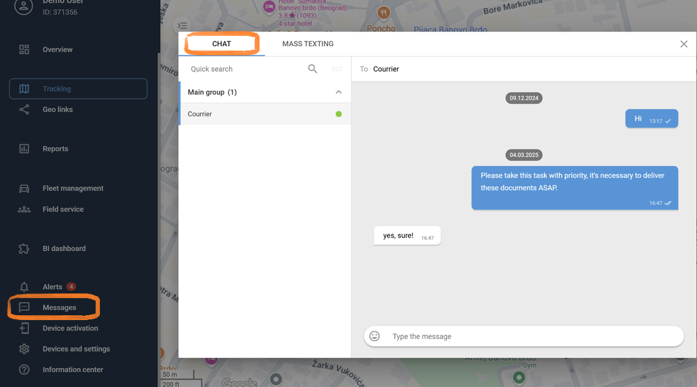
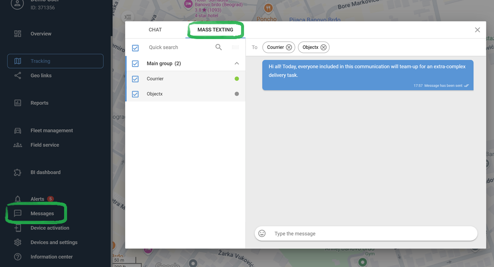
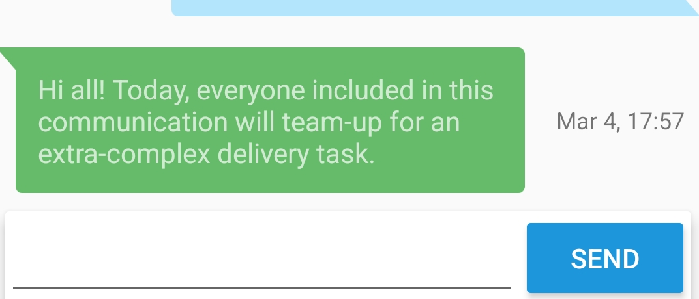
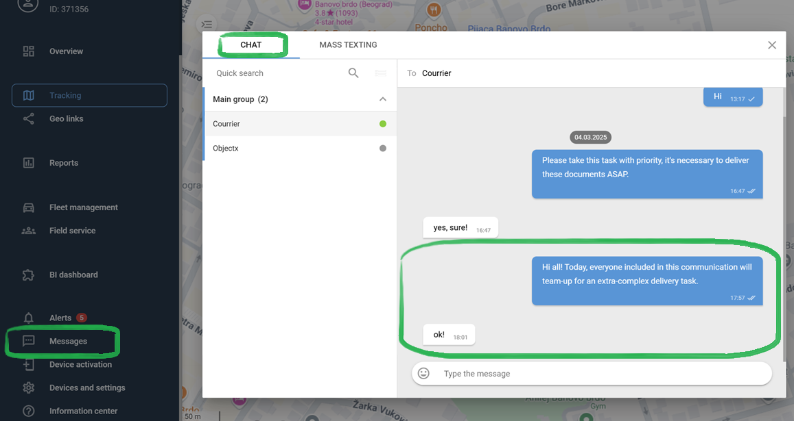
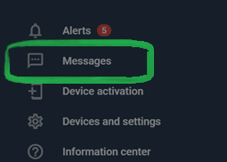

# Messages

During the day, field and office staff are at a distance from each other. In order to act together, each of them needs to receive information from colleagues in a timely manner. Therefore, it is extremely important for the company to provide the opportunity to quickly share information with each participant in the workflow:

* **Mobile employee** - an employee performing tasks on the road. This may be a sales representative, service engineer, courier, or even an employee of a warehouse remote from the office.
* **Dispatcher** - an office employee coordinating the actions of field staff. It can be either a dispatcher directly or a logistician or supervisor.

So the on-site employee will be able to transfer the results of the meeting with the client to the office, signal to colleagues about the difficulties encountered in the work, clarify the procedure for emergency situations, and so on. And the dispatcher will inform the mobile worker about new clients that need to be visited, inform about the appearance of additional tasks when visiting customers or notify about a change in the work process.

Messages can be sent in two modes:

* Chat between field employee and dispatcher
* Mass texting by the dispatcher for several field employees

### Chat with an employee

In chat mode, the dispatcher and field employee exchange one-on-one messages. Both a dispatcher and a mobile worker can start a chat. At the same time, the dispatcher uses the Messages application for correspondence in the web interface.

And the field employee uses the Chat tab in the X-GPS Tracker mobile application

In Chat mode, it is convenient to exchange messages that relate to the work of a specific field employee. For example, this way the dispatcher will inform the sales representative about a new client whom he needs to visit, and the field employee will be able to clarify the details of the upcoming meeting: time, address, contact person and subject of negotiations.

### Mass texting

Mass texting allows the dispatcher to simultaneously send the same message to several field employees. For example, this way the dispatcher will inform couriers of the decision of the management to take photographs of the packaging of the goods upon receipt.

Only dispatcher from the web interface can send messages. To do this, he marks the mailing list recipients on the list and writes them one or more general messages.

A field employee can reply to a message on the Chat tab in the X-GPS Tracker mobile application.

In this case, only the dispatcher will see the answer in a separate Chat with the employee.

Due to this, the remaining field employees will not be distracted by the dialogue that has begun and the discussion will be held in a constructive manner.

### Messaging between employees on practice

Chat and mailing are available to the dispatcher in the main menu, in the **Messages** section.

This will allow the dispatcher to correspond with mobile personnel in real-time and quickly switch between **Chat** and **Mass** texting. As a result, office staff and field staff will act as a single team that solves common tasks.
